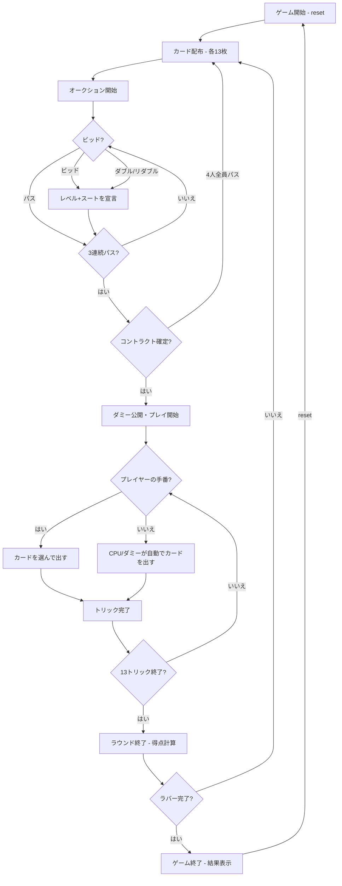

# コントラクトブリッジ（CUI版）遊び方

## ゲーム概要

4人（プレイヤー1人 + CPU 3人）で遊ぶ2チーム制（0+2 vs 1+3）のトリックテイキング型カードゲームです。標準52枚のカード（各プレイヤー13枚）を使用し、オークション（ビッド）でコントラクトを決定した後、13トリックをプレイします。ラバーブリッジ方式のスコアリングで、先に2ゲームを獲得したチームがラバーに勝利します。

## 起動方法

```sh
go run ./cmd/trumpcards bridge
go run ./cmd/trumpcards --lang en bridge  # 英語モード
```

## ルール

### 基本ルール

- 52枚のカードを4人に均等配布（1人13枚）
- 4人を2チームに分ける（プレイヤー0+2 vs プレイヤー1+3）
- オークション（ビッド）でコントラクト（レベル+スート/ノートランプ）を決定
- コントラクトを勝ち取ったプレイヤーがディクレアラー（宣言者）
- ディクレアラーのパートナーがダミー（手札を公開し、ディクレアラーが操作）
- リードスートに従う（フォロースート）
- 切り札（トランプ）がある場合、切り札が勝つ

### オークション（ビッド）

- ディーラーの左隣から時計回りにビッド
- ビッドはレベル（1〜7）とスート（クラブ < ダイヤ < ハート < スペード < ノートランプ）の組み合わせ
- 前のビッドより高いビッドのみ可能
- **パス**: ビッドを見送る
- **ダブル**: 相手チームの最後のビッドに対して宣言（得点/失点が倍）
- **リダブル**: 自チームへのダブルに対して宣言（得点/失点が4倍）
- 3人連続パスでオークション終了、最後のビッドがコントラクトになる
- 4人全員パスの場合はパスアウト（ラウンドやり直し）

### プレイ

- ディクレアラーの左隣がオープニングリード
- リード後、ダミーの手札が公開される
- ディクレアラーはダミーのカードも操作する
- フォロースート必須（持っていない場合のみ他のスート可）
- トリックの勝者が次のリードを行う

### 得点（ラバーブリッジ）

#### ライン以下（コントラクトポイント）

- **クラブ/ダイヤ（マイナースート）**: 1トリックあたり20点
- **ハート/スペード（メジャースート）**: 1トリックあたり30点
- **ノートランプ**: 最初のトリック40点、以降30点
- ダブル時は2倍、リダブル時は4倍
- ライン以下が100点以上でゲーム獲得

#### ライン以上（ボーナス/ペナルティ）

- **オーバートリック**: コントラクト以上に取ったトリック分のボーナス
- **アンダートリック**: コントラクト未達のペナルティ（バルネラブルで増加）
- **スラムボーナス**: スモールスラム（6レベル達成） 500/750、グランドスラム（7レベル達成） 1000/1500
- **ラバーボーナス**: 2-0勝ち 700点、2-1勝ち 500点

#### バルネラビリティ

- 1ゲーム獲得したチームはバルネラブル（脆弱）状態になる
- バルネラブル時はアンダートリックのペナルティとスラムボーナスが増加

### ゲーム終了

- **勝利条件**: 先に2ゲームを獲得してラバーに勝利

### CPU難易度

- **Easy** (0): ランダムにビッド・プレイ
- **Normal** (1): HCP（ハイカードポイント）に基づくビッド、基本的なトリック戦略
- **Hard** (2): HCP+分布点によるビッド、パートナー連携、切り札管理、ボイド戦略

## ゲームの流れ



## コマンド一覧

| コマンド | 短縮形 | 説明 |
|----------|--------|------|
| `reset` | `r` | ゲームリセット（設定保持） |
| `bid <type> [level] [suit]` | `b <type> [level] [suit]` | ビッド（type: 0=パス, 1=通常, 2=ダブル, 3=リダブル） |
| `play <idx>` | `p <idx>` | カードをプレイ（インデックス指定） |
| `next` | `n` | 次のトリックへ |
| `nextround` | `nr` | ラウンドをスコアリングして次のラウンドへ |
| `setdifficulty <0-2>` | `sd <0-2>` | CPU難易度設定（0=Easy, 1=Normal, 2=Hard） |
| `hint` | `h` | 推奨ビッド/カードのヒントを表示 |
| `log` | `l` | 棋譜表示 |
| `quit` | `q` | ゲーム終了 |
| `help` | `?` | ヘルプ表示 |

### コマンド例

- `b 0` → パス
- `b 1 1 5` → 1ノートランプをビッド（レベル1, スート5=ノートランプ）
- `b 1 3 4` → 3スペードをビッド（レベル3, スート4=スペード）
- `b 2` → ダブル
- `b 3` → リダブル
- `p 0` → インデックス0のカードを出す

### スートコード

| コード | スート |
|--------|--------|
| 1 | クラブ |
| 2 | ダイヤ |
| 3 | ハート |
| 4 | スペード |
| 5 | ノートランプ |

## 画面の見方

```
==========
Contract Bridge (コントラクトブリッジ)
==========
ラウンド: 1  トリック: 0
ディーラー: あなた
切り札: ノートランプ
コントラクト: 1レベル ノートランプ
バルネラビリティ: チーム0=false チーム1=false
チーム0: 0点 (ゲーム0勝 ライン下0)  チーム1: 0点 (ゲーム0勝 ライン下0)
あなた: チーム0 獲得0トリック 13枚
[0]SPADE 2  [1]SPADE 3  [2]SPADE 4  [3]SPADE 6  [4]SPADE 11  [5]CLOVER 9  ...
CPU 1: チーム1 獲得0トリック 13枚
CPU 2: チーム0 獲得0トリック 13枚
CPU 3: チーム1 獲得0トリック 13枚
----------
オークション: CPU 1:1SPADE → CPU 2:1ノートランプ → CPU 3:パス
ビッドフェーズ: あなたの番
上回るには 2CLOVER 以上が必要です
b <type> [level] [suit] (bid: 0=Pass, 1=Normal, 2=Double, 3=Redouble)
==========
```

- `ラウンド: N  トリック: M`: 現在のラウンドとトリック番号
- `ディーラー: 名前` / `切り札: ノートランプ`: ディーラーと切り札
- `コントラクト: 1レベル ノートランプ`: 確定したコントラクト
- `バルネラビリティ: チーム0=false チーム1=false`: **独立した行**で出ます
  (`[V]` のような印ではありません)
- `チーム0: 0点 (ゲーム0勝 ライン下0)  チーム1: ...`: 両チームの得点が
  1 行に並びます
- プレイヤー行: `チームN 獲得Mトリック X枚`
- `[0]SPADE 2`...: インデックス付きの手札カード
- `オークション: CPU 1:1SPADE → CPU 2:1ノートランプ → ...`: ここまでの
  入札の並び。**`上回るには 2CLOVER 以上が必要です` が続けて出る**ので、
  いくらから宣言できるかがその場で読めます
- `トリック: あなた=SPADE 2, ...`: プレイフェーズで現在のトリックに
  出ている札。まだ 1 枚も出ていなければ行ごと出ません

## 遊び方のコツ

- HCP（A=4, K=3, Q=2, J=1）が13点以上あればオープニングビッドを検討しましょう
- パートナーとのビッドのやり取りで互いの手札の強さを伝え合います
- ディクレアラーの場合、ダミーの手札と合わせて作戦を立てましょう
- フォロースートできない場合、切り札で取るか、不要なカードを捨てるか判断しましょう
- バルネラブル時はアンダートリックのペナルティが大きいため、無理なビッドは避けましょう
- 迷った時は `h` コマンドでヒントを表示できます
