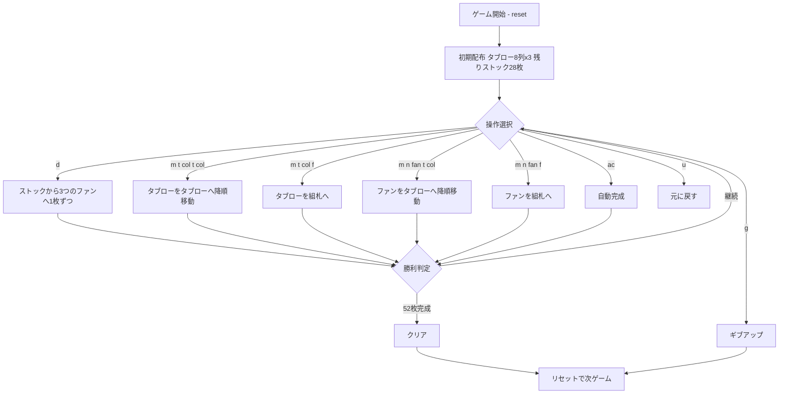

# ブリストル（CUI版）遊び方

## ゲーム概要

ブリストル（Bristol）は1人用ソリティア。8列のタブロー（場札）、3つのファン（予備列）、ストック、4つのファウンデーション（組札）を使い、52枚すべてをファウンデーションに積み上げることを目指す。タブローはスートに縛られず降順に積めるのが特徴。

## 起動方法

```sh
go run ./cmd/trumpcards bristol
go run ./cmd/trumpcards --lang en bristol  # 英語モード
```

## ルール

- タブローは8列。開始時に各列3枚ずつ表向きに配られる（計24枚）。
- タブローの最上段、またはファンのトップカードを、他のタブロー列へ移動できる（スート不問・降順）。
- 一度空になったタブロー列には、もうカードを置けない。
- ファンは3つ。ストックから1回の操作で各ファンに1枚ずつ（計3枚）配られる。各ファンの一番上のカードのみ使用できる。
- ファウンデーションは4つ。AからKへ昇順に積む（スート不問）。タブローやファンのトップから積める。
- 4つのファウンデーションすべてが13枚（合計52枚）になればクリア。

## ゲームの流れ



## コマンド一覧

| コマンド | 短縮形 | 説明 |
|----------|--------|------|
| `d` / `draw` | `d` | ストックから3つのファンに1枚ずつ配る |
| `m t <col> t <col>` | — | タブロー列からタブロー列へ（降順） |
| `m t <col> f` | — | タブロー列からファウンデーションへ |
| `m n <fan> t <col>` | — | ファンからタブロー列へ（降順） |
| `m n <fan> f` | — | ファンからファウンデーションへ |
| `g` / `giveup` | `g` | ギブアップ |
| `hint` | `h` | ヒント |
| `ac` / `autocomplete` | `ac` | 自動完成 |
| `u` / `undo` | `u` | 元に戻す |
| `log` | `l` | 棋譜表示 |
| `reset` | `r` | リセット |
| `quit` | `q` | 終了 |
| `help` | `?` | コマンド一覧を表示 |

## 画面の見方

```
==========
Bristol (ブリストル)
==========
組札0: [空]
組札1: [空]
組札2: [空]
組札3: [空]
----------
タブロー0列: ♠5,♥9,♣2
タブロー1列: ♦K,♠7,♥3
...
タブロー7列: ♣Q,♦4,♠10
----------
ファン0: [空]
ファン1: [空]
ファン2: [空]
----------
ストック: 28枚
----------
手数: 0
```

- **組札（ファウンデーション）**: 4つ。AからK昇順、スート不問
- **タブロー**: 8列。各列の最上段が移動可能。スート不問の降順で積む
- **ファン**: 3つの予備列。各ファンの一番上のカードのみ使用可
- **ストック**: 山札の残り枚数。配ると3つのファンに1枚ずつ

## 遊び方のコツ

- 空き列を作るとそこには二度と置けないため、列を空にするタイミングは慎重に。
- ファンのトップは塞がれやすいので、早めに組札やタブローへ逃がす。
- 同じランクが複数スートで揃うと、組札が連鎖的に伸びる。
- 行き詰まったら `u`（元に戻す）で読み直す。
