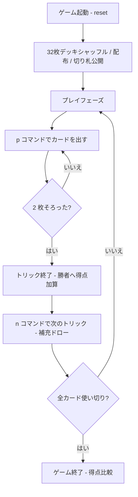

# ブリュスカンビーユ（CUI版）遊び方

## ゲーム概要

17世紀フランス生まれのトリックテイキングゲームで、ブリスコラとベジークの**双方の祖先**とされます。**2〜5人**で遊び、32枚デッキ (7-8-9-10-J-Q-K-A) を使います。

最大の特徴は**二相構造**です。**山札が残っている間は自由出し**（どのカードでも出せる）ですが、**山札と表向きの切り札を使い切ると、以降はリードスートへの追従が必須**になります。前半は補充があるので好きに捨てられ、後半は補充が無いので手元に残した札で受けるしかありません —— 前半に何を捨てたかが後半に効いてきます。

120点を取り合い、最多得点者が勝利します。

## 起動方法

```sh
go run ./cmd/trumpcards brusquembille          # 日本語で起動
go run ./cmd/trumpcards --lang en brusquembille # 英語で起動
```

## ルール

### 基本ルール

- 32枚のデッキ (7, 8, 9, 10, J, Q, K, A × 4スート) を使用
- **3人卓・5人卓では低い札 (7) を2枚抜きます。** 32 は 3 でも 5 でも割り切れず、
  そのままだと最後に手札が残って打ち切れないためです
- 各プレイヤーに 3 枚ずつ配り、次の 1 枚を表向きで山札の底に置きます (この札の**スートが切り札**)
- **前半 (山札あり)**: リードスートに従う義務はなし — どのカードでも出せます
- **後半 (山札切れ)**: リードスートを持っていれば**必ず従います**。持っていなければ自由
- 1 トリックが終わるごとに、**勝者から順に**卓を一周して 1 枚ずつ山札から補充
- 山札が尽きると表向きの切り札を最後に引き、**その時点から追従必須**に切り替わります

### カードの強さ (スート内)

**A > 10 > K > Q > J > 9 > 8 > 7**

普段のトランプと違い、**10 が K より強い**（A に次ぐ2番目）のがこのゲームの癖です。

### カードの得点

| カード | 点数 |
|-------|------|
| A (アス) | 11 |
| 10 (ディス) | 10 |
| K (ロワ) | 4 |
| Q (ダム) | 3 |
| J (ヴァレ) | 2 |
| その他 (7,8,9) | 0 |

合計 120点。

### トリックの勝者

1. **両者が切り札**: 上記スート内強さの大きい方が勝つ
2. **片方だけ切り札**: 切り札の方が勝つ
3. **両者非切り札**: リードスートで返したカード同士で強さ比べ。リードスートを切らないとそもそも勝てない

### ゲーム終了

40 枚すべてプレイし終えたらゲーム終了。

- 最多得点者が勝利
- 60-60 は引き分け

## ゲームの流れ



## コマンド一覧

| コマンド | 短縮形 | 説明 |
|----------|--------|------|
| `play <idx>` | `p` | 手札のカードを出す (インデックス指定) |
| `next` | `n` | 次のトリックへ進む |
| `hint` | `h` | ヒント表示 |
| `log` | `l` | 棋譜表示 |
| `reset` | `r` | ゲームリセット |
| `quit` | `q` | ゲーム終了 |
| `help` | `?` | ヘルプ表示 |

## 画面の見方

```
=== Brusquembille (ブリュスカンビーユ) ===
トリック: 4  山札: 25枚
トランプ (ブリュスカンビーユ): ♠K
得点: あなた=18  CPU=15
あなた: 獲得2トリック 18点 3枚
  [0]♠1  [1]♣11  [2]♥3
CPU 1: 獲得3トリック 15点 3枚
----------
Trick: ♣7 (CPU 1)
手番: あなた
play <idx>・・・カードを出す
```

- 上部: 現在のトリック番号、山札残数、表向きの切り札、両者の得点合計
- プレイヤー行: トリック獲得数、得点、手札枚数。あなたの手札はインデックス付きで全表示
- `Trick:` 行: 現在進行中のトリックに既に出されたカード
- `手番:` 行: 次に出すプレイヤー (人間 or CPU)

## 遊び方のコツ

- **must-follow がない** ので、相手が高得点 (A=11, 3=10) を出してきたら積極的に切り札で取りに行きましょう
- 自分から切り札を出すのは控えめに — 山札にある間は補充されるとはいえ、切り札は希少です
- リードする時は **0点のスモールカード** (2, 4, 5, 6, 7) を選び、得点札 (A, 3) は切り札で勝てる場面まで温存
- 山札が空になったら **残り全カードをカウント** して、相手の手札を読み切る局面に入ります
