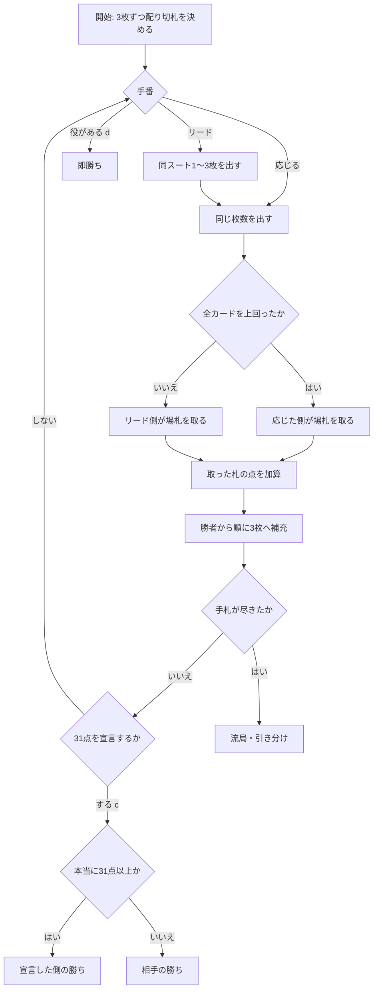

# ブラ（CUI版）遊び方

## ゲーム概要

ロシアの ace-ten 系トリックテイキングゲーム。36 枚のショートデッキ（6〜A）を使い、手札は常に 3 枚に補充されます。取った札のカード点を合計 **31 点**集め、それを**自分から宣言**すると勝ちです。

同じスートのカードは最大 3 枚まとめて出せます（**molodka**）。まとめて出すと一度に大量の点が動く反面、受けきられると全部相手に渡ります。

## 起動方法

```sh
go run ./cmd/trumpcards bura
go run ./cmd/trumpcards --lang en bura   # 英語表示
```

## ルール

- **デッキ**: 36 枚（A, 6, 7, 8, 9, 10, J, Q, K × 4 スート）
- **カード点**: A=11 / 10=10 / K=4 / Q=3 / J=2 / その他=0（デッキ全体で 120 点）
- **強さ**: A > 10 > K > Q > J > 9 > 8 > 7 > 6（**10 が K/Q/J より強い**のが特徴）
- **切札**: 山札の底のカードで決まり、表向きに置かれます。最後に引かれます
- **リード**: 同一スートを 1〜3 枚まとめて出せます
- **応じ方**: リードと**同じ枚数**を出します。**フォロー義務はありません** — 勝てない札を捨てて強い札を温存するのが駆け引きです
- **勝敗判定**: リードの各カードを、それぞれ別のカードで上回れば受けきり、場の札を全部取ります。1 枚でも上回れなければリード側が取ります
- **切札**は非切札を常に上回ります。異なる非切札スートは上回れません
- **31 点は自己申告制**: 到達しただけでは勝ちません。`c` で宣言して初めて勝ち、**足りていなければ負け**です
- **即勝ち役**: `d` で宣言します
  - **bura** — 切札 3 枚
  - **Moscow** — A 3 枚
  - **Little Moscow** — 6 が 3 枚（切札の 6 を含むこと）
  - **molodka** — 切札以外の同一スート 3 枚
- **流局**: 山札も手札も尽きて誰も宣言しなければ引き分けです

## ゲームの流れ



## コマンド一覧

| コマンド | 説明 |
|---------|------|
| `p <i> [i] [i]` | カードを出す。リードは同スート最大 3 枚 |
| `c` | 31 点到達を宣言する（足りなければ負け） |
| `d` | 手札の即勝ち役を宣言する |
| `h` | ヒントを表示する |
| `l` / `log` | 棋譜を表示する |
| `r` | ゲームをリセットする |
| `q` | 終了する |

## 画面の見方

```
トリック3 / 山札24枚
切札: ♥7
31点を集めて宣言すれば勝ち
あなた: 18点 (手札3枚)
 0:♠A 1:♠10 2:♣7
CPU: 12点 (手札3枚)
----------
あなたのリード: ♠A ♠10
手番: CPU
```

- **切札**行は表向きの指示カード。引かれた後はスート名だけが残ります
- 自分の手札には `p` で指定する添字が付きます
- CPU の手札は**枚数のみ**表示されます

## 遊び方のコツ

- **まとめ出しは諸刃**です。2 枚出せば取れる点は倍ですが、受けきられれば倍取られます。相手の切札が尽きたと読めてから使うのが安全です
- **10 は K より強い**ことを忘れないでください。K で 10 を受けようとして失敗するのが最も多い事故です
- **切札は温存**しましょう。切札はどの非切札スートも上回れる万能札なので、点の低い場面で切るのは損です
- **宣言のタイミング**が全てです。31 点に届いたら早めに `c` を打ってください。相手が先に宣言すると、こちらが何点持っていても負けます
- 逆に**届いていないのに宣言すると即負け**です。`h` で到達を確認できます
