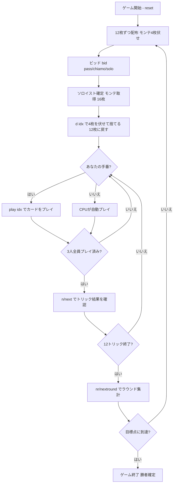

# カラブレセッラ（CUI版）遊び方

## ゲーム概要

Calabresella（Terziglio / カラブレセッラ）はイタリア・カラブリア地方で親しまれている**トリックテイキングゲーム**です。Tressette 系の**切り札なし（ノートランプ）**ゲームで、40枚デッキを3人でプレイします。1人の**ソロイスト（soloist）**が残り2人の**連合（coalition）**を相手に戦うのが特徴です。オークションで最も高い宣言をしたプレイヤーがソロイストとなり、全体の**過半数（33サードのうち18以上）**を獲得すれば勝ちです。最初に目標点（既定21点）へ到達したプレイヤーがマッチ勝利です。

## 起動方法

```sh
go run ./cmd/trumpcards calabresella
go run ./cmd/trumpcards --lang en calabresella  # 英語モード
```

## ルール

### デッキと配布

- **デッキ**: 40枚のイタリアンカード（A, 2, 3, 4, 5, 6, 7, J, Q, K × 4スート。8/9/10 は除外）。Tressette / Briscola と同じ構成です。
- **プレイヤー**: 3人（プレイヤー0 = あなた、プレイヤー1〜2 = CPU）
- **配布**: 各プレイヤー12枚（合計36枚）。残り**4枚はモンテ（monte）**として伏せられます。

### ビッド（オークション）

- 前手（forehand = ディーラーの左隣）から順に、各プレイヤーは次のいずれかを宣言します。
  - **パス（pass）**: 降りる。
  - **キアーモ（chiamo / call）**: ステーク1で名乗りを上げる。
  - **ソロ（solo）**: ステーク2で名乗りを上げる。
- 最も高い宣言をしたプレイヤーが**ソロイスト**になります。
- 全員がパスした場合は、**前手がキアーモを引き受けます**。

### モンテ交換

- オークション終了後、ソロイストは伏せられた**モンテ4枚を引き取り**（手札16枚）、**不要な4枚を伏せて捨てます**（手札12枚に戻す）。

### フォロー義務（切り札なし）

- リードスートを持っていれば**必ず従わなければなりません（must-follow）**。
- このゲームに**切り札はありません**。ボイド時は任意の札を出せます。

### カードの強さ

トリックの強さ（強い順）: **3 > 2 > A > K > Q > J > 7 > 6 > 5 > 4**。切り札がないため、リードスートで最も強い札を出したプレイヤーがトリックを取ります。

### カード点数（サード = 1/3点）

| カード | サード |
|--------|--------|
| A | **3** |
| 2, 3, J, Q, K | **各1** |
| 4, 5, 6, 7 | 0 |

- 最終トリック（ウルティマ = ultima）を取ると **+1サード**。
- 合計 **33サード = 11点** が1ディールで動きます。

### 得点計算と勝利条件

- ソロイストは**過半数（18サード以上）**を獲得すればラウンド勝利。未満なら連合の勝利。
- 宣言のステーク（キアーモ=1／ソロ=2）に応じて、ソロイストと連合の間で点数が移動します。
- **マッチ勝利**: 先に目標点（既定 **21**）に達したプレイヤーが勝利。

## ゲームの流れ



## コマンド一覧

| コマンド | 短縮形 | 説明 |
|----------|--------|------|
| `bid pass` / `bid chiamo` / `bid solo` |  | パス／キアーモ（ステーク1）／ソロ（ステーク2）を宣言 |
| `d <idx>` | `d` | モンテ交換で手札のidx番目を伏せて捨てる（4回） |
| `play <idx>` | `p` | 手札のidx番目のカードを出す |
| `next` | `n` | 次のトリックへ進む |
| `nextround` | `nr` | 次のラウンドへ進む |
| `setdifficulty <0-2>` | `sd` | CPU難易度設定（0=Easy, 1=Normal, 2=Hard） |
| `hint` | `h` | 推奨アクションを表示 |
| `log` | `l` | アクションログを表示 |
| `reset` | `r` | 新しいゲームを開始（設定保持） |
| `quit` | `q` | ゲーム終了 |
| `help` | `?` | コマンド一覧を表示 |

## 画面の見方

- **手札**: プレイ可能な札（フォロー義務でフィルタ済み）が表示されます。
- **プレイヤー情報**: 各プレイヤーの累積得点・ソロイストの表示・現在の宣言・獲得サード。
- **モンテ（公開）**: ソロイストが取得した伏せ札 4 枚。取得した時点で全員に公開される情報なので、ラウンド終了まで表示されます（Web の「モンテ（伏せ札）」パネルと同じ内容）。
- **現在のトリック**: 場に出ている札とリードプレイヤー。
- **ラウンド結果**: ソロイスト／連合それぞれの獲得サードと点数の移動。

## 遊び方のコツ

- **強い手のときだけ高く宣言せよ**: ソロイストは18サード以上取らなければ連合に点を渡すことになります。3・2・A の枚数と長いスートを見て、キアーモかソロかを判断しましょう。
- **モンテ交換で弱い札を捨てる**: 交換では点にならない 4・5・6・7 を捨て、3・2・A などの高得点札を手元に残しましょう。
- **フォロー義務を意識する**: 切り札がないため、リードスートの高札（3・2・A）でトリックを制するのが基本です。
- **最終トリック（ウルティマ）を狙う**: 最後のトリックを取ると +1サード。競った局面では終盤の1枚が勝敗を分けます。
- **連合側は協力プレイ**: あなたがソロイストでない場合、もう1人の連合と協力してソロイストの過半数達成を阻止しましょう。
