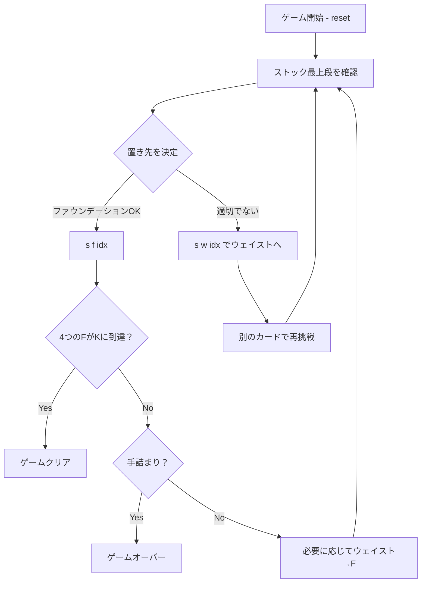

# カルキュレーション（CUI版）遊び方

## ゲーム概要

1人用のソリティア系パズルゲームです。場に A, 2, 3, 4 の4枚をファウンデーション（組札）のベースとして置き、それぞれ「1ずつ増える」「2ずつ増える」「3ずつ増える」「4ずつ増える」という等差数列の規則（mod 13）に従って K まで積み上げます。4つのウェイスト（捨て場）を自由に使いこなして、残り48枚のストックをすべて適切に処理できればゲームクリアです。

## 起動方法

```sh
go run ./cmd/trumpcards calculation
go run ./cmd/trumpcards --lang en calculation  # 英語モード
```

## ルール

- 標準52枚のデッキを使用。最初にシャッフル後、A・2・3・4 を1枚ずつ取り出してファウンデーション0〜3のベースにする。残り48枚がストック。
- ファウンデーションの積み上げ規則（mod 13）:
  - F0（+1）: A→2→3→…→Q→K
  - F1（+2）: 2→4→6→8→10→Q→A→3→5→7→9→J→K
  - F2（+3）: 3→6→9→Q→2→5→8→J→A→4→7→10→K
  - F3（+4）: 4→8→Q→3→7→J→2→6→10→A→5→9→K
- プレイヤーはストックの最上段のカードを、ファウンデーション（適切な値なら）か任意のウェイストパイルに置くことができる。
- ウェイスト最上段のカードも、値が合えばファウンデーションに送れる（ウェイスト間の移動はできない）。
- 4つのファウンデーションすべてが K に到達すればクリア。
- ストックが空になり、かつどのウェイスト最上段もファウンデーションに送れなくなった場合は手詰まり（GameOver）。

## ゲームの流れ



## コマンド一覧

| コマンド | 短縮形 | 説明 |
|----------|--------|------|
| `reset` | `r` | 新しいゲームを開始 |
| `s f <idx>` | — | ストック最上段をファウンデーション `<idx>` (0..3) に置く |
| `s w <idx>` | — | ストック最上段をウェイスト `<idx>` (0..3) に置く |
| `w <wIdx> f <fIdx>` | — | ウェイスト `<wIdx>` 最上段をファウンデーション `<fIdx>` に置く |
| `hint` | `h` | ファウンデーションへ置ける手があればヒント表示 |
| `autocomplete` | `ac` | 可能なウェイスト→ファウンデーションを自動実行 |
| `undo` | `u` | 直前の手を取り消す |
| `giveup` | `g` | ギブアップ |
| `log` | `l` | 棋譜を表示 |
| `quit` | `q` | ゲーム終了 |
| `help` | `?` | コマンド一覧を表示 |

## 画面の見方

```
==========
Calculation (カルキュレーション)
==========
[F0 +1] SPADE 1 (1/13)
[F1 +2] HEART 2 (1/13)
[F2 +3] DIAMOND 3 (1/13)
[F3 +4] CLOVER 4 (1/13)
----------
[W0] (empty)
[W1] (empty)
[W2] (empty)
[W3] (empty)
----------
ストック: 48枚 次のカード: SPADE 7
手数: 0
==========
```

- `[F0 +1]` 等がファウンデーション（ステップ数付き）。右の `(枚数/13)` が進捗。
- `[W0]`〜`[W3]` がウェイストパイル（4つ）。最上段のカードと枚数を表示。
- 「次のカード」はストック最上段の現在プレイ可能なカード。
- 「手数」はこれまでのアクション数。

## 遊び方のコツ

- 最終的に K が埋まるので、各ファウンデーションの K を最後に置くことを意識する。
- ウェイストは4つあるので、たとえば「すぐに使う予定の小さい数字」「将来の中間値」「どうしようもないカード」といった分類で使い分けるとよい。
- J（11）・Q（12）は F0 以外では中盤から後半に必要になりやすいので温存するか、対応する F の直前に置く順序を考える。
- 手詰まり前に Undo で分岐を試すのも有効。
