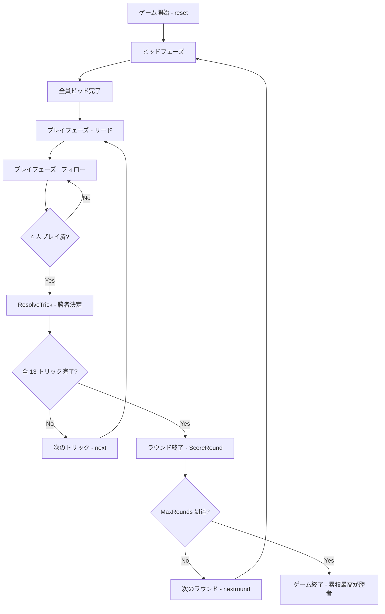

# コールブレイク（CUI版）遊び方

## ゲーム概要

Call Break は 4 人プレイのトリックテイキングゲームで、南アジアを中心に絶大な人気を誇る Spades 系統のゲームです。スペードが常に切り札で、各プレイヤーが取れると思うトリック数 (ビッド) を申告し、達成度合いに応じて得点します。標準では 5 ラウンド固定で行い、累積スコアが最高のプレイヤーが勝者となります。

## 起動方法

```sh
go run ./cmd/trumpcards callbreak
go run ./cmd/trumpcards --lang en callbreak  # 英語モード
```

## ルール

### 基本ルール

- 4 人プレイ、52 枚デッキを各 13 枚配る。
- スペードが常に切り札 (`spades broken` 後はリードに使用可)。
- ビッドフェーズで各プレイヤーが 1〜13 のビッドを宣言する (Nil ビッドは無し)。
- プレイフェーズ: リードスートに従う必要がある。リードスートを持たない場合は **必ずスペードで切らなければならない** (持っていれば)。

### 得点

スコアは内部で整数 ×10 として管理し、UI 上は小数点付きで表示する。

| 達成度 | 計算式 (内部値) | 表示例 |
|--------|---------------------------|--------|
| ビッド達成 (ぴったり) | `bid × 10` | `bid=4 → 4.0` |
| ビッド達成 (超過) | `bid × 10 + overtricks` | `bid=4・5取り → 4.1` |
| ビッド未達 | `-bid × 10` | `bid=4・3取り → -4.0` |

### ゲーム終了

- `MaxRounds` (デフォルト 5) 到達時にゲーム終了。
- 累積スコアが最も高いプレイヤーが勝者。

### CPU難易度

- Easy: ランダムビッド・ランダムプレイ。
- Normal: 手札の強さに基づくビッド、リードスート優先のフォロー。
- Hard: スペード保有数を考慮、勝てる最小カード優先などの戦略プレイ。

## ゲームの流れ



## コマンド一覧

| コマンド | 短縮形 | 説明 |
|----------|--------|------|
| `reset` | `r` | 新しいゲームを開始 (設定保持) |
| `quit` | `q` | ゲーム終了 |
| `bid <n>` | `b <n>` | ビッドを宣言 (1〜13) |
| `play <i>` | `p <i>` | 手札のインデックス `i` のカードをプレイ |
| `next` | `n` | 次のトリックへ進む |
| `nextround` | `nr` | ラウンドをスコアリングして次のラウンドへ |
| `setdifficulty <0-2>` | `sd <0-2>` | CPU 難易度設定 (0=Easy, 1=Normal, 2=Hard) |
| `setrounds <n>` | `sr <n>` | 総ラウンド数を設定 (1 以上、デフォルト 5) |
| `hint` | `h` | 推奨ビッド/カードを表示 |
| `log` | `l` | 棋譜表示 (ゲーム終了後) |

## 画面の見方

```
Call Break (コールブレイク)
ラウンド: 1 / 5  トリック: 1
スペードブレイク: なし
あなた: ビッド=未ビッド 獲得0トリック バッグ0 累積0.0点 ラウンド0.0点 13枚
[0]CLOVER 2 [1]CLOVER 5 [2]CLOVER 11 ...
CPU 1: ビッド=未ビッド 獲得0トリック バッグ0 累積0.0点 ラウンド0.0点 13枚
...
----------
ビッドフェーズ: あなたの番
b <n>・・・ビッドを宣言 (1-13)
```

- `[idx]<Suit> <Value>` 表記は手札のインデックスと内容を示す。Ace は値 1、King=13 で表示される (Spades と同じ規則)。
- `バッグ` はビッドを超えて取った余剰トリック数。未ビッド (-1) は 0 として扱う。
- スコアは内部値を `/10` して `X.Y` 形式で表示される (Call Break の小数スコア表現)。
- スペードブレイクが「なし」の場合、最初のリードでスペードは出せない。

## 遊び方のコツ

- **ビッドは控えめに**: ビッド達成の超過は +0.1 点だが、未達は -bid 点と痛い。確実に取れる枚数を読む。
- **スペードを温存**: スペードはトランプ。ボイドが見えるまで温存し、終盤の確実な勝ち札にする。
- **必ずトランプ**: リードスートを持たない場合、スペードを持っていれば切らなければならないため、スペードの使いどころを計画する。
- **ハードで CPU 観察**: Hard モードは Q 札を 50% でカウントするなど揺らぎがあるため、ビッドのブラフ余地を読み取る。
