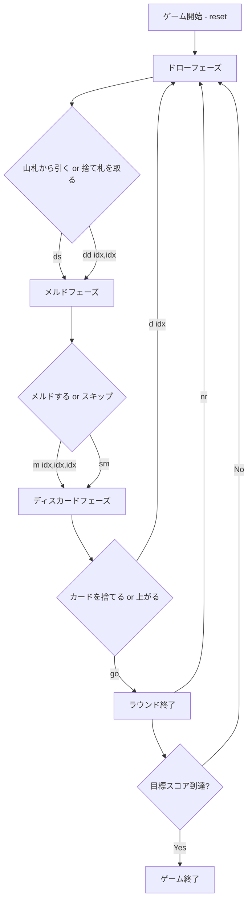

# カナスタ（CUI版）遊び方

## ゲーム概要

カナスタは2人対戦のラミー系カードゲームです。2デッキ＋4枚のジョーカー（計108枚）を使用し、同ランクのカードを集めてメルド（3枚以上の組）を作り、7枚以上のメルド「カナスタ」の完成を目指します。先に目標スコア（デフォルト5000点）に到達したプレイヤーが勝利します。

## 起動方法

```sh
go run ./cmd/trumpcards canasta
go run ./cmd/trumpcards --lang en canasta
```

## ルール

### 基本ルール

- **デッキ**: 標準52枚×2デッキ＋ジョーカー4枚＝108枚
- **配布**: 各プレイヤーに15枚
- **ワイルドカード**: 2とジョーカーはワイルド
- **赤3**: ハート3・ダイヤ3は引いた時点で自動的に場に出し、山札から補充
- **黒3**: スペード3・クローバー3は捨てるだけ（メルド不可、相手のピックアップをブロック）

### メルド

- 同ランク3枚以上で構成
- ナチュラルカード最低2枚必要
- ワイルドカードは最大3枚まで
- カナスタ: 7枚以上のメルド（ナチュラル=ワイルドなし、ミックス=ワイルドあり）

### 初回メルド最低点

累積スコアに応じて初回メルドの最低合計点が変わります:

| 累積スコア | 最低点 |
|-----------|--------|
| マイナス | 15点 |
| 0〜1499 | 50点 |
| 1500〜2999 | 90点 |
| 3000以上 | 120点 |

### 捨て札の山を取る

- トップカードと同ランクのナチュラルカード2枚（ペア）が必要
- 山全体を手札に加える
- フリーズ状態（ワイルドが捨てられた場合）でも同条件

### 得点

| カード | 点数 |
|--------|------|
| ジョーカー | 50点 |
| 2、A | 20点 |
| K〜8 | 10点 |
| 7〜4 | 5点 |
| 黒3 | 5点 |

| ボーナス | 点数 |
|----------|------|
| ナチュラルカナスタ | 500点 |
| ミックスカナスタ | 300点 |
| 上がりボーナス | 100点 |
| コンシールド上がり | 200点 |
| 赤3（1枚あたり） | 100点 |
| 赤3（4枚全部） | 800点 |

### CPU難易度

- Easy: ランダムプレイ
- Normal: 基本戦略（ペアがあれば山を取る）
- Hard: 戦略的プレイ（山のサイズを考慮）

## ゲームの流れ



## コマンド一覧

| コマンド | 短縮形 | 説明 |
|----------|--------|------|
| reset | r | ゲームをリセット |
| drawstock | ds | 山札から引く |
| drawdiscard idx,idx | dd idx,idx | 捨て札の山を取る（ナチュラルペアのインデックス） |
| meld idx,idx,idx;idx,idx,idx | m idx,...;idx,... | メルドを出す（;でグループ区切り） |
| skipmeld | sm | メルドせずにスキップ |
| discard idx | d idx | カードを捨てる |
| goout | go | 上がる（カナスタが必要） |
| nextround | nr | 次のラウンドへ |
| setdifficulty n | sd n | CPU難易度変更 (0=Easy, 1=Normal, 2=Hard) |
| setlimit n | sl n | 目標スコア変更 |
| log | l | 棋譜を表示 |
| quit | q | 終了 |
| help | ? | ヘルプを表示 |
| `reset` | `r` | 新しいゲームを開始 |
| `quit` | `q` | ゲーム終了（`exit` も同じ） |
| `help` | `?` | コマンド一覧を表示 |

## 画面の見方

```
==============================
Canasta (カナスタ)
==============================
ラウンド: 1  山札: 67枚  捨て札: 1枚
捨て札: ♠7
  山の中身: [0]♣2 [1]♥9 [2]♠K [3]♦4 [4]♣J [5]♥3 [6]♠8 [7]♦Q
  山の中身: [8]♣5 [9]♠7
You: 累積0点 ラウンド0点 15枚
  メルド[ナチュラル]: ♠K, ♥K, ♦K
  [0]♣2 [1]♠4 [2]♥5 [3]♦6 [4]♣7 ...
CPU 1: 累積0点 ラウンド0点 15枚
----------
手番: You (ドローフェーズ)
ds・・・山札から引く
dd <idx,idx>・・・捨て札の山を取る
==============================
```

## 遊び方のコツ

- カナスタ（7枚以上のメルド）の完成を最優先にしましょう
- ナチュラルカナスタ（ワイルドなし）は500点のボーナス
- 捨て札の山が大きい時は積極的に取りましょう。**山の中身は全部表示されます**（山ごと取るルールなので公開情報です）。8 枚ごとに折り返して並びます
- ワイルドカードを捨てると山がフリーズするので注意
- 黒3を捨てると相手の山取りをブロックできます
- 赤3は自動的に場に出るので手札管理に注意
