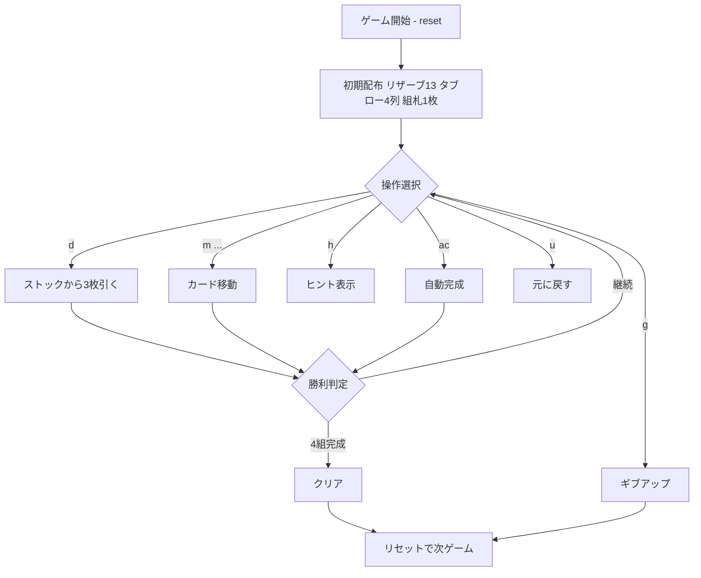

# キャンフィールド（CUI版）遊び方

## ゲーム概要

キャンフィールド（Canfield）は1人用ソリティア。13枚のリザーブ、4列のタブロー、組札を使い、ベースランクから始めてすべてのカードを積み上げることを目指す。

## 起動方法

```sh
go run ./cmd/trumpcards canfield
go run ./cmd/trumpcards --lang en canfield
```

## ルール

- タブロー: 赤黒交互、降順、ラップアラウンド（K→A→...）
- 組札: 同スート、ベースランクから昇順にラップアラウンド
- 空のタブロー列はリザーブから自動補充
- ストックは3枚ずつウェイストへめくる。リサイクル可

## ゲームの流れ



## コマンド一覧

| コマンド | 短縮形 | 説明 |
|----------|--------|------|
| `d` / `draw` | `d` | ストックから3枚引く |
| `m w t <col>` | — | ウェイストからタブロー列へ |
| `m w f` | — | ウェイストから組札へ |
| `m r t <col>` | — | リザーブからタブロー列へ |
| `m r f` | — | リザーブから組札へ |
| `m t <col> f` | — | タブローから組札へ |
| `m t <col> <idx> t <col>` | — | タブロー間移動 |
| `g` / `giveup` | `g` | ギブアップ |
| `hint` | `h` | ヒント |
| `ac` / `autocomplete` | `ac` | 自動完成 |
| `u` / `undo` | `u` | 元に戻す |
| `log` | `l` | 棋譜表示 |
| `reset` | `r` | リセット |
| `quit` | `q` | 終了 |
| `help` | `?` | コマンド一覧を表示 |

## 画面の見方

```
==========
Canfield (キャンフィールド)
==========
Base rank: 5
組札はベースランクから始まり、Kの次はAへ循環します
Foundations: [♠5] [♥-] [♦-] [♣-]
Reserve(12): [♣K]
Tableau:
  0: ♥Q ♠J
  1: ♦10
  2: ♣9
  3: ♥8
Stock(21) / Waste(3): ... [♠4]
```

- **Foundations**: 4つの組札。ベースランクから昇順に積む
- **Reserve**: 残り枚数とトップ1枚。タブロー空列を自動補充
- **Tableau**: 4列。赤黒交互・降順で重ねる
- **Stock / Waste**: 山札の残り枚数とウェイストのトップカード
