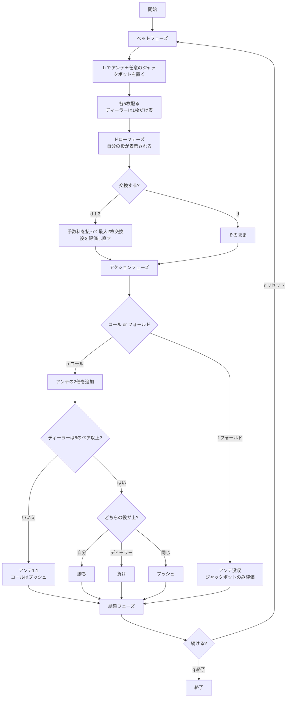

# カリビアンドローポーカー（CUI版）遊び方

## ゲーム概要

5枚のカードでディーラーと勝負するカジノポーカーです。カリビアンスタッドに**ドロー（交換）**を足した卓で、勝負を決める前に手札のうち最大2枚を引き直せます。

交換は無料ではなく、アンテと同額の手数料がかかります。**タダなら常に引くのが正解になってしまう**ので、料金があることで「引くか、そのまま行くか」という判断に意味が出ます。

## 起動方法

```sh
go run ./cmd/trumpcards caribbeandraw
go run ./cmd/trumpcards --lang en caribbeandraw   # 英語モード
```

## ルール

### 基本ルール

- 52枚のトランプ（ジョーカーなし）を使用
- プレイヤーとディーラーにそれぞれ5枚ずつ配る。ディーラーは1枚だけ表向き
- **配られた後、最大2枚まで交換できる**（手数料はアンテと同額。交換しなければ無料）
- 交換後、コール（アンテの2倍を追加）かフォールド（アンテ没収）かを決める
- **ディーラーは「8のペア以上」でクオリファイ**する

### カリビアンスタッドとの違い

| | カリビアンスタッド | カリビアンドロー |
|---|---|---|
| 交換 | 無し | **最大2枚**（手数料 = アンテ） |
| クオリファイ条件 | ペア以上、または A-K ハイ | **8のペア以上** |
| フェーズ数 | 3（ベット→アクション→結果） | **4**（ベット→**ドロー**→アクション→結果） |

**A-K ハイはここではクオリファイしません。** スタッドの感覚で降りずに待つと、勝負に応じてもらえる回数が変わります。なおクオリファイ判定でエースは14として数えるので、エースのペアはきちんと通ります。

### 勝敗と配当

| 条件 | 結果 |
|------|------|
| ディーラーがクオリファイせず | アンテ1:1、コールはプッシュ（**必ずプラス**） |
| 自分の役 > ディーラーの役 | 勝ち（アンテ1:1、コールは役に応じた配当） |
| 自分の役 < ディーラーの役 | 負け（アンテ・コールとも没収） |
| 同じ役・同じキッカー | プッシュ（両方返却） |

ディーラーが降りた場合、アンテ・コールで3倍賭けて4倍戻るので、手がどれだけ悪くても取り分は増えます。結果表示も「勝ち」になります。

**コール配当（役に応じた倍率）:**

| 役 | 倍率 |
|----|------|
| ロイヤルフラッシュ | 50:1 |
| ストレートフラッシュ | 20:1 |
| フォーカード | 10:1 |
| フルハウス | 5:1 |
| フラッシュ | 4:1 |
| ストレート | 3:1 |
| スリーカード | 2:1 |
| ツーペア以下 | 1:1 |

引ける卓では役が完成しやすいので、スタッドより薄い配当表になっています。

**プログレッシブジャックポット（任意のサイドベット）:**

| 役 | 倍率 |
|----|------|
| ロイヤルフラッシュ | 10000:1 |
| ストレートフラッシュ | 2000:1 |
| フォーカード | 200:1 |
| フルハウス | 50:1 |
| フラッシュ | 25:1 |

**交換後の手で判定します。** 引いて完成させたロイヤルフラッシュも本物として払いますし、フォールドしても評価されます。

## ゲームの流れ



## コマンド一覧

| コマンド | 短縮形 | 説明 |
|---------|--------|------|
| `bet <アンテ> [ジャックポット]` | `b` | ベットしてカードを配る |
| `draw [番号...]` | `d` | 最大2枚交換（手数料 = アンテ）。**番号は1始まり**。番号なしで交換しない |
| `play` | `p` | コール（アンテの2倍を追加して勝負） |
| `fold` | `f` | フォールド（アンテを失う。ジャックポットは評価される） |
| `hint` | `h` | 助言を表示 |
| `log` | `l` | 棋譜（アクションログ）を表示 |
| `reset` | `r` | ゲームをリセット |
| `help` | `?` | ヘルプを表示 |
| `quit` | `q` | 終了 |

**番号は画面と同じ1始まり**です。`d 1 3` なら左から1枚目と3枚目を交換します。

## 画面の見方

```
----------
チップ: 890
フェーズ: ドロー（最大2枚交換）
最大2枚まで交換できます（手数料 100）。`d 1 3` で1枚目と3枚目を交換、`d` だけで交換しません。
--- あなた ---
ハンド: Two Pair
SPADE 11,HEART 11,CLOVER 7,SPADE 7,HEART 3
--- ディーラー ---
DIAMOND 12,??,??,??,??
----------
```

ドローフェーズでは**今の役が表示されます**。これが「どれを捨てるか」を決める材料です。ディーラーは1枚だけ表向きで、残りは `??` のまま。

```
----------
チップ: 590
フェーズ: 結果
--- あなた ---
ハンド: One Pair
DIAMOND 10,HEART 11,CLOVER 11,SPADE 7,HEART 3
--- ディーラー ---
ハンド: One Pair
（クオリファイ）
DIAMOND 12,HEART 10,CLOVER 1,HEART 4,DIAMOND 1
----------
アンテ: 100
プレイ: 200
交換手数料: 100
合計払戻し: 400
----------
```

結果フェーズでディーラーの手札とクオリファイの有無が開示されます。**交換手数料は配当ではない**ので配当行には含まれず、別の行として出ます（これが無いと、引いたラウンドだけ残高の引き算が合わなく見えます）。
