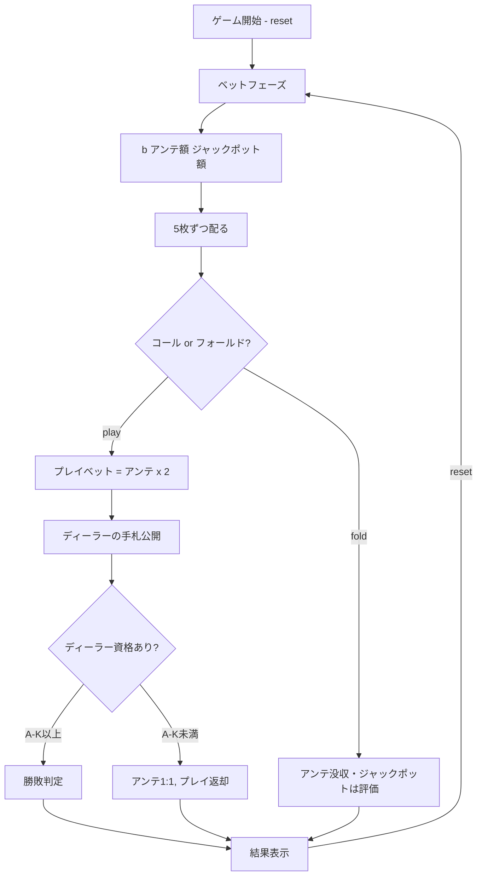

# カリビアンスタッドポーカー（CUI版）遊び方

## ゲーム概要

5枚のカードでディーラーと勝負するカジノポーカーです。アンテベットとオプションのプログレッシブジャックポットサイドベットを組み合わせてプレイします。コール時はアンテの2倍を追加で賭けます。

## 起動方法

```sh
go run ./cmd/trumpcards caribbeanstud
go run ./cmd/trumpcards --lang en caribbeanstud   # 英語モード
```

## ルール

### 基本ルール

- 52枚のトランプ（ジョーカーなし）を使用
- プレイヤーとディーラーにそれぞれ5枚ずつ配る
- プレイヤーはアンテベット後、自分の手札を見てコール（プレイ）またはフォールドを決定
- ディーラーは「Aと Kを含む」または「ペア以上」で「クオリファイ（資格あり）」

### 手札ランキング（強い順）

| ランク | 説明 |
|--------|------|
| ロイヤルフラッシュ | 同じスートのA-K-Q-J-10 |
| ストレートフラッシュ | 同じスートの連続5枚 |
| フォーカード | 同じランク4枚 |
| フルハウス | スリーカード+ペア |
| フラッシュ | 同じスートの5枚 |
| ストレート | 連続する5枚 |
| スリーカード | 同じランク3枚 |
| ツーペア | ペア2組 |
| ワンペア | 同じランク2枚 |
| ハイカード | 上記以外 |

### ベットタイプと配当

**アンテ/プレイベット:**

| 条件 | アンテ配当 | プレイ配当 |
|------|-----------|------------|
| ディーラー不資格 | 1:1 | プッシュ（返却） |
| プレイヤー勝ち | 1:1 | 役に応じて支払い |
| ディーラー勝ち | 没収 | 没収 |
| 引き分け | プッシュ | プッシュ |

**プレイ配当倍率（プレイヤー勝ち時）:**

| 役 | 配当 |
|----|------|
| ロイヤルフラッシュ | 100:1 |
| ストレートフラッシュ | 50:1 |
| フォーカード | 20:1 |
| フルハウス | 7:1 |
| フラッシュ | 5:1 |
| ストレート | 4:1 |
| スリーカード | 3:1 |
| ツーペア | 2:1 |
| ワンペア以下 | 1:1 |

**プログレッシブジャックポット（サイドベット）:**

| 役 | 配当 |
|----|------|
| ロイヤルフラッシュ | 20000x |
| ストレートフラッシュ | 5000x |
| フォーカード | 500x |
| フルハウス | 100x |
| フラッシュ | 50x |

## ゲームの流れ



## コマンド一覧

| コマンド | 短縮形 | 説明 |
|----------|--------|------|
| `reset` | `r` | 新しいゲームを開始 |
| `bet <amount> [jackpot]` | `b <amount> [jackpot]` | アンテベット（金額と任意のジャックポット額を指定） |
| `play` | `p` | プレイベットを置いてディーラーと勝負（コール） |
| `fold` | `f` | フォールド（アンテを放棄） |
| `log` | `l` | アクションログ（棋譜）を表示 |
| `quit` | `q` | ゲーム終了 |
| `help` | `?` | コマンド一覧を表示 |

### コマンド例

- `r` → ゲームリセット
- `b 100` → 100チップをアンテベット（ジャックポットなし）
- `b 100 10` → 100チップをアンテベット、10チップをジャックポット
- `p` → コール（アンテの2倍のプレイベット）
- `f` → フォールド
- `l` → 棋譜を表示
