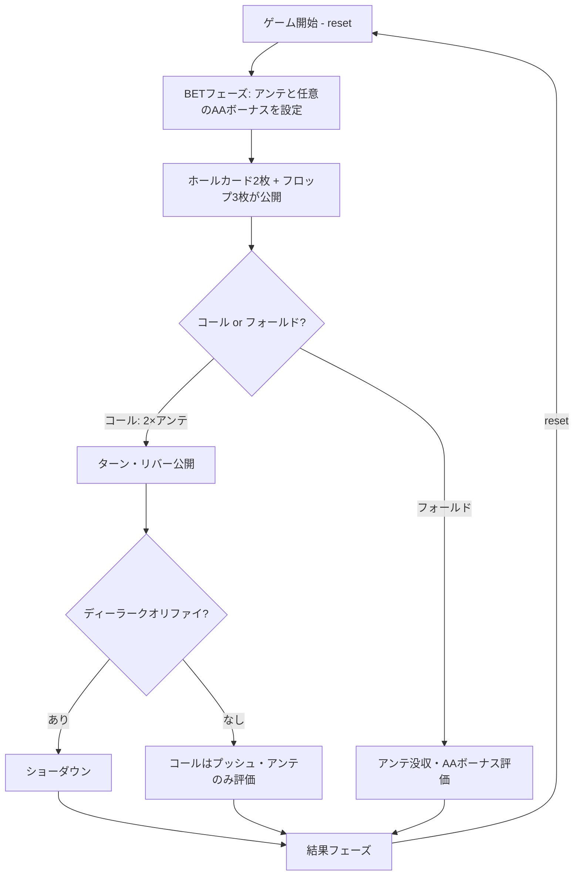

# カジノホールデム（CUI版）遊び方

## ゲーム概要

ディーラーと1対1で対戦するカジノ版テキサスホールデムの簡易版です。プレイヤーとディーラーは2枚のホールカードを受け取り、5枚のコミュニティカードを使って最良の5枚役を作ります。アンテベットの後、フロップ（3枚）を見た時点でコール（アンテの2倍）かフォールドの2択。コールするとターン・リバーが一気に公開されてショーダウンとなります。

## 起動方法

```sh
go run ./cmd/trumpcards casinoholdem
go run ./cmd/trumpcards ch                       # 短縮形エイリアス
go run ./cmd/trumpcards --lang en casinoholdem   # 英語モード
```

## ルール

### 基本ルール

- 52枚のトランプ（ジョーカーなし）を使用
- プレイヤーとディーラーにそれぞれ2枚のホールカード、共有のコミュニティカード5枚を配る
- アンテベット必須＋AAボーナスサイドベット任意
- ベット後、ホールカードとフロップ3枚が同時に公開される
- フロップを見て「コール（アンテの2倍）」または「フォールド」を選択
- コールするとターン・リバーが公開されショーダウン
- ディーラーは「ペア4以上」でクオリファイ。クオリファイしない場合、アンテはハンドランクに応じた配当を支払い、コールベットはプッシュ（返却）

### ハンドランキング（強い順）

| ランク | 説明 |
|--------|------|
| ロイヤルフラッシュ | 同じスートのA-K-Q-J-10 |
| ストレートフラッシュ | 同じスートの連続5枚 |
| フォーカード | 同じランク4枚 |
| フルハウス | スリーカード+ペア |
| フラッシュ | 同じスートの5枚 |
| ストレート | 連続する5枚 |
| スリーカード | 同じランク3枚 |
| ツーペア | ペア2組 |
| ワンペア | 同じランク2枚 |
| ハイカード | 上記以外 |

### アンテ配当

プレイヤーが勝った場合（またはディーラーノークオリファイ時）に支払い。

| ハンド | 配当 |
|--------|------|
| ロイヤルフラッシュ | 100:1 |
| ストレートフラッシュ | 20:1 |
| フォーカード | 10:1 |
| フルハウス | 3:1 |
| フラッシュ | 2:1 |
| その他（ストレート以下） | 1:1 |

### コールベット配当

| 結果 | 配当 |
|------|------|
| ディーラークオリファイ＆プレイヤー勝ち | 1:1 |
| ディーラーノークオリファイ | プッシュ（返却） |
| ディーラークオリファイ＆引き分け | プッシュ |
| ディーラークオリファイ＆敗北 | 没収 |

### AAボーナス（サイドベット）

プレイヤーの2枚＋フロップ3枚＝5枚の役で評価。

| ハンド | 配当 |
|--------|------|
| ロイヤルフラッシュ | 100:1 |
| ストレートフラッシュ | 50:1 |
| フォーカード | 40:1 |
| フルハウス | 30:1 |
| フラッシュ | 20:1 |
| ストレート | 10:1 |
| スリーカード | 8:1 |
| ツーペア | 7:1 |
| エースペア | 7:1 |

エースペア未満は元金没収となります。

## ゲームの流れ



## コマンド一覧

| コマンド | 短縮形 | 説明 |
|----------|--------|------|
| `bet <ante> [bonus]` | `b` | アンテとオプションのAAボーナスをベット |
| `call` | `c` | コール（アンテの2倍） |
| `fold` | `f` | フォールド |
| `reset` | `r` | 新しいゲームを開始 |
| `log` | `l` | アクションログを表示 |
| `quit` | `q` | ゲーム終了 |
| `help` | `?` | コマンド一覧を表示 |

## 画面の見方

```
----------
チップ: 1000
フェーズ: FLOP
--- BOARD ---
S12,S11,S10
--- PLAYER ---
現在の役: Royal Flush
S01,S13
--- DEALER ---
??,??
----------
```

- `現在の役`: 手札2枚＋フロップ3枚での役。コール／フォールドを決める材料で、ターン・リバーが開くと変わります
- `--- DEALER ---` の `??`: ショーダウンまでディーラーの2枚は伏せられています

## 遊び方のコツ

- ペア以上の役ならコール推奨（ディーラーがクオリファイしなくてもアンテ1:1以上を確保できる）
- ホールカードが完全に外れていても、フラッシュドロー（4枚スーテッド）やストレートドローがある場合はコール検討
- ノーペアでドローもない場合はフォールドが堅実。期待値はマイナス
- AAボーナスはハウスエッジが高い（〜6%）ので長期的にはマイナス。エンタメ目的で
