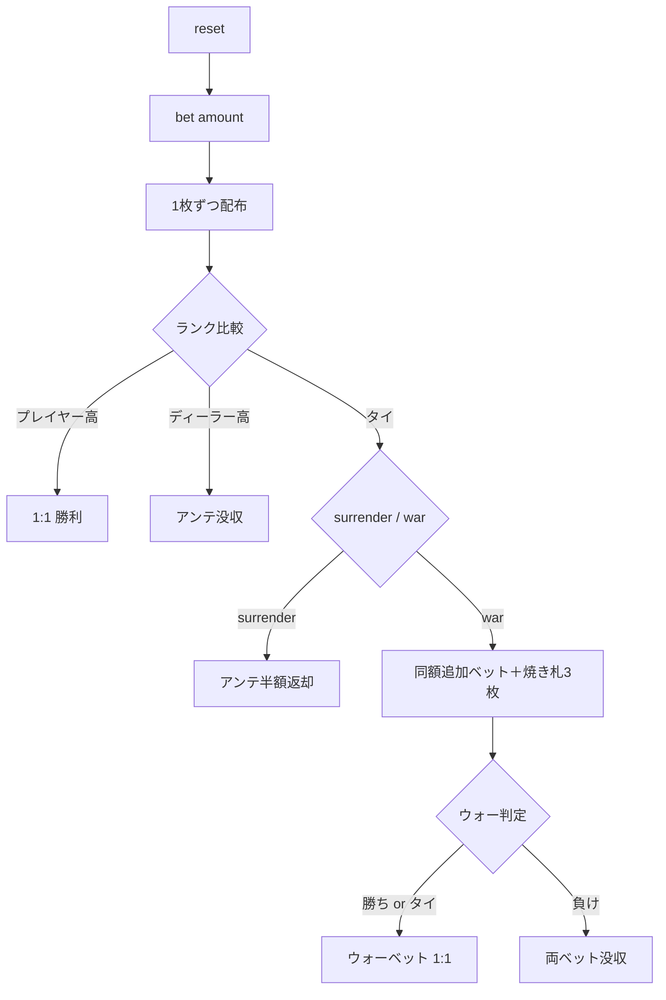

# カジノウォー（CUI版）遊び方

## ゲーム概要

カジノウォー（Casino War）は、プレイヤー対ディーラーのシンプルなカジノカードゲームです。1 枚ずつ配られたカードのランクが高い方が勝ちで、タイの場合はサレンダーかウォーを選びます。

## 起動方法

```sh
go run ./cmd/trumpcards casinowar
go run ./cmd/trumpcards --lang en casinowar
```

## ルール

### 基本ルール

1. プレイヤーがアンテをベットします（最低 10、10 単位）。
2. プレイヤーとディーラーに 1 枚ずつ表向きに配られます。
3. ランクが高い方が勝ち。A=14 高、2 が最弱。スートで順位はつきません。
4. プレイヤーが勝てばアンテに対して 1:1、負ければアンテを没収。
5. タイの場合は `surrender`（半額返却で終了）か `war`（同額追加ベットして再勝負）を選択。
   - チップがアンテに足りないときは `war` を選べません。画面にその旨が先に表示されます。
6. ウォー後はプレイヤーが勝ち or タイならウォーベットに 1:1 でアンテはプッシュ、負ければ両ベット没収。

### 配当一覧

| 結果 | 配当 |
|------|------|
| 初手でプレイヤー勝ち | アンテに対して 1:1 |
| 初手でディーラー勝ち | アンテ没収 |
| タイ → サレンダー | アンテの半額返却（半額没収） |
| タイ → ウォー → プレイヤー勝ち or タイ | ウォーベットに 1:1、アンテはプッシュ |
| タイ → ウォー → ディーラー勝ち | アンテとウォーベットの両方を没収 |

## ゲームの流れ



## コマンド一覧

| コマンド | 短縮形 | 説明 |
|----------|--------|------|
| `reset` | `r` | 新しいゲームを開始 |
| `bet <amount>` | `b <amount>` | アンテをベット |
| `surrender` | — | タイ時にアンテの半額を取り戻して終了 |
| `war` | — | タイ時に同額を追加ベットして再勝負 |
| `log` | — | 棋譜を表示 |
| `quit` | `q` | ゲーム終了 |
| `help` | `?` | コマンド一覧を表示 |

## 画面の見方

```
----------
chips: 900
phase: TIE DECISION
ante: 100
--- INITIAL ---
player: H7
dealer: S7
----------
```

- `chips` — 手持ちチップ
- `phase` — 現在のフェーズ（BET / INITIAL DEALT / TIE DECISION / WAR DEALT / END）
- `ante` / `warBet` — 現在のベット
- `INITIAL` / `BURN` / `WAR` — 配られたカード（焼き札はウォー宣言時のみ）

## 遊び方のコツ

- 数学的にはサレンダー（ハウスエッジ約 3.7%）よりウォー（約 2.88%）が有利です。タイのときは常に `war` が基本戦略です。
- アンテは 10 の倍数のみ受け付けます（半額返却での端数を防ぐため）。
- ウォーで負けるとアンテとウォーベットの両方を失うため、所持チップが少ないときは `surrender` も検討してください。
