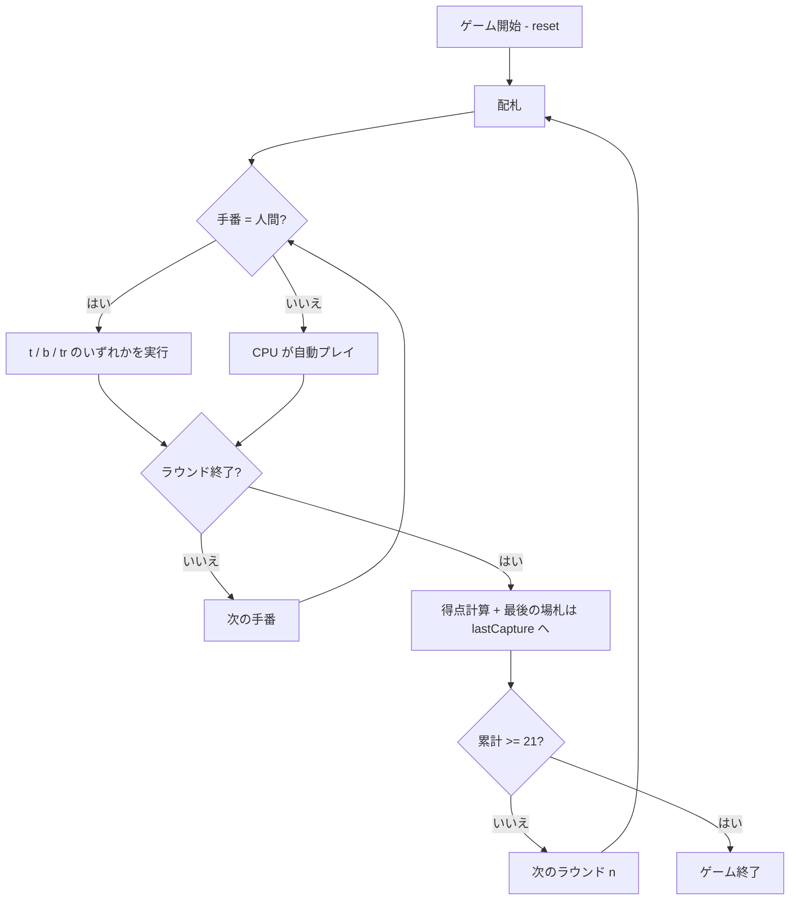

# カッシーノ（CUI版）遊び方

## ゲーム概要

カッシーノ (Cassino) は 4 人用の「フィッシング系」カードゲーム。標準 52 枚デッキを使い、手札と場札を合わせたり足し算で組み合わせたりして札を獲得します。累計 21 点を先取したプレイヤーの勝ちです。

## 起動方法

```sh
go run ./cmd/trumpcards cassino
go run ./cmd/trumpcards --lang en cassino   # 英語モード
```

## ルール

### 基本ルール

- プレイヤーは 4 人 (あなた + CPU 3 人)。
- 各ラウンドで各プレイヤーに 4 枚ずつ配札。最初のラウンドのみ場にも 4 枚公開する。
- 手番では手札 1 枚を選び、以下 3 つのいずれかを行う:
  - **Take (取る)**: 合計値が手札と一致する場札を複数枚まとめて取る。絵札 (J/Q/K) は同ランクだけ取れる。
  - **Build (ビルド)**: 手札 + 場札で合計 `value` (2〜10) を宣言し、同じ値の手札をキープして次以降で捕獲する。
  - **Trail (場に置く)**: 捕獲せずに手札 1 枚を場に置く。自分が保有するビルドが残ってる時は置けない。
- 全員の手札が尽きたら次のパックを配る (初回以外は場には足さない)。デッキが尽きたら「最後に捕獲したプレイヤー」が残りの場札を受け取る (スイープ扱いではない)。

### 得点 (1 ラウンドあたり)

- 最多カード: 3 点 (同数なら誰もなし)
- 最多スペード: 1 点
- 10♦ (ビッグカシノ): 2 点
- 2♠ (リトルカシノ): 1 点
- エース 1 枚につき: 1 点
- スイープ (場を空にした) 1 回につき: 1 点

### ゲーム終了

累計 21 点以上に到達したプレイヤーが出た時点で終了。複数同時到達なら全員勝者。

### CPU 難易度

- 0: Easy (ランダムな合法手)
- 1: Normal (貪欲: 得点スコアが最大の手)
- 2: Hard (Normal + 相手へ点を渡さないよう trail を避ける)

## ゲームの流れ



## コマンド一覧

| コマンド | 短縮形 | 説明 |
|----------|--------|------|
| `reset` | `r` | 新しいゲームを開始 |
| `next` | `n` | 次のラウンドを開始 |
| `take <h> <t...> [b <bi...>]` | `t ...` | 手札 h 番で場札 / ビルドを捕獲 |
| `build <h> <value> <t...>` | `b ...` | 手札 h と場札で `value` のビルドを作成 |
| `trail <h>` | `tr <h>` | 手札 h を場に置く |
| `setdifficulty <0-2>` | `sd <0-2>` | CPU 難易度を変更 |
| `setrule <key> <0\|1>` | `sr` | ルール切替 (`multibuild` / `sweepbonus`) |
| `log` | `l` | 棋譜を表示 |
| `quit` | `q` | ゲーム終了 |
| `help` | `?` | ヘルプを表示 |

## 画面の見方

```
==========
Cassino (カッシーノ)
==========
You (human): 手札4枚 / 捕獲0枚 / スイープ0 / 累計0点
  [0] ♠3 [1] ♥7 [2] ♦10 [3] ♣Q
CPU 1: 手札4枚 / 捕獲0枚 / スイープ0 / 累計0点
CPU 2: ...
CPU 3: ...
----------
場: ♠2 ♦5 ♥8 ♣J
[ビルド]
  (なし)
手番: You (human)
t <hand> <tbl...> で捕獲 / b <hand> <value> <tbl...> でビルド / tr <hand> で場に置く
```

## 遊び方のコツ

- 10♦・2♠・エース・スペードはできるだけ自分で取る (ポイント)。
- スイープを狙って場を空にできれば +1 点。
- 強い札を早めに trail しない (相手に easy take を与えない)。
- ビルドは「同じ値の手札が手元にある時だけ」作れる。宣言値を相手に奪われるリスクと相談。
