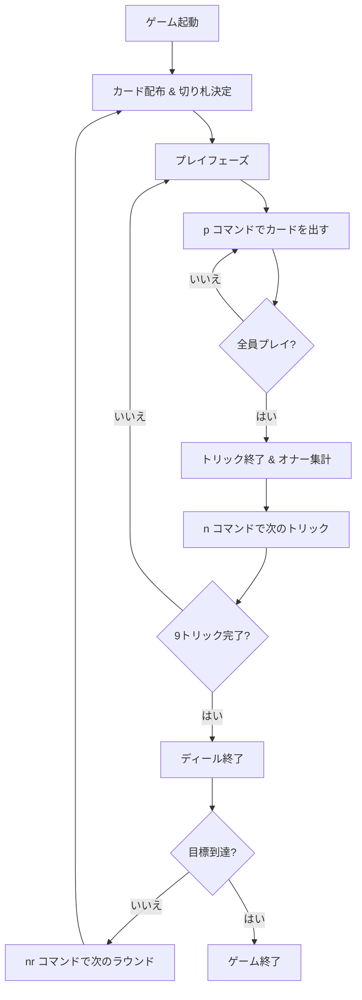

# キャッチ・ザ・テン（CUI版）遊び方

## ゲーム概要

スコットランド発祥の36枚デッキを使う4人プレイ（あなた + CPU3人）の2vs2パートナー戦トリックテイキングゲームです。スコッチ・ホイスト（Scotch Whist）とも呼ばれます。ビッドフェーズはなく、毎ディール決まる切り札（トランプ）と、トリックで捕獲した切り札のオナーの合計で得点します。先に目標ポイントに到達したチームが勝利します。

## 起動方法

```sh
go run ./cmd/trumpcards catchten          # 日本語で起動
go run ./cmd/trumpcards --lang en catchten # 英語で起動
```

## ルール

### 基本ルール

- 36枚のカード（各スート 6・7・8・9・10・J・Q・K・A）を4人に9枚ずつ配ります
- ディーラーの最後のカードのスートがそのディールの切り札（トランプ）になります
- フォロースート必須（リードされたスートのカードを持っていればそれを出す）
- 切り札は常にリードスートに勝ちます

### カードの強さ

- 切り札スートは J が最強で、続いて A・K・Q・10・9・8・7・6 の順です
- その他のスートは A が最強で、K・Q・10・9・8・7・6 と下がります

### チーム

- 席0と席2がチーム0（あなたはチーム0）
- 席1と席3がチーム1

### 得点

トリックを取ったプレイヤーは、そのトリックに含まれる切り札のオナーを獲得します（切り札以外は0点）。

- J=11、10=10、A=4、K=3、Q=2（各ディール合計30点）
- 複数ディールを行い、先に目標ポイント（デフォルト41）に到達したチームが勝利
- 両チームが同じディールで目標に到達した場合は合計が高い方が勝ち。完全に同点の場合は引き分け

## ゲームの流れ



## コマンド一覧

| コマンド | 短縮形 | 説明 |
|----------|--------|------|
| `play <idx>` | `p` | 手札のカードを出す（インデックス指定） |
| `next` | `n` | 次のトリックへ進む |
| `nextround` | `nr` | 次のディールへ進む |
| `setdifficulty <0-2>` | `sd` | CPU難易度設定 (0=Easy, 1=Normal, 2=Hard) |
| `setlimit <n>` | `sl` | 目標ポイント設定 |
| `hint` | `h` | ヒント表示 |
| `log` | `l` | 棋譜表示 |
| `reset` | `r` | ゲームリセット |
| `quit` | `q` | ゲーム終了 |
| `help` | `?` | ヘルプ表示 |

## 画面の見方

```
=== Catch the Ten ===
Round 1 | Team0= 12 - Team1= 8 | Target= 41
Trump= ♥
----------
Trick 4=  [0]♠5  [1]♠K  [2]♠3  [3]?
Lead= ♠                  You are player 0 (Team0)
----------
Your hand=
  [0]♠9  [1]♣4  [2]♦J  [3]♥10  [4]♥A  [5]♣Q  ...

Play a card (p <idx>)=
```

- `Trump=` はそのディールの切り札スートです。切り札では J が最強です。
- `Trick` 行はテーブル上の現在トリックで、各席のプレイ状況を示します。
- `Your hand=` のインデックスは `p <idx>` で指定できます。

## 遊び方のコツ

- 切り札の J と 10 は最大の得点源です。確実に取れる場面で出すか、温存しましょう。
- パートナー（席2）のリードをよく観察し、勝っているトリックに切り札のオナーを重ねます。
- 切り札では J が最強なので、A や K でリードしても J でさらわれる点に注意しましょう。
- `h` コマンドでヒントを参照し、迷ったときの指針にできます。
```

