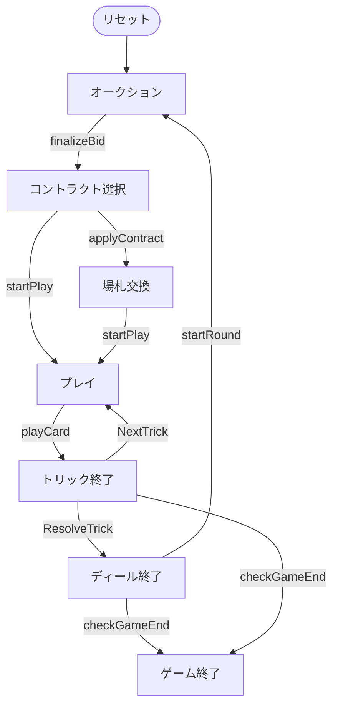

# チェゴ（CUI版）遊び方

## ゲーム概要

Cego（チェゴ）はドイツ・バーデン地方の4人用**タロックゲーム（トリックテイキング）**です。54枚のタロックデッキ（4スート × 8枚、切り札21枚、スキュース）を使い、あなた（プレイヤー0）はオークションに参加します。デクレアラーは**チェゴ**か**ハントシュピール**のコントラクトを選び、1人で残り3人と**1対3**で戦います。

## 起動方法

```sh
go run ./cmd/trumpcards cego
go run ./cmd/trumpcards --lang en cego  # 英語モード
```

## ルール

### デッキと配布

- **デッキ**: 54枚。
  - **スート札**: ♠♥♦♣ の4スート × 各8枚（1〜4、J/C/Q/K）。
  - **切り札**: 番号1〜21の21枚。数字が大きいほど強い。
  - **スキュース**: 最強の切り札1枚。
- **プレイヤー**: 4人（プレイヤー0 = あなた、CPU1〜3）。各11枚。
- **場札（チェゴ / blind）**: 場に伏せた10枚。中身は公開されません。

### オークション（入札）

パスするか**プレイを宣言**します。最初にプレイを宣言した人がデクレアラー。全員パスならディーラーの左隣が強制デクレアラーです。

### コントラクト選択

- **チェゴ（Cego）**: 手札を1枚だけ残して残り10枚を伏せ、10枚の場札を手に取ります（勝負手）。
- **ハントシュピール（Handspiel）**: 配られた手札のまま戦います。場札は対戦側の得点になります。

### 場札交換（チェゴのみ）

チェゴを選んだら、**手元に残す1枚**を指定します。残り10枚を伏せ、場札10枚を手札に加えます。

### プレイ

リードスートにマストフォロー。フォローできなければ切り札を出し、それも無ければ任意の札。最も高い切り札（無ければリードスートの最高札）がトリックを取ります。

### 得点

デクレアラー単独の獲得カードポイントが過半（54点以上）なら成功、届かなければ失敗。ゼロサム（1対3）で精算します。規定ディール後に累計得点が最多のプレイヤーが勝者です（同点は引き分け）。

## ゲームの流れ

ゲームの進行は `internal/domain/Cego.go` のフェーズ機械そのものです。各ノードは同ファイルの `CegoPhase` 定数、矢印ラベルはその遷移を行うメソッド名です。



## コマンド一覧

| コマンド | 短縮形 | 説明 |
|----------|--------|------|
| `bid play` |  | プレイを宣言 |
| `pass` |  | オークションでパス |
| `cego` |  | コントラクトをチェゴにする |
| `handspiel` |  | コントラクトをハントシュピールにする |
| `discard <i>` |  | チェゴ交換で手元に残す1枚を選ぶ |
| `play <idx>` |  | カードをプレイ |
| `next` | `n` | 次のトリックへ |
| `nextround` | `nr` | 次のディールへ |
| `hint` | `h` | ヒントを表示 |
| `reset` | `r` | ゲームをリセット |
| `quit` | `q` | 終了 |
| `help` | `?` | コマンド一覧を表示 |

## 画面の見方

実際の出力例です。配りは毎回シャッフルされるので、カードの並びは実行ごとに変わります。

```
==========
チェゴ
==========
ディール: 1  トリック: 0  コントラクト: -
あなた (対戦側): 11 枚  得点: 0  トリック: 0
[0]♠2  [1]♠K  [2]♣C  [3]♣Q  [4]♥K  [5]♦3  [6]T6  [7]T11  [8]T15  [9]T20  [10]T21
CPU 1 (対戦側): 11 枚  得点: 0  トリック: 0
CPU 2 (対戦側): 11 枚  得点: 0  トリック: 0
CPU 3 (対戦側): 11 枚  得点: 0  トリック: 0
----------
オークション — 手番: あなた  (最高: プレイ)
bid play ... 入札  |  pass ... パス
==========
```

- **1〜3行目**: ゲーム名の見出し
- **ディール / トリック / コントラクト**: 何ディール目か、そのディールで何トリック消化したか、確定したコントラクト（未確定なら `-`）
- **プレイヤー行**: 各席の陣営（宣言者側／対戦側）、残り手札枚数、獲得点、獲得トリック数
- **`[i]` 付きの行**: あなたの手札。`play <idx>` の `<idx>` はこの番号
  - `♠ ♣ ♥ ♦` は通常スート、`T1`〜`T21` はタロック（切り札）、`Sküs` は最強の切り札
- **`----------` の下**: 現在のフェーズと手番、そのフェーズで打てるコマンドの早見
