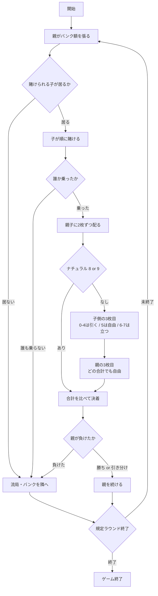

# シュマン・ド・フェール（CUI版）遊び方

## ゲーム概要

シュマン・ド・フェール（Chemin de Fer）はバカラの原型にあたるフランスのバンキングゲームです。6デッキ312枚のシューを使い、6席（席0があなた、他はCPU）で遊びます。

**ハウスではなく席の1つが親（バンカー）になります。** 親は自分の資金でバンク額を張り、他の席（子＝ポンテ）がそれを分け合って賭けます。親は勝っている限り親を続けられ、負けるとバンクが隣の席へ渡ります。

現在広まっているバカラ（プント・バンコ）との決定的な違いは**3枚目の引き方**です。プント・バンコでは親も子も引き方が表で固定されていますが、シュマン・ド・フェールで固定されているのは**子の0〜4（必ず引く）と6〜7（必ず立つ）だけ**。合計5の子と、**どの合計であっても親**は自分で決めます。

## 起動方法

```sh
go run ./cmd/trumpcards chemindefer
```

英語で起動する場合:

```sh
go run ./cmd/trumpcards --lang en chemindefer
```

## ルール

- 合計値は**各札の点の合計の下1桁**（mod 10）で、9に近いほうが勝ちです。
  - A = 1点、2〜9 = 額面どおり、10・J・Q・K = 0点
- 親が張ったバンク額を、子が親の右隣から順に分け合って賭けます。賭けの総額はバンク額を超えません。
- 賭けの**最高額を出した子が代表**となり、子側の判断を行います（同額なら親に近い席）。
- 親と子側に2枚ずつ配ります。どちらかが**8か9（ナチュラル）なら即決着**で、3枚目はありません。
- ナチュラルが出なければ3枚目の判断に入ります。
  - **子側**: 0〜4は必ず引く / 5は自由 / 6〜7は必ず立つ
  - **親**: どの合計でも自由（引いても立ってもよい）
- 合計を比べ、大きいほうの勝ちです。同点は引き分け（égalité）で、チップは動きません。
- 親が勝てば親を続けます。**子側が勝てばバンクは隣の席へ**渡ります。引き分けなら親のままです。
- 卓のチップ総額は最初から最後まで変わりません（ゼロサム）。

## ゲームの流れ



## コマンド一覧

| コマンド | 短縮形 | 説明 |
|----------|--------|------|
| `stake <額>` | - | 親としてバンク額を張る |
| `bet <額>` | - | 子として賭ける（`bet 0` で降りる） |
| `draw [p\|b]` | - | 3枚目を引く（側を省くと手番の側） |
| `stand [p\|b]` | - | 3枚目を引かない（側を省くと手番の側） |
| `pass` | - | 親を降りてバンクを隣へ渡す |
| `next` | - | 次のラウンドへ |
| `giveup` | - | 投了する |
| `hint` | - | 助言を表示する |
| `log` | - | 棋譜を表示する |
| `reset` | `r` | ゲームをやり直す |
| `quit` | `q` | ゲームを終了する |
| `help` | - | ヘルプを表示する |

## 画面の見方

```
フェーズ: BANKER DRAW
ラウンド: 3 / 12
親: 席 0（バンク額 300）
賭け合計: 300（未消化 0）
子側の代表: 席 1
----------
子: ♠7 ♦K = 7
親: ♥3 ♣2 = 5
----------
チップ: #0*:1300 #1:700 #2:1000 #3:1000 #4:1000 #5:1000（* が親）
```

- **フェーズ**: `STAKE`（張り）→ `BET`（賭け）→ `PUNTER DRAW`（子の判断）→ `BANKER DRAW`（親の判断）→ `ROUND END`（決着）
- **親**: 現在の親の席とバンク額。チップ行では `*` が付きます
- **賭け合計 / 未消化**: 子が賭けた総額と、まだ誰にも覆われていないバンク額
- **子側の代表**: 最高額を賭けた席。子側の3枚目を決めます
- **子 / 親**: それぞれの手札と合計値（mod 10）
- **チップ**: 各席の持ちチップ。賭け中の額は `(50)` のように括弧で表示されます
- **あなたの結果**: 決着の次の行に、その回のチップの純増減を出します（`あなたの結果: +200 チップ` / `-50 チップ` / `増減なし`）。**卓の決着と自分の勝ち負けは別**——子側が勝っても、自分が親なら負けです

子側に選択の余地がない合計（0〜4、6〜7）のときは、`※ この合計に選択の余地はありません` と表示され、規則どおりに自動で進みます。

## 遊び方のコツ

- **親のときが考えどころです。** 子側と違って親はどの合計でも自由に選べます。子が3枚目を引いたかどうか、引いたならその札が何だったかが最大の手掛かりです。
- 子側の代表になれるのは最高額を賭けた席だけです。判断に参加したいなら厚く賭ける必要があります。
- 親は勝ち続ける限り続けられますが、バンク額は自分の持ちチップから出します。張りすぎると1回の負けで大きく減ります。
- `hint` はいまの合計に対する定石を教えます。ただし**親が定石に従う義務はありません**——そこがこのゲームの面白さです。
