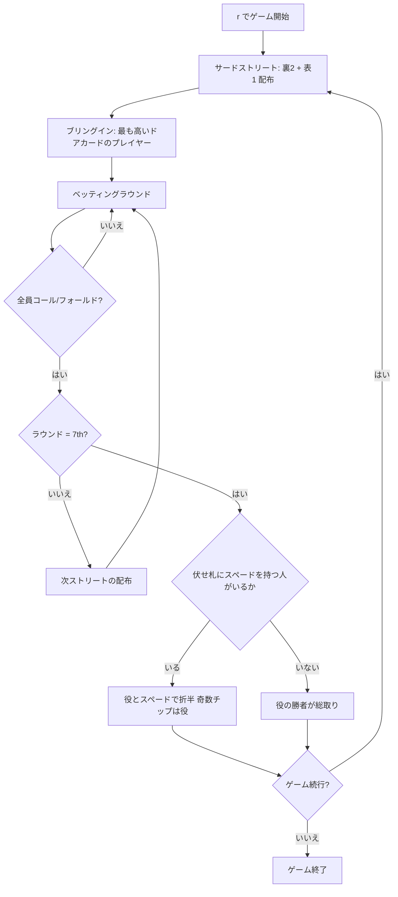

# シカゴ（CUI版）遊び方

## ゲーム概要

シカゴ（Chicago）はアメリカの dealer's choice ホームゲームの一つで、セブンカード・スタッドのポット分割版です。**ポットの半分は通常どおり最強の役へ、残り半分は「伏せ札の中で最も高いスペード」を持つ人**へ渡ります。

分割の基準がハイローとは根本的に違います。ハイローの半分は「8以下5枚」という**役**ですが、シカゴの半分は**たった1枚のカード**、しかも他の誰にも見えていない札で決まります。伏せ札にスペードを1枚も持っていない人はその半分を取れず、**誰も持っていなければ役の勝者がポットを総取り**します。

## 起動方法

```sh
go run ./cmd/trumpcards chicago
go run ./cmd/trumpcards --lang en chicago  # 英語モード
```

## ルール

### 基本ルール

- 52枚のトランプを使用
- コミュニティカードなし — 各プレイヤーに個別にカードが配られる
- 合計7枚（裏向き3枚 + 表向き4枚）から**最強5枚**を選ぶ（通常のポーカー役）
- **ポットの半分は伏せ札（裏向きの3枚）の中で最も高いスペード**を持つ人へ
- **A♠ が最高**、以下 K♠ > Q♠ > J♠ > 10♠ > … > 2♠ の順
- **表向きのスペードは数えません。** 全員に見えている札で半分を主張できてしまうため
- 伏せ札にスペードが1枚も無い人はスペード側の分配に参加できない
- **誰も伏せ札にスペードを持っていなければ、役の勝者がポットを総取り**
- ポットを折半するとき、**奇数チップは役の側**に付く（ポーカー慣例）
- デッキが尽きたときに配られる共有カードは**伏せ札として数えません**（卓の全員に見えているため）
- ブリングインは最も高いドアカードのプレイヤーが支払う（通常のスタッドと同じ）

### ゲームの進行

1. **アンティ**: 全プレイヤーがアンティを支払う
2. **サードストリート**: 裏向き2枚 + 表向き1枚配布。ブリングインを投入
3. **フォースストリート**: 表向き1枚追加
4. **フィフスストリート**: 表向き1枚追加
5. **シックスストリート**: 表向き1枚追加
6. **セブンスストリート**: 裏向き1枚追加。最後のベッティングラウンド
7. **ショーダウン**: 役の最強者と伏せ札の最高スペードを持つ人でポットを折半。スペードの持ち主がいなければ役の総取り

### ベッティングアクション

| アクション | 説明 |
|-----------|------|
| フォールド | 手札を捨ててラウンドから降りる |
| チェック | ベットせずにパスする（未ベット時のみ） |
| コール | 現在のベット額に合わせる |
| ベット | 新たにベットする（未ベット時のみ） |
| レイズ | 現在のベット額を上げる |
| オールイン | 全チップを賭ける |

## ゲームの流れ



## コマンド一覧

| コマンド | 短縮形 | 説明 |
|----------|--------|------|
| `reset` | `r` | 新しいゲームを開始 |
| `fold` | `f` | フォールド（降りる） |
| `check` | `ck` | チェック（パス） |
| `call` | `c` | コール（ベット額に合わせる） |
| `bet <額>` | `b <額>` | ベットする |
| `raise <額>` | `ra <額>` | レイズする |
| `allin` | `a` | オールイン |
| `rebuy` | `rb` | リバイ（チップを再購入） |
| `skiprebuy` | `sr` | リバイをスキップ |
| `addon` | `ad` | アドオン（チップを追加購入） |
| `skipaddon` | `sa` | アドオンをスキップ |
| `muck` | `m` | マック（手札を伏せる） |
| `show` | `sh` | ショー（手札を公開する） |
| `log` | `l` | アクションログを表示 |
| `quit` | `q` | ゲーム終了 |
| `help` | `?` | コマンド一覧を表示 |

## 画面の見方

```
==========
Chicago (シカゴ)
==========
テーブル: 4-max
ディーラー: Player 0
ポット: 150
----------
あなた チップ:1000 ベット:20
  ドアカード: ♠4
  ホールカード: ♠1  ♦12
CPU 1 (LAP) チップ:980 ベット:20
  ドアカード: ♥9
----------
```

- `ホールカード:` は自分だけに見える裏向きカードです。**スペード側の半分はここだけで決まります。**
- `ドアカード:` は全員に公開されている表向きカードです。ここにスペードが並んでいても半分は取れません。
- ショーダウンでは、役名と獲得額に加えて**（役 N / スペード M）**の内訳と、半分を取った**伏せ札の最高スペード**が表示されます。ポットが折半された理由がそこで分かります。

## 遊び方のコツ

- **A♠ を1枚伏せているだけで半分の権利があります。** 役が弱くても降りる理由にはなりません
- 逆に、伏せ札にスペードが無いなら**役で勝つしかありません**。半分を諦めた上で勝てる手かを考えます
- 相手のドアカードにスペードが多く出ているほど、伏せ札に残っているスペードは少なくなります。**低いスペードでも半分を取れる可能性が上がります**
- スペードを引いたのが7枚目（裏向き）なら、その時点まで誰も気づきません。ベッティングの材料として最後まで使えます
- 役とスペードの両取り（スクープ）が最大の利益です
