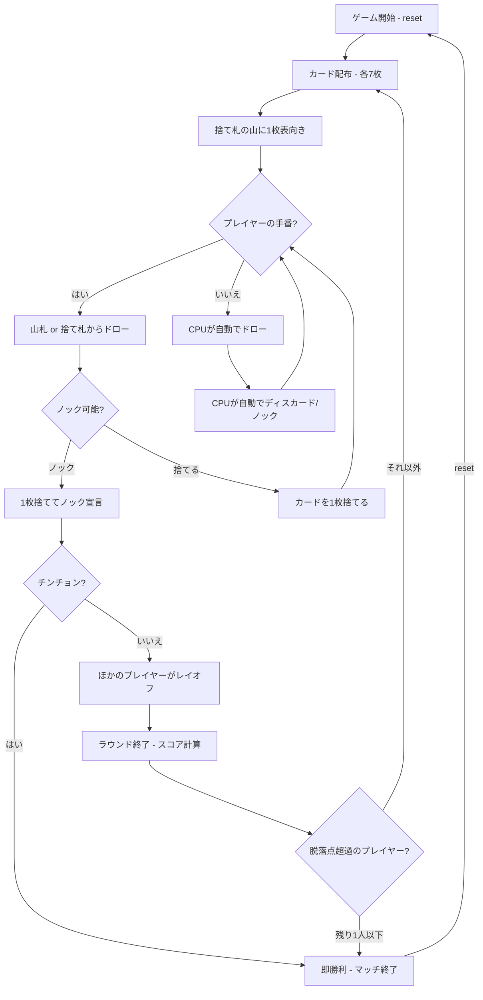

# チンチョン（CUI版）遊び方

## ゲーム概要

スペイン生まれのジンラミー系カードゲームです。2〜4人（プレイヤー1人 + CPU 1〜3人）で遊びます。8・9・10を抜いた40枚のラテンデッキを使い、各自7枚の手札でメルド（セットやラン）を作り、デッドウッド（メルドに含まれないカード）の合計点を減らします。ノックしてラウンドを終え、デッドウッドが最も少ない者がそのラウンドの勝者です。累積点が脱落点に達したプレイヤーは退場となり、最後まで残ったプレイヤーが勝者です。

## 起動方法

```sh
go run ./cmd/trumpcards chinchon
go run ./cmd/trumpcards --lang en chinchon  # 英語モード
```

## ルール

### 基本ルール

- 8・9・10を抜いた40枚のラテンデッキを使用、2〜4人プレイ
- 各プレイヤーに7枚ずつ配り、1枚を表向きにして捨て札の山を開始、残りは山札（ストック）
- 手番ではまず山札または捨て札の山からカードを1枚ドローする
- その後、手札からカードを1枚捨てるか、その1枚を捨ててノックする

### メルドとデッドウッド

- **メルド**: セット（同ランク3枚以上）またはラン（同スート3枚以上の連番）
- **連番のルール**: 8・9・10がないため、A,2,3,4,5,6,7,J,Q,K を連続したランクとして扱う（**7とJは隣接**）
- **デッドウッド**: メルドに含まれない手札の合計点（J/Q/K=10点、A=1点、その他=額面）

### ノック

- **ノック**: 捨てる1枚を選び、その後のデッドウッド合計がノック上限（デフォルト5点）以下のときにノックできる
- ノック後、ほかのプレイヤーはノッカーのメルドにカードをレイオフ（付け足し）できる
- ラウンド終了時、デッドウッドが最少のプレイヤーがそのラウンドの勝者

### チンチョン（即勝利）

- **チンチョン**: 同じスートの7枚すべてが連番（例: ♠A-2-3-4-5-6-7、または7とJを跨ぐ並び）になると、その場で即勝利

### 脱落とゲーム終了

- 各ラウンドの終了時、デッドウッド点が累積得点に加算される
- 累積得点が脱落点（デフォルト100点）を超えたプレイヤーは退場
- 最後まで残ったプレイヤーがマッチの勝者

### CPU難易度

- **Easy** (0): ランダムにカードを出す
- **Normal** (1): 基本的なメルド戦略（デフォルト）
- **Hard** (2): 戦略的なプレイ（相手の捨て札を分析等）

## ゲームの流れ



## コマンド一覧

| コマンド | 短縮形 | 説明 |
|----------|--------|------|
| `reset` | `r` | ゲームリセット（設定保持） |
| `drawstock` | `ds` | 山札から1枚ドロー |
| `drawdiscard` | `dd` | 捨て札の山から1枚ドロー |
| `discard <idx>` | `d <idx>` | カードを捨てる（インデックス指定） |
| `knock <idx>` | `k <idx>` | 指定カードを捨ててノック（デッドウッド≤上限の時） |
| `layoff <idx...>` | `lo <idx...>` | レイオフ（ノッカーのメルドにカードを付け足す） |
| `nextround` | `nr` | ラウンドをスコアリングして次のラウンドへ |
| `setdifficulty <0-2>` | `sd <0-2>` | CPU難易度設定（0=Easy, 1=Normal, 2=Hard） |
| `setplayers <2-4>` | `sp <2-4>` | プレイヤー人数設定 |
| `log` | `l` | 棋譜表示 |
| `quit` | `q` | ゲーム終了 |
| `help` | `?` | ヘルプ表示 |

### コマンド例

- `ds` → 山札から1枚ドロー
- `dd` → 捨て札の山からトップカードをドロー
- `d 3` → インデックス3のカードを捨てる
- `k 3` → インデックス3のカードを捨ててノック（デッドウッド≤上限の時）
- `lo 0 3` → インデックス0, 3のカードをレイオフ

## 画面の見方

```
==========
Chinchon (チンチョン)
==========
ラウンド 2
ノック上限: 5
----------
[You]: total=30 round=12 cards=7
[0]SPADE A  [1]SPADE 5  [2]SPADE 6  [3]SPADE 7  [4]HEART J  ...
デッドウッド: 11点 (ノック閾値 5点以下)
  メルド済み: SPADE 5, SPADE 6, SPADE 7
  デッドウッド: HEART 9, CLOVER 2 (9 + 2 = 11)
CPU 1: total=10 round=3 cards=7
----------
捨て札トップ: HEART 7
山札残り: 24枚
手番: あなた
==========
```

- `ラウンド N`: 現在のラウンド番号
- `[You]: total=N`: プレイヤーの累計得点（round=今ラウンドの得点, cards=手札枚数）
- `[0]SPADE A`...: インデックス付きの手札カード
- `メルド済み`: いま成立しているメルド（`/` 区切り）。自分の手札だけに出ます
- `デッドウッド: <札> (a + b = 計)`: メルドに入らなかった札とその点数内訳。合計は上の「デッドウッド: N点」と必ず一致します
- `捨て札トップ`: 捨て札の山の一番上のカード
- `山札残り`: 山札の残り枚数
- `ノッカーのメルド [ラベル]`: レイオフフェーズで表示。ラベルはセット（同ランク）ならそのランク、ラン（同スート連番）なら `♠ 7-Q` のようにスート記号と範囲。乗せられる札を見分けるための目印です

## 遊び方のコツ

- 序盤は捨て札からドローして、メルドを素早く作りましょう
- 8・9・10がないため、7とJが隣接する連番に注意しましょう
- デッドウッドの高いカード（J/Q/K=10点）は早めに処理するのが有効です
- ノック上限が低いので、メルドを2組以上そろえてからノックを狙いましょう
- 相手のノックに備えて、レイオフできるカード（相手のメルドに付け足せるカード）を意識しておきましょう
- 同スート7枚連番のチンチョンが狙えるなら、一気の即勝利を目指しましょう
