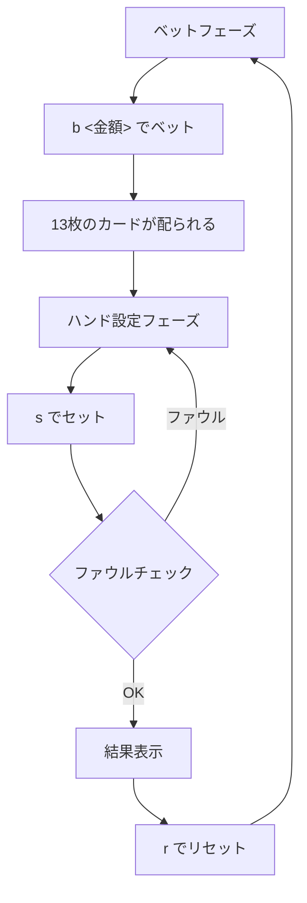

# チャイニーズポーカー（CUI版）遊び方

## ゲーム概要

13枚のカードをフロント（3枚）、ミドル（5枚）、バック（5枚）の3つのハンドに分割し、ディーラーと各ハンドを比較するカジノポーカーゲームです。

## 起動方法

```
go run ./cmd/trumpcards chinesepoker
go run ./cmd/trumpcards --lang en chinesepoker
```

## ルール

- 52枚のカード（ジョーカーなし）を使用します。
- プレイヤーとディーラーに13枚ずつ配ります。
- 13枚をフロント（3枚）、ミドル（5枚）、バック（5枚）に分割します。
- **ファウル制約**: バックの役 ≧ ミドルの役 ≧ フロントの役 でなければなりません。
- 各ハンド（フロント同士、ミドル同士、バック同士）を比較します。
- タイはディーラー勝ち。3勝 = スクープ（3:1）、2勝 = 勝ち（1:1）、1勝以下 = 負け。
- ロイヤリティ（ボーナスポイント）付き。

## ゲームの流れ



## コマンド一覧

| コマンド | 説明 |
|---------|------|
| `b <金額>` | ベットする（例: `b 100`） |
| `s <f0> <f1> <f2> <m0> <m1> <m2> <m3> <m4>` | ハンドを設定する（フロント3枚+ミドル5枚のインデックス、例: `s 0 1 2 3 4 5 6 7`） |
| `r` | ゲームをリセット |
| `l` / `log` | 棋譜を表示 |
| `q` / `quit` | 終了 |

## 画面の見方

```
----------
チップ: 1000
フェーズ: SET HANDS
--- PLAYER ---
カード: [0]♠A [1]♥K [2]♣Q [3]♦J [4]♠10 [5]♥9 [6]♣8 [7]♦7 [8]♠6 [9]♥5 [10]♣4 [11]♦3 [12]♠2
----------
```

## 遊び方のコツ

- `s` コマンドでは最初の3つがフロント、次の5つがミドルのカードインデックスです。
- 残りの5枚が自動的にバックに配置されます。
- ファウルにならないようインデックスを選んでください。
