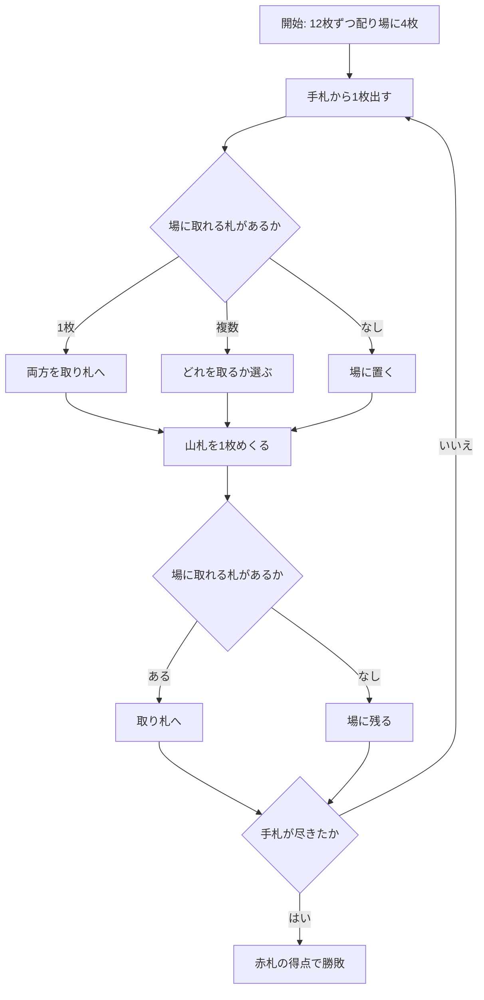

# 撿紅點（CUI版）遊び方

## ゲーム概要

中国・台湾のフィッシング系ゲーム。52 枚を使い、**赤札（♥♦）だけが得点になります**。手札を出して場札を取り、**続けて山札から 1 枚めくって、それでも取れます**。

## 起動方法

```sh
go run ./cmd/trumpcards chineseten
go run ./cmd/trumpcards --lang en chineseten   # 英語表示
```

## ルール

- **デッキ**: 52 枚
- **配札**: 各自 **12 枚**、場に **4 枚**（2 人戦。配札は 24 ÷ 人数）
- **捕獲**:
  - **A〜9** は、場札との**合計がちょうど 10** になる札を取れます（A+9、3+7、5+5 …）
  - **10・J・Q・K** は**同ランク**の札しか取れません
  - この 2 つは**別の規則**です。9 は 9 を取れませんし、10 は数札を取れません
  - 出した 1 枚が取れるのは**場札 1 枚だけ**です
- **1 手番は 2 段**:
  1. 手札から 1 枚出す。取れれば両方を取り札へ、取れなければ場に置く
  2. **続けて山札の一番上をめくり、同じ規則で場札を取る**。取れなければ場に残る
- **再配布はありません。**手札 1 枚につき山札 1 枚が減るので、両者は同時に尽きます
- **得点は赤札のみ**:

  | 札 | 点 |
  |---|---|
  | 赤の 2〜8 | 額面どおり |
  | 赤の 9・10・J・Q・K | 各 10 点 |
  | 赤の A | 各 20 点 |

  黒札は 0 点です。取っても得点には効きません
- 赤札の総点は **210 点**で、**105 点**が引き分けです（ちょうど半分）

## ゲームの流れ



## コマンド一覧

| コマンド | 説明 |
|---------|------|
| `p <i>` | 手札の `i` 番目を出す |
| `s <i>` | 取れる場札が複数のとき、どれを取るか選ぶ |
| `h` | ヒントを表示する |
| `l` / `log` | 棋譜を表示する |
| `r` | ゲームをリセットする |
| `q` | 終了する |

## 画面の見方

```
山札24枚 · 引き分け点105
捕獲: A〜9は合計10、10〜Kは同ランク／得点は赤札(♥♦)のみ
場: [0]♥9(10) [1]♠K [2]♦3(3) [3]♣7
あなた: 0点 (手札12枚)
  取り札: -
  [0]♠A [1]♥K(10) ...
CPU: 0点 (手札12枚)
  取り札: -
```

- 札のうしろの `(n)` は**その札の得点**です。赤札にだけ付きます
- **取り札は双方とも公開**されます。何が取られたかを見て残りを読むゲームだからです
- CPU の**手札**は枚数のみ表示されます

## 遊び方のコツ

- **赤い A（20 点）が最大の獲物**です。9 で取れるので、赤 A が場に出たら 9 を惜しまないでください
- 逆に**自分が赤札を場に置くと相手に渡ります。**取れない手番では、黒札を出して場を汚すのが基本です
- **10・J・Q・K は同ランクでしか取れません。**場に♥K があるなら、こちらの K は取りに行く価値があります（10 点）
- **山札のめくりは運です**が、場に何を残すかは自分で選べます。相手が取りやすい札を置かないことが、めくり運の影響を減らす唯一の方法です
- 105 点が引き分けなので、**106 点取れば勝ち**です。細かい赤札を積み上げる価値があります
