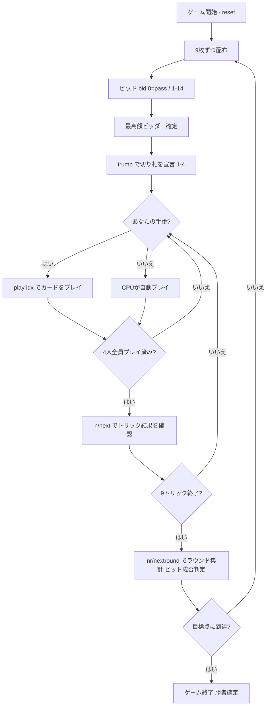

# Cinch / Double Pedro チンチ（ダブル・ペドロ / ハイ・ファイブ）（CUI版）遊び方

## ゲーム概要

Cinch（チンチ / Double Pedro / High Five）は、All-Fours（Pitch / Seven Up）系の**ビッド式トリックテイキングゲーム**です。標準52枚デッキを4人（あなた＋CPU3人）で個人戦としてプレイします。各プレイヤーに9枚ずつ配り、最高額をビッドしたプレイヤーが切り札を宣言してリードします。1ディールで動く得点は合計**14点**で、切り札の 5（ライト・ペドロ）と同色の 5（レフト・ペドロ）がそれぞれ **5点**の大物です。ビッド側は宣言した点数以上を獲得できなければ**セットバック（宣言額のマイナス）**となります。先に目標点（既定21点）へ到達したプレイヤーが勝ちです。

## 起動方法

```sh
go run ./cmd/trumpcards cinch
go run ./cmd/trumpcards --lang en cinch  # 英語モード
```

## ルール

### デッキと配布

- **デッキ**: 標準52枚（A〜2 × 4スート）。
- **プレイヤー**: 4人（プレイヤー0 = あなた、プレイヤー1〜3 = CPU）。個人戦で各自が得点します。
- **配布**: 各プレイヤー9枚（合計36枚）。

### ビッド

- ディーラーの左隣から順に、各プレイヤーは **0（パス）** または **1〜14** をビッドします。
- 直前までの最高額を上回る額のみ宣言できます（0 はいつでもパス可能）。
- **最高額をビッドしたプレイヤー**が切り札を宣言し、最初のトリックをリードします。

### 切り札宣言

- ビッド勝者は切り札スートを選びます。エンコードは **1=♠スペード / 2=♣クラブ / 3=♥ハート / 4=♦ダイヤ**（0=未設定）。

### 得点カード（1ディール14点）

| カード | 点数 |
|--------|------|
| High（切り札の A） | **1** |
| King（切り札の K） | **1** |
| Ten（切り札の 10、"Game"） | **1** |
| Jack（切り札の J） | **1** |
| Right Pedro（切り札の 5） | **5** |
| Left Pedro（切り札と同色の 5） | **5** |

- **レフト・ペドロ**は、切り札の 5 のすぐ下の強さを持つ**切り札扱い**です。フォローや勝敗判定でも切り札として扱います。
- 1ディールで動く点数は合計 **14点**です。

### フォロー義務・トリック

- リードスートを持っていれば**必ず従わなければなりません（must-follow）**。ボイド時は任意の札（切り札含む）を出せます。
- 切り札が出たトリックは最も強い切り札を出したプレイヤーが取ります。切り札が出なければリードスートの最高札が取ります。
- 1ディールは **9トリック**です。

### 得点計算と勝利条件

- ビッド勝者は、獲得した得点カードの合計が**宣言額以上**であれば、その獲得点がスコアに加算されます。
- 宣言額に**届かなかった場合はセットバック**となり、**宣言額をマイナス**されます。
- ビッド勝者以外のプレイヤーは、自分が獲得した得点カードの点数をそのまま加算します。
- **勝利**: 先に目標点（既定 **21**）へ到達したプレイヤーが勝利します。

## ゲームの流れ



## コマンド一覧

| コマンド | 短縮形 | 説明 |
|----------|--------|------|
| `bid <0-14>` | `b` | ビッド。0=パス、1〜14=宣言額 |
| `trump <1-4>` | `t` | 切り札を宣言（1=♠ / 2=♣ / 3=♥ / 4=♦） |
| `play <idx>` | `p` | 手札のidx番目のカードを出す |
| `next` | `n` | 次のトリックへ進む |
| `nextround` | `nr` | 次のラウンドへ進む |
| `setdifficulty <0-2>` | `sd` | CPU難易度設定（0=Easy, 1=Normal, 2=Hard） |
| `hint` | `h` | 推奨アクションを表示 |
| `log` | `l` | アクションログを表示 |
| `reset` | `r` | 新しいゲームを開始（設定保持） |
| `quit` | `q` | ゲーム終了 |
| `help` | `?` | コマンド一覧を表示 |

## 画面の見方

```
==========
Cinch (チンチ)
==========
Round 1  Trick 1/9  Trump = ♠
Bid winner = P0  Bid = 6

Players:
  P0 (You)   Score  0   Bid  6
  P1 (CPU)   Score  0   Bid  pass
  P2 (CPU)   Score  0   Bid  4
  P3 (CPU)   Score  0   Bid  pass

Current trick: P0 -> ♠A   P1 -> ♠K   ...

Your hand: [0]♠A [1]♠5 [2]♥5 [3]♦K ...

P0 のビッド番です（現在の最高ビッド: 4）
  手札の点数: SPADE 11  CLOVER 5  HEART 6  DIAMOND 1（最有力: SPADE で 11 点／14 点中）
```

- **フェーズ表示**: ビッド／切り札宣言／プレイ／トリック結果／ラウンド結果を示します。
- **プレイヤー情報**: 各プレイヤーの累積得点、現在のビッド（pass または額）、ビッド勝者。
- **現在のトリック**: 場に出ている札とリードプレイヤー。
- **手札**: プレイ可能な札（フォロー義務でフィルタ済み）。切り札と同色の 5（レフト・ペドロ）は切り札として扱われます。
- **手札の点数**（ビッドフェーズのみ）: 各スートを切り札にしたとき自分の手札が持っている点数（14 点満点）と、その最大となるスート。レフト・ペドロも数に入ります。持っている＝取れる ではないので、あくまで目安です。
- **ラウンド結果**: ビッド勝者の成否（達成 / セットバック）と各プレイヤーの獲得点。

## 遊び方のコツ

- **ペドロは大物**: ライト・ペドロ（切り札の 5）とレフト・ペドロ（同色の 5）はそれぞれ 5 点。合わせて 10 点が動くため、これを取るか守るかがディールの勝敗を大きく左右します。
- **切り札の長さと高札でビッドを決める**: 切り札にしたいスートの A・K・J・10・5 を多く持ち、長いスートがあるときだけ高くビッドしましょう。届かないとセットバックで宣言額をそのまま失います。
- **レフト・ペドロは切り札**: 切り札と同色の 5 は切り札の 5 のすぐ下として扱われます。フォロー時にうっかり出さないよう注意しましょう。
- **相手のペドロを刈り取る**: 自分がビッド勝者でないときは、切り札の高札で相手のペドロを取り上げ、ビッド側のセットバックを狙いましょう。
- **難易度調整**: `sd` コマンドで CPU の強さを変えられます。慣れないうちは 0（Easy）から始めましょう。
