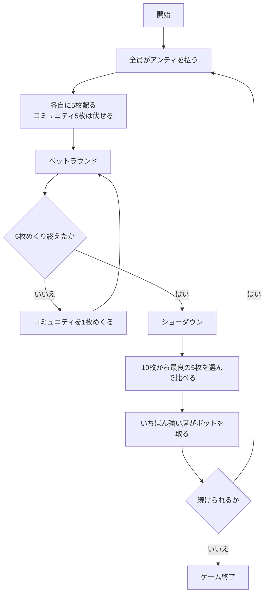

# シンシナティ（CUI版）遊び方

## ゲーム概要

シンシナティは、アメリカのホームポーカーの定番バリアントです。テキサスホールデムの原型のひとつとも言われます。

**各自の手札は 5 枚**、場のコミュニティも **5 枚**。この 10 枚から最良の 5 枚を選んで役を作ります。

ホールデムとの一番の違いは 2 つです。

1. **手札が 5 枚あるので、場を 1 枚も使わずに役が完成することがあります。** 逆に、場の 5 枚だけで役ができることもあります。
2. **コミュニティは 1 枚ずつ、5 回に分けてめくります。** そのたびにベットラウンドが入るので、情報が少しずつ増えていきます。降りどころがホールデムより多いゲームです。

## 起動方法

```sh
go run ./cmd/trumpcards cincinnati
```

英語で起動する場合:

```sh
go run ./cmd/trumpcards --lang en cincinnati
```

## ルール

- 標準 52 枚。2〜7 席（既定 4 席）で、席 0 があなた、残りは CPU です。
- 開始時に全員がアンティ（既定 10）を払います。
- 各自に **5 枚**を伏せて配ります。コミュニティ 5 枚も伏せて置かれます。
- **コミュニティを 1 枚めくるたびにベットラウンド**が入ります（計 5 回）。
  - 誰も賭けていなければ **チェック** または **ベット**
  - 誰かが賭けていれば **コール** / **レイズ** / **フォールド**
  - **レイズは 1 ラウンド 3 回まで**です。
- 5 枚すべてが公開され、最後のベットラウンドが終わるとショーダウンです。
- **手札 5 枚 + コミュニティ 5 枚の 10 枚から、最良の 5 枚**で役を比べます。手札だけ・場だけ・混ぜたもの、どれでも構いません。
- いちばん強い役の席がポットを取ります。同じ役なら山分けし、端数は若い席から配ります。
- チップが尽きた席は脱落し、あなたが賭けられなくなるか、残り 1 席になったら終了です。

## ゲームの流れ



## コマンド一覧

| コマンド | 短縮形 | 説明 |
|----------|--------|------|
| `fold` | `f` | 降りる |
| `check` | `k` | 賭けずに次へ（誰も賭けていないとき） |
| `call` | `c` | 現在の賭け額に合わせる |
| `bet <額>` | `b` | 賭ける（誰も賭けていないとき） |
| `raise <額>` | - | 上乗せする（1ラウンド3回まで） |
| `next` | - | 次のハンドへ |
| `hint` | - | 助言を表示する |
| `log` | - | 棋譜を表示する |
| `reset` | `r` | ゲームをやり直す |
| `quit` | `q` | ゲームを終了する |
| `help` | - | ヘルプを表示する |

## 画面の見方

```
フェーズ: BETTING
ハンド: 2（ポット: 80）
----------
場: ♠10 ♥3  （2 / 5 枚公開）
*YOU チップ 970 / 賭け 0 : ♠A ♠K ♥7 ♣4 ♦2
 CPU1 チップ 990 / 賭け 0 : (伏せ)
 CPU2（降り） チップ 990 / 賭け 0 : (伏せ)
 CPU3 チップ 990 / 賭け 0 : (伏せ)
チェックできます
```

- **フェーズ**: `BETTING`（ベット）→ `SHOWDOWN`（ショーダウン）→ `GAME END`（終了）
- **場**: 表向きのコミュニティと、**あと何枚めくれるか**。残りの回数だけベットラウンドがあります
- **席の行**: `*` が付いているのがあなたの手番。**CPU の手札はショーダウンまで伏せたまま**です
- **最後の行**: チェックできるか、コールにいくら要るか

ショーダウンでは全員の手札が開き、獲得額が**役名つき**（`あなた が 80 を獲得（Two Pair）`）で表示されます。5 枚の手札だけで成立する役も普通にあるので、金額だけでは理由が読めないためです。

## 遊び方のコツ

- **手札 5 枚で完成している役は強いです。** ホールデムの感覚だと場を使いたくなりますが、このゲームでは手札だけで組んだ役が最良になる場面が普通にあります。
- **1 枚目で降りる判断ができます。** コミュニティが 1 枚しか出ていない時点でも、手札 5 枚の形はもう決まっています。役になっていない手を 5 回ぶんのベットに付き合わせるのがいちばん高くつきます。
- **場が育つと全員が強くなります。** コミュニティは共有なので、場に強い役の材料が並ぶほど、自分だけが強い状況ではなくなります。
- **レイズの上限（3 回）を覚えておいてください。** 上限に達すると押し切れないので、その前に降ろすつもりで賭けるかどうかを決めます。
