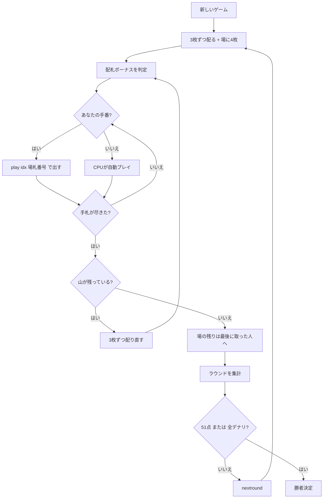

# チルッラ（CUI版）遊び方

## ゲーム概要

チルッラ（Cirulla）はイタリア・リグーリア州の**フィッシング**系カードゲームです。Scopa（スコパ）と同じ **40 枚のイタリア式デッキ**（A〜7 と J・Q・K）を使い、あなたと CPU の 2 人で戦います。

一番の特徴は **捕獲の規則が 1 つ増える**こと。Scopa の捕獲はそのまま残り、そこに「**合計 15**」が足されます。

## 起動方法

```sh
go run ./cmd/trumpcards cirulla
# または
go run ./cmd/trumpcards --lang en cirulla
```

## ルール

### 札の値

A=1、2〜7 はそのまま、**J=8、Q=9、K=10**。

### 捕獲の 3 通り（15 は「足される」）

手札から 1 枚出し、場札を取ります。

1. **同値の 1 枚** — 場に同じ値の札があれば、それを取れます。**Scopa と違い、これは他の取り方を締め出しません** ── 同値の札があっても、合計一致や合計 15 の組をそのまま選べます（原典: "unlike Scopa, if several different captures are available with the played card, the player is free to choose which one to make"）。
2. **合計が出した札に一致する組** — 例: 8（J）を出して、場の 3 と 5 を取る。
3. **出した札と足して 15 になる組** — 例: 6 を出して、場の 9（Q）を取る。

**「15 に固定される」のではありません。** 固定してしまうと、7 で 7 を取る当たり前の手が打てなくなります。

### アッソ・ピリアトゥット（A の総取り）

**場にアッソ（A）が 1 枚も無いときに A を出すと、場の札を全部取れます。** 場に A があるときは総取りが消え、ただの 1 に戻ります ── そこから先は他の札と同じで、同値の 1 枚と合計 15 の組を自由に選べます。

### 配札ボーナス（毎回ある）

3 枚配られるたびに判定します。**最初の 3 枚だけの話ではありません。**

| 役 | 条件 | 点 |
|----|------|----|
| バルセガ | 3 枚の合計が **9 以下** | **3 点** |
| バルセゴン | 3 枚が**同位** | **10 点** |

**7♥ はワイルド**ですが、**ボーナスの判定にだけ**効きます。捕獲ではただの 7 です。

### 取れるときは取る

取れる札があるのに場に置くことはできません。

### スコパ

場を空にすると 1 点。ただし山も手札も尽きた**最後の 1 手は数えません**。

### ラウンドの集計

| 項目 | 点 |
|------|----|
| 最多枚数 | 1 点（**同数なら誰にも入りません**） |
| 最多デナリ（♦） | 1 点（同数なら入りません） |
| セッテベッロ（7♦） | 1 点 |
| プリミエラ | 1 点 |
| ピッコラ | A♦ から続いた枚数がそのまま点（A♦-2♦ で 2 点） |
| グランデ（K♦・Q♦・J♦） | 5 点 |
| スコパ | 1 回 1 点 |
| 配札ボーナス | 上表のとおり |

ラウンド末に場に残った札は、**最後に取った人**のものになります。

### 勝敗

**51 点**（設定で 11〜51）に先に届いた側の勝ち。ただし **デナリ 10 枚すべてを取ると、点に関係なくその場で勝ち**です。

## ゲームの流れ



## コマンド一覧

| コマンド | 短縮形 | 説明 |
|----------|--------|------|
| `play <idx> [場札...]` | `p` | 手札の idx 番を出す。場札の番号を並べるとその組を取る |
| `nextround` | `nr` | 次のラウンドへ進む |
| `setdifficulty <0-2>` | `sd` | CPU難易度（0=Easy, 1=Normal, 2=Hard） |
| `settarget <11-51>` | `st` | 目標点 |
| `hint` | `h` | 推奨アクションを表示 |
| `log` | `l` | アクションログを表示 |
| `reset` | `r` | 新しいゲームを開始（設定保持） |
| `quit` | `q` | 終了 |
| `help` | `?` | コマンド一覧を表示 |

## 画面の見方

```
==========
チルッラ
==========
ラウンド 1（51 点勝負）
山の残り: 30 枚
あなた （子）: 取り札 0 枚（デナリ 0）　スコパ 0　得点 0
  → バルセガ（合計 9 以下）！
[0]♠3  [1]♥5  [2]♦1
CPU 1 （親）: 取り札 0 枚（デナリ 0）　スコパ 0　得点 0
----------
場: [0]♣7  [1]♦9  [2]♠2  [3]♥6
手番: あなた
  [0]♠3 で取れる: (2)
  [2]♦1 で取れる: (0 1 2 3)
play <idx> [場札の番号...] ... 札を出す
==========
```

「で取れる」の行が要点です。**同値・合計一致・合計 15・A の総取りが混ざる**ので、どの札で何が取れるかを端末が並べます。`(0 1 2 3)` は場の 4 枚すべて ── A のピリアトゥットです。
