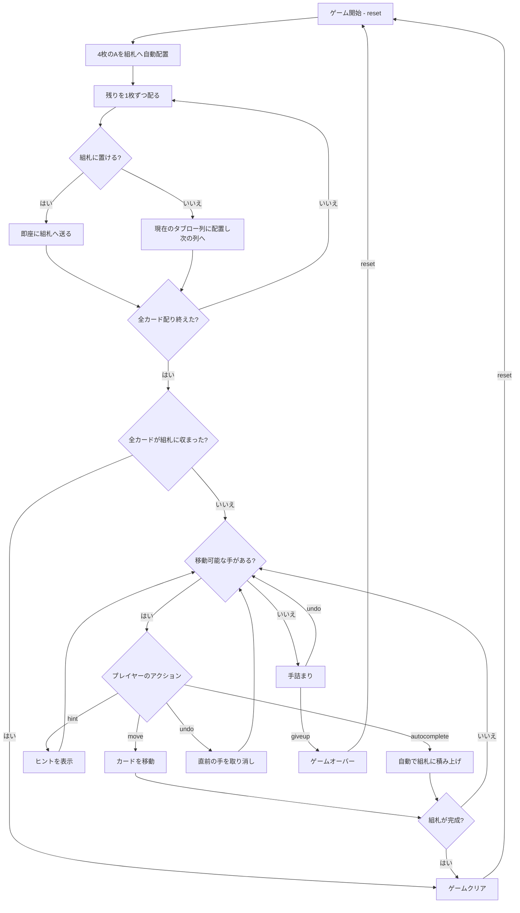

# シタデル（CUI版）遊び方

## ゲーム概要

1人用のソリティアカードゲームです。1デッキ（52枚）を使用し、開始時に4枚のAが組札（ファンデーション）に置かれます。残りのカードは1枚ずつ配られますが、そのカードが組札に置ける場合は即座に組札へ送られ、置けないカードのみが8列のタブローに順に表向きで配られます（そのため列の枚数は基礎へ流れた分だけ不揃いになり、基礎札もAより進んだ状態で始まることがあります）。ストックやウェイストはありません。中央の組札（城）の左右に4列ずつ並ぶタブロー（包囲軍）から、組札へA→Kの順に積み上げきればクリアです（配り切っただけでクリアになることもあります）。

## 起動方法

```sh
go run ./cmd/trumpcards citadel
go run ./cmd/trumpcards --lang en citadel  # 英語モード
```

## ルール

### 基本ルール

- 1デッキ（52枚、ジョーカーなし）を使用
- 4枚のAは開始時に各スートの組札へ自動的に配置される
- 残りのカードを1枚ずつ配る際、組札へ置けるカードは即座に組札へ送られ、置けないカードのみが8列のタブローへ順に表向きで配られる（各列の枚数は最大6枚で、基礎へ流れた分だけ不揃いになる）
- 初期配りだけで全カードが組札に収まった場合はその時点でゲームクリアとなる
- 4つの組札（ファンデーション）はスート別にA→Kの順に積み上げる
- タブローではスート関係なく、ランクが1つ下のカードに重ねる（例: ♠5の上に♣4または♦4または♥4）
- 移動できるのは1枚ずつのみ（複数枚の同時移動は不可）
- **空の列には任意のカードを置ける**（フリーセル系の柔軟なルール）

### ゲームクリア

- 4つの組札すべてにA→Kまで13枚ずつ積み上げるとゲームクリア

### ゲームオーバー

- これ以上移動可能な手がない場合は手詰まり（アンドゥやオートコンプリートで打開可能）

## ゲームの流れ



## コマンド一覧

| コマンド | 短縮形 | 説明 |
|----------|--------|------|
| `reset` | `r` | 新しいゲームを開始 |
| `move` | `m` | カードを移動する（サブ引数で移動元・移動先を指定） |
| `undo` | `u` | 直前の操作を元に戻す |
| `giveup` | `g` | ギブアップしてゲームを終了 |
| `hint` | `h` | 次の一手のヒントを表示 |
| `autocomplete` | `ac` | 自動的に組札へ積み上げ可能なカードを移動 |
| `log` | `l` | アクションログ（棋譜）を表示 |
| `quit` | `q` | ゲーム終了 |
| `help` | `?` | コマンド一覧を表示 |

### コマンド例

- `m 0 1` → 列0の最上段カードを列1へ移動
- `m 3 f` → 列3の最上段カードを組札（ファンデーション）へ移動
- `u` → 直前の操作を元に戻す
- `h` → ヒントを表示
- `ac` → オートコンプリート

## 画面の見方

```
==========
Citadel (シタデル)
==========
Foundation: SPADE 2 | CLOVER 5 | HEART 3 | DIAMOND 3
----------
列0: [0]♠K [1]♠8 [2]♥Q [3]♣8 [4]♦7
列1: [0]♣K [1]♥8 [2]♦9 [3]♥7 [4]♠6
列2: [0]♥K [1]♣10 [2]♠9 [3]♦8 [4]♣6 [5]♠4
列3: [0]♦K [1]♠J [2]♥9 [3]♣7
列4: [0]♠Q [1]♣J [2]♦10 [3]♥6 [4]♦4
列5: [0]♥J [1]♠10 [2]♣9 [3]♠5 [4]♥4
列6: [0]♦Q [1]♣Q [2]♥10 [3]♠7 [4]♦5
列7: [0]♥5 [1]♦J [2]♠3 [3]♦6
----------
手数: 0
==========
```

- `Foundation`: 4つのスート別の組札の状態（配る途中で置けたカードが積まれているため、開始時でもAより進んでいることがある）
- `列N`: タブロー列（左がベース、右が最上段。基礎へ流れた分だけ列ごとに枚数が異なる）
- `[0]♠K`: 列内の位置インデックスとカード
- `手数: N`: 現在の手数

## 遊び方のコツ

- すべてのカードが表向きで、配る途中で組札へ移動したカードにより基礎札が進んだ状態で始まるため、盤面の状況を素早く把握できます
- 空列は任意のカードを置けるため、戦略的に列を空けると非常に強い手になります
- ランク13（K）はタブロー間移動の終端になりやすいので、Kの真下に控えるカードを早めに展開しましょう
- ヒント機能で詰まった時のアドバイスを得られます
- 手詰まりになったらアンドゥで戻ってリトライしましょう
