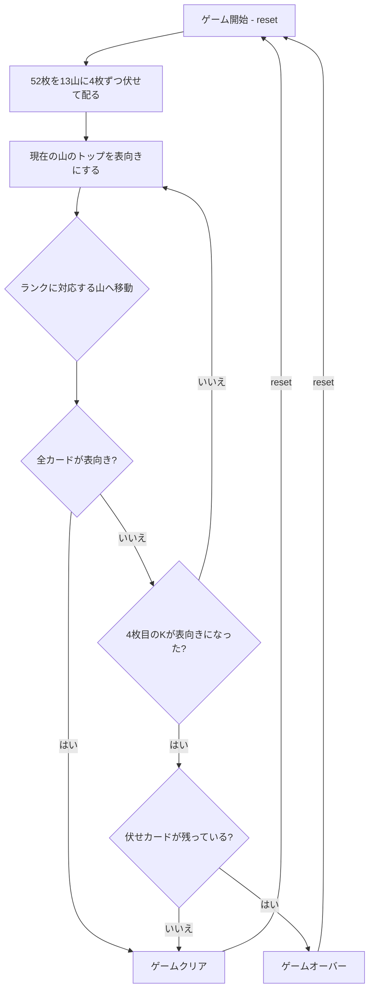

# クロックソリティア（CUI版）遊び方

## ゲーム概要

1人用の完全自動ソリティアカードゲームです。52枚のカードを時計の文字盤に見立てた13箇所（1〜12時の位置＋中央のK置き場）に4枚ずつ伏せて配り、カードを1枚ずつ表向きにして対応する位置に移動させます。4枚目のKが表向きになる前に全カードを表向きにするとクリアです。

## 起動方法

```sh
go run ./cmd/trumpcards clocksolitaire
go run ./cmd/trumpcards --lang en clocksolitaire  # 英語モード
```

## ルール

### 基本ルール

- 52枚のトランプ（ジョーカーなし）を使用
- 13箇所の山に4枚ずつ伏せて配る
  - 位置1〜12 = 時計の1時〜12時の位置
  - 位置13（中央）= Kの置き場
- ゲームは完全自動で進行（シャッフル後にプレイヤーの選択はなし）

### カードの移動ルール

- 現在の山のトップカードを表向きにし、そのランクに対応する山の一番下へ移動させる
  - A = 位置1（1時）
  - 2〜10 = 位置2〜10
  - J = 位置11（11時）
  - Q = 位置12（12時）
  - K = 中央（位置13）
- 移動先の山が次の「現在の山」になる

### ゲームクリア

- 4枚目のKが表向きになる前に全52枚が表向きになるとクリア

### ゲームオーバー

- 4枚目のKが表向きになった時点で、まだ伏せカードが残っていればゲームオーバー
- Kは全て中央の山に集まるため、4枚目のKが出ると中央以外への移動ができなくなる

## ゲームの流れ



## コマンド一覧

| コマンド | 短縮形 | 説明 |
|----------|--------|------|
| `reset` | `r` | 新しいゲームを開始 |
| `step` | `s` | カードを1枚表向きにして対応する山へ移動 |
| `autoplay` | `a` | 残りのカードをすべて自動で処理してゲームを完了させる |
| `log` | `l` | アクションログ（棋譜）を表示 |
| `quit` | `q` | ゲーム終了 |
| `help` | `?` | コマンド一覧を表示 |

### コマンド例

- `r` → 新しいゲームを開始する
- `s` → カードを1枚進める
- `a` → 残りすべてを一気に処理する
- `l` → これまでの手順を確認する

## 画面の見方

```
==========
Clock Solitaire (クロックソリティア)
==========
完成: 0/13
[12時] ?? ?? ?? ??  (0/4)
[ 1時] ?? ?? ?? ??  (0/4)
[ 2時] ?? ?? ?? ??  (0/4)
[ 3時] ?? ?? ?? ??  (0/4)
[ 4時] ?? ?? ?? ??  (0/4)
[ 5時] ?? ?? ?? ??  (0/4)
[ 6時] ?? ?? ?? ??  (0/4)
[ 7時] ?? ?? ?? ??  (0/4)
[ 8時] ?? ?? ?? ??  (0/4)
[ 9時] ?? ?? ?? ??  (0/4)
[10時] ?? ?? ?? ??  (0/4)
[11時] ?? ?? ?? ??  (0/4)
----------
[中央K] ?? ?? ??  (0/4)
----------
手持ち: DIAMOND 11
  → 11時の山へ
ステップ: 0
==========
```

- `完成: N/13`: 4 枚とも揃った山の数
- `[12時]`〜`[11時]` と `[中央K]`: 山の位置。**時計まわりの表記**で、
  中央の K だけ別行です
- `?? ?? ?? ??`: 伏せカード。表になった札はその場に表示されます
- `(N/4)`: その山で表になっている枚数
- `手持ち: X` と `  → N時の山へ`: いま手に持っている札と、次にそれを
  置く山。**次に何が起きるかがこの 2 行で読めます**
- `ステップ: N`: これまでに処理したカードの枚数

## 遊び方のコツ

- このゲームはシャッフル後の運だけで決まる純粋な確率ゲームです
- クリア確率は約1/13（約7.7%）と言われています
- `autoplay` コマンドを使うと一気にゲームを進められます
- `step` コマンドで1手ずつ確認しながら進めると、ゲームの仕組みを理解しやすいです
- 結果に関わらず `log` でカードの動きを振り返ることができます
- 何度もリセットして挑戦してみましょう
