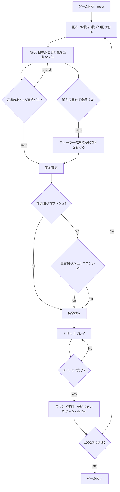

# コワンシュ（CUI版）遊び方

## ゲーム概要

Coinche（コワンシュ）はベロートに**競り**と**倍化**を足したフランスの発展形です。32枚デッキ（7〜A × 4スート）を4人2チームで対戦し、切り札のJ（=20点）を最強とする独自の得点体系で、先に1000点を取ったチームが勝利します。

既存の `belote` との違いは 2 つです。**32枚を配り切ってから目標点と切り札を競り上げる**こと、そして**勝敗はカード点の多寡ではなく、宣言した点に届いたかで決まる**ことです。相手より多く取っていても、宣言に 1 点足りなければ落ちます。

## 起動方法

```sh
go run ./cmd/trumpcards coinche
go run ./cmd/trumpcards --lang en coinche  # 英語モード
```

## ルール

### 基本ルール

- プレイヤーは4人（人間1 + CPU3）。プレイヤー0と2、プレイヤー1と3が同チーム。
- 32枚デッキ（7,8,9,10,J,Q,K,A × 4スート）を使用。
- 各ラウンドは8トリック。
- 切り札を取ったチームを「メイカー」と呼ぶ。

### 配布と競り

1. **32枚を4人に8枚ずつ配り切ります。** ターンアップも山札の残りもありません。
2. ディーラーの左隣から順に、**目標点と切り札スート**を宣言するかパスします。
3. 目標点は **80から10刻みで180**、その上が **Capot（250）= 全8トリック**。宣言は今出ている契約を必ず上回らなければなりません。
4. **誰かが宣言したあと3人が続けてパスすると競りが閉じます**（宣言者以外の全員がパスしたということ）。
5. 誰も宣言しないまま4人がパスしたら、ディーラーの左隣が最低契約（80）を引き受けます。**配り直しはしません** — CPU が宣言しない手札が続くと終わらなくなるためです。

開幕の配りではあなたが最初に話すので、12の契約すべてから選べます。

### コワンシュ（倍化）

競りが閉じたら、**守備側**は `co` で **コワンシュ**（賭けを2倍）を宣言できます。倍化されたら、**宣言側**は `su` で **シュルコワンシュ**（4倍）を返せます。どちらもしないなら `ok` でプレイへ進みます。倍率は精算の係数そのもので、成功しても失敗しても同じ倍率が掛かります。

### カードの強さと得点

| カード | 切り札ランク | 切り札得点 | 非切り札ランク | 非切り札得点 |
|-------|------|------|------|------|
| J (Jack) | 8 (最強) | 20 | 4 | 2 |
| 9 | 7 | 14 | 3 | 0 |
| A | 6 | 11 | 8 (最強) | 11 |
| 10 | 5 | 10 | 7 | 10 |
| K | 4 | 4 | 6 | 4 |
| Q | 3 | 3 | 5 | 3 |
| 8 | 2 | 0 | 2 | 0 |
| 7 | 1 | 0 | 1 | 0 |

- 1ラウンドのカード合計は 152点（+ Dix de Der 10点）。

### プレイ（必須ルール）

1. **フォロースート義務**: リードスートを持っていれば必ずそれを出す。
2. **切り札義務 (obligation à couper)**: リードスートを持っていない場合、切り札があれば必ず切り札を出す。
3. **オーバートランプ義務 (obligation à monter)**: 切り札を出す際、既出の切り札より強い切り札があれば必ずそれを出す。
4. **パートナー保護**: パートナーが現在の勝者の場合、切り札義務は免除される。

### 得点

- 各トリックの得点 = カード得点の合計を勝者チームに加算。
- 最終トリックの勝者に **Dix de Der +10点**。
- **Belote/Rebelote**: K+Q of trumps を両方持っているプレイヤーが両方を出すと +20点。
- **勝敗は契約に届いたかで決まります。** 宣言側のカード点が目標点以上なら成功、届かなければ **dedans（失敗）**。
- 成功: 宣言側に **(契約点 + 取ったカード点) × 倍率**。守備側は 0。
- dedans: 守備側に **(162 + 契約点) × 倍率**。宣言側は 0 で、取ったカード点も残りません。
- **Capot 契約（250）はトリック数が条件**です。全8トリックを取らなければ、カード点を全部取っていても落ちます。
- Belote/Rebelote の +20 は契約の成否と無関係に、宣言した側のチームに残ります。

### CPU難易度

- `0` Easy: 宣言のしきい値が高く、めったに競りに乗らない。
- `1` Normal（既定）: 手札スコアから目標点を見積もって宣言する。
- `2` Hard: しきい値が低く積極的に宣言し、倍化も辞さない。

## ゲームの流れ



## コマンド一覧

| コマンド | 短縮形 | 説明 |
|---------|--------|------|
| `reset` | `r` | 新しいゲームを開始（設定保持） |
| `bid <点> <suit>` | `b <点> <suit>` | 契約を宣言（点=80〜180の10刻み / 250=Capot、suit: 1=♠ 2=♣ 3=♥ 4=♦） |
| `pass` | `pa` | パス（宣言しない） |
| `coinche` | `co` | コワンシュ（相手の契約を2倍） |
| `surcoinche` | `su` | シュルコワンシュ（さらに2倍 = 4倍） |
| `ok` | — | 倍化せずにプレイへ進む |
| `play <i>` | `p <i>` | インデックス i のカードを出す |
| `next` | `n` | 次のトリックへ |
| `nextround` | `nr` | 次のラウンドへ |
| `setdifficulty <0-2>` | `sd` | CPU難易度を設定 |
| `settarget <n>` | `st` | ターゲットスコアを設定（既定1000） |
| `hint` | `h` | おすすめの一手を表示 |
| `log` | `l` | 棋譜（アクションログ）を表示 |
| `quit` | `q` | ゲーム終了（`bye.`） |
| `help` | `?` | コマンド一覧を表示 |

## 画面の見方

```
==========
Coinche (コワンシュ)
==========
ラウンド: 1  トリック: 1
ディーラー: CPU 3
切り札: SPADE (宣言: チーム0)
契約: 110点（チーム0 / 倍率 x1）
チーム0: 0点  チーム1: 0点
あなた: チーム0 獲得0トリック 8枚
[0]SPADE 11 [1]SPADE 9 [2]HEART 1 ...
CPU 1: チーム1 獲得0トリック 8枚
CPU 2: チーム0 獲得0トリック 8枚
CPU 3: チーム3 獲得0トリック 8枚
----------
手番: あなた
p <i> (play)
```

- **8 トリック目に入ると「最終トリック: … Dix de Der +10 点」の行が出ます。**点数は設定値なので、Dix de Der を 0 にしている場合は出ません。
- 「切り札」行はメイカーチームと切り札スートを表示。
- 「[i]CARD」はあなたの手札と `play <i>` で使うインデックス。
- フェーズ別のプロンプトが画面下部に出る（取る/コール/プレイ/トリック終了/ラウンド終了）。

## 遊び方のコツ

- **いくらで宣言するか**: 切り札にしたいスートの J・9 を持っているかがすべて。J + 9 が揃えば 100 以上、片方だけなら 80〜90 が目安です。届かない宣言は倍にされると一気に沈みます。
- **コワンシュの判断**: 高い契約ほど倒しやすいので、相手が 140 以上を宣言していて自分の手札がその切り札に強ければ倍にする価値があります。
- **オーバートランプ義務**: 切り札を出す場面では「より強い切り札を持っているか」を必ず確認。J→9→A→10→K→Q→8→7 の順を意識する。
- **Dix de Der**: 最終トリックの 10点ボーナスは勝負の分かれ目になりやすい。最後に強い切り札を残す配分を考える。
- **Belote/Rebelote**: K+Q of trumps を握っていれば自動的に +20点が宣言される。早めに K と Q を順に出して確実に確保する。

`bid` は目標点と切り札スートを 2 つとも取ります。片方だけの入力は受け付けません — 既定値に落ちると、打ち間違いが別の契約として黙って通ってしまうためです。競りの画面には、その時点で**上回れる点だけ**が案内されます。
