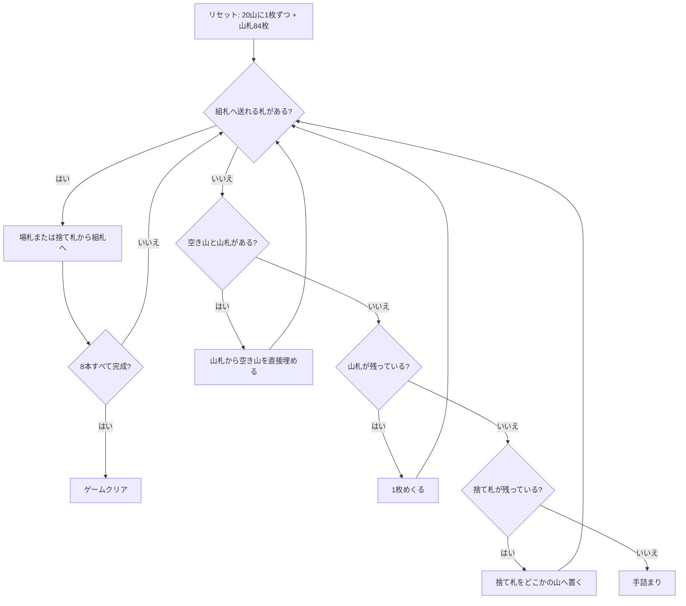

# コロラド（CUI版）遊び方

## ゲーム概要

イギリスの古典的な一人用ソリティア。52 枚 2 組の 104 枚を、20 山の場札と 8 本の組札で捌く。

このゲームの判断は実質ひとつしかない — **めくった札をどの山に置くか**。捨て札の札はスートも数字も問わずどの山にも置けるが、置けばその下の札は掘り出すまで使えなくなる。組札の半分が K からの降順なのも効いていて、A も K も同じくらい欲しい札になる。

## 起動方法

```sh
go run ./cmd/trumpcards colorado
go run ./cmd/trumpcards --lang en colorado   # 英語
```

## ルール

- 52 枚 2 組（104 枚）。**20 山の場札に 1 枚ずつ**配り、残り 84 枚が山札
- **組札は 8 本**。前半 4 本は各スート A から K への昇順（↑）、後半 4 本は各スート K から A への降順（↓）。8×13 = 104 枚がちょうど収まる
- 山札は 1 枚ずつ捨て札へめくる。**めくり直しは無い（1 巡のみ）**
- **捨て札の一番上**は組札へ送るか、**スートも数字も問わず好きな場札の山へ置ける**
- **場札の札は組札へしか送れない**。場札同士の移動は無い
- 空いた場札の山は、山札から直接埋めることもできる（捨て札を 1 枚節約できる）
- 8 本すべてが 13 枚になれば勝ち

## ゲームの流れ



## コマンド一覧

| コマンド | 短縮形 | 説明 |
|----------|--------|------|
| `draw` | `d` | 山札から1枚めくる |
| `m t <col>` |  | 場札 `<col>` (0..19) の最上段を組札へ |
| `m w f` |  | 捨て札を組札へ |
| `m w t <col>` |  | 捨て札を場札 `<col>` (0..19) へ置く |
| `m s t <col>` |  | 山札から空き山 `<col>` を直接埋める |
| `hint` | `h` | ヒントを表示する |
| `autocomplete` | `ac` | 送れるカードを自動で組札へ送る |
| `undo` | `u` | 1 手戻す |
| `giveup` | `g` | ギブアップ |
| `log` | `l` | 棋譜（アクションログ）を表示する |
| `reset` | `r` | 最初からやり直す |
| `quit` | `q` | 終了する |
| `help` | `?` | コマンド一覧を表示 |

## 画面の見方

```
基礎札(↑=A→K, ↓=K→A): ↑♠A | ↑(空) | ↑(空) | ↑(空) | ↓♠K | ↓(空) | ↓(空) | ↓♦K
山札: 71枚 捨て札: ♥6 (3枚)
----------
山0: [0]♥12
山1: (空)
山2: [0]♣3 [1]♦9
...
山19: [0]♠2
----------
手数: 13
```

- 先頭の**↑と↓**が組札の向き。↑ は A から K へ、↓ は K から A へ積みます
- `山0`〜`山19` が場札。`[n]` は下から数えた位置で、動かせるのは一番右（最上段）だけです
- `(空)` の山は、山札からも捨て札からも埋められます

## 遊び方のコツ

- **同じ数字の札は 2 枚あります。** 1 枚は昇順の組札へ、もう 1 枚は降順の組札へ入るので、K を昇順の 13 枚目に使っても降順の 1 枚目は必ず別の K が回ってきます
- **どこに捨てるかがすべて。** 置く先の山の一番上を見て、「その札が組札に必要になるまで何枚あるか」が一番遠い山を選びます。`hint` はこの基準で山を選んでいます
- **空き山は山札から埋める。** 捨て札を経由させると山札の 1 巡が 1 枚分早く減ります
- 山札はめくり直しが無いので、組札へ送れるものは送っておく
- 手詰まりになるのは山札と捨て札の両方が尽きたときだけです。それまでは必ず何か打てます

