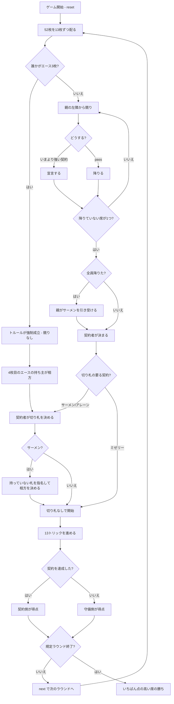

# カラーホイスト（CUI版）遊び方

## ゲーム概要

ベルギー・フランドル地方で遊ばれる**契約制ホイスト**（クルーレンヴィーゼン）。標準52枚を4人に13枚ずつ配ります。**手札の形が契約を決めてしまうことがある**のがこのゲームの特徴です。あなたは席0です。

## 起動方法

```sh
go run ./cmd/trumpcards colourwhist
go run ./cmd/trumpcards --lang en colourwhist  # 英語モード
```

## ルール

### トルール（Troel）——手札が契約を決める

**配った時点で誰かがエースを3枚持っていれば、競りをせずにトルールが成立します。**

- エース3枚を持っている人が契約者
- **4枚目のエースを持っている人が自動的に相方**（本人には最初から分かります）
- 2対2で8トリックを目指します
- **4枚とも1人が持っていれば相方は付かず**、単独で8トリックです

**トルールは競りでは選べません。** 配りでしか成立しない契約なので、`bid troel` は弾かれます。

### 競り（トルールが出なかったとき）

親の左隣から順に、**いまより強い契約を宣言するか、降りる（pass）**かを選びます。

| 強さ | 契約 | 目標 | 組 |
|------|------|------|----|
| 1 | **サーメン（Samen）** | 相方と合わせて8トリック | 2対2 |
| 2 | **アレーン（Alleen）** | 単独で8トリック | 単独対3人 |
| 3 | **ミゼリー（Miserie）** | **1トリックも取らない** | 単独対3人 |

サーメンは切り札を決めたあと、自分が持っていない札を1枚指名します。その札の持ち主が相方で、**指名された札が場に出るまで伏せられます**（トルールの相方と違って、すぐには分かりません）。

**全員が降りたら親がサーメンを引き受けます。**

### 札の強さとフォロー

エースが最強（A > K > Q > J > 10 > … > 2）。リードのスートを持っていればフォローします。ミゼリーだけ切り札がありません。

### 得点はゼロサム

**卓の得点の合計は常に 0** です。

| 契約 | 守備側1人あたり |
|------|----------------|
| サーメン / トルール | 1 + 目標との差 |
| アレーン | 3 |
| ミゼリー | 4 |

契約側は守備側が失った合計を人数比で受け取ります。契約側は1人か2人、守備側は3人か2人なので、**どちらの組み合わせでも割り切れて端数が出ません**。

規定ラウンド（既定8）を終えた時点で、いちばん点の高い席の勝ちです。

## ゲームの流れ



## コマンド一覧

| コマンド | 短縮形 | 説明 |
|----------|--------|------|
| `play <idx>` | `p` | 手札の `<idx>` 番目を出す |
| `bid <samen\|alleen\|miserie>` | | 契約を宣言する（**troel は指定できません**） |
| `pass` | | 競りを降りる |
| `call <s\|c\|h\|d>` | | 切り札を決める |
| `next` | | 次のラウンドを配る |
| `hint` | | 助言を表示する |
| `giveup` | | 投了する |
| `log` | | 棋譜（アクションログ）を表示する |
| `reset` | `r` | 最初からやり直す |
| `quit` | `q` | 終了する |
| `help` | `?` | コマンド一覧を表示 |

## 画面の見方

```
==========
Colour Whist (カラーホイスト)
==========
フェーズ: PLAY
ラウンド: 2 / 8
契約: トルール（エース3枚・強制）（切り札: ハート）
席 1 がエース3枚のため troel が強制成立しました（競りはありません）
契約者: 席 1（獲得 5 トリック）
得点: #0:-2 #1:6 #2:-2 #3:-2
----------
  席 2: SPADE 13
  席 3: SPADE 4
----------
手札: [0*]SPADE 1 [1 ]HEART 9 [2*]SPADE 7 ...
```

- **トルールの行**: 競りが飛ばされた理由がここに出ます。競りで決めた契約では出ません
- **契約者と獲得トリック**: 目標に届いているかが分かります
- **得点**: **負にもなります。** 合計は必ず 0 です
- **`*`**: 出せる札。フォローできるスートがあるときはそれだけになります

## 遊び方のコツ

- **エースが3枚来たら、競らずにトルールが始まります。** 宣言の機会が飛ばされても異常ではありません
- **トルールの相方は最初から分かります。** サーメンと違って読み合いがありません
- **ミゼリーは「弱い手札」で狙う契約。** 低い札ばかりなら、1トリックも取らないほうが簡単です
- **降りるのも立派な判断。** 契約は達成できないと失点します
- **ゼロサムなので、守備側で勝つのも得点になります。** 常に競り落とす必要はありません
