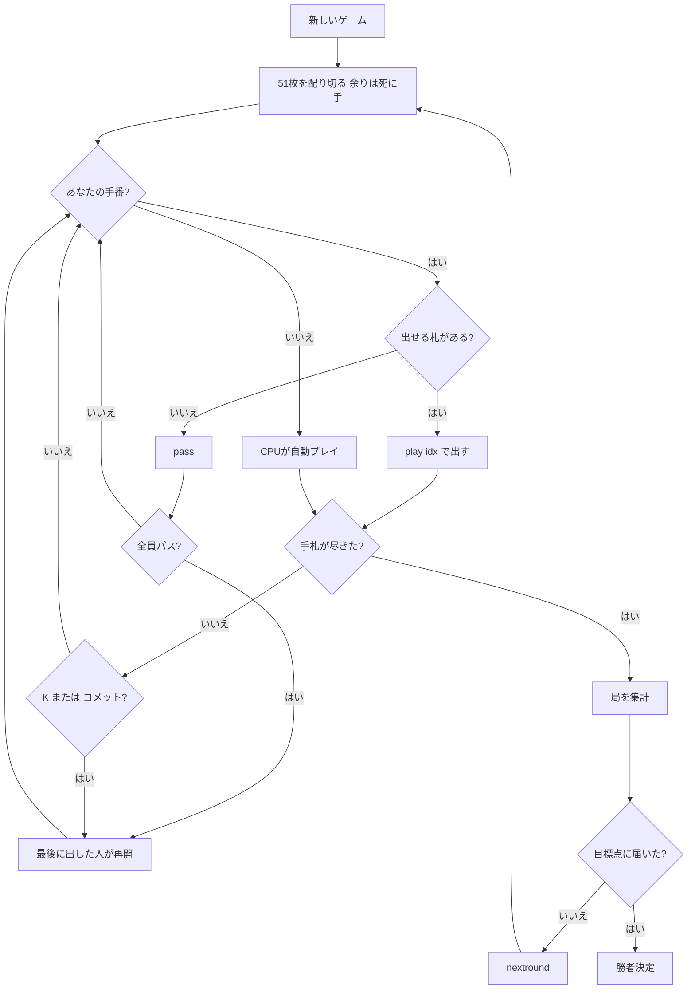

# コメット（CUI版）遊び方

## ゲーム概要

コメット（Comet）は 17 世紀フランスに生まれた **stops 系**カードゲームの祖です。1682 年のハレー彗星にちなんで名前が付きました。あなたと CPU 1〜4 人で戦います。

手札を早く出し切ることを競い、**ワイルドの「コメット」（9♦）** がどのランクの代わりにもなります。

## 起動方法

```sh
go run ./cmd/trumpcards comet
# または
go run ./cmd/trumpcards --lang en comet
```

## ルール

### 札と配り

**52 枚から 8♦ を抜いた 51 枚**を使います。全員に均等に配り、**割り切れない余りは伏せたまま「死に手」**として使いません。

**8♦ が無いことと、死に手に眠った札**が、連なりが止まる原因になります。これが「stops（止まる）」という名前の由来です。

### 連なりの作り方

**スートは一切見ません。ランクだけで昇ります。**

1. 親の左隣が**好きな札**を 1 枚出します（A から始める決まりではありません）
2. 次のランクを持っている人が出します。**スートは問いません**
3. 出せない人はパスします
4. K まで昇ると連なりは終わりです

**「同じスートで繋げる」ではありません。** スートを見るのは派生の Commit のほうで、**スートを見ないことがコメットを Michigan と分ける唯一の点**です。

### コメット（9♦）

**9♦ は「コメット」で、どのランクの代わりにもなります。** 出せる札が無いときの逃げ道になり、出したあとは**連なりが切れて、出した本人が新しい連なりを始められます**。

ただし**抱えたまま誰かに上がられると 1 点失います**。

### K は止まる

**K を出すと連なりが切れます。** 出した本人が新しい連なりを始めます。

### ストップ

全員が続けられずパスしたら、**最後に札を出した人**が好きな札で再開します。

### 得点

誰かが手札を出し切ったらその局は終わりです。上がった人が取ります。

| 項目 | 点 |
|------|-----|
| 上がり | 1 |
| 相手の手札に残った札 | 1 枚につき 1 |
| **出なかった K** | 1 枚につき **2** |
| コメットを抱えたまま終わった人 | **-1**（その人の失点） |

### 勝敗

**100 点**（設定で 20〜200）に先に届いた人の勝ちです。同点のまま並んだら次の局へ持ち越します。

## ゲームの流れ



## コマンド一覧

| コマンド | 短縮形 | 説明 |
|----------|--------|------|
| `play <idx>` | `p` | 手札の idx 番を出す |
| `pass` | | パスする（出せる札が無いときだけ） |
| `nextround` | `nr` | 次の局へ進む |
| `setdifficulty <0-2>` | `sd` | CPU 難易度（0=Easy, 1=Normal, 2=Hard） |
| `setplayers <2-5>` | `sp` | 席数 |
| `settarget <20-200>` | `st` | 目標点 |
| `hint` | `h` | 助言を表示 |
| `log` | `l` | 行動ログを表示 |
| `reset` | `r` | ゲームをリセット |
| `quit` | `q` | 終了 |
| `help` | `?` | コマンド一覧を表示 |

## 画面の見方

```
局 1（100 点勝負）
伏せた死に手: 3 枚
あなた （子）: 手札 12 枚　得点 0
[0]♥J  [1]♥K  [2]♠8  [3]♠5  [4]♣A  [5]♦9（コメット）
CPU 1 （子）: 手札 12 枚　得点 0
----------
連なり: ♠5 → ♥6 → ♠7
次に要るランク: 8（スートは問いません）
手番: あなた
  出せる札: [2]♠8
play <idx> ... 札を出す / pass ... パス
```

「連なり」の行が **♠5 → ♥6 → ♠7** と**スートを跨いでいる**ことに注目してください。コメットには **（コメット）** の印が付きます ── どのランクの代わりにもなる特別な 1 枚が、ただの ♦9 に見えていると出せる手を見落とすためです。

「出せる札」に何も並ばないときは `pass` するしかありません。**伏せた死に手の枚数**は見せています ── そこに眠った札で連なりが止まるので、読みの材料になります。
