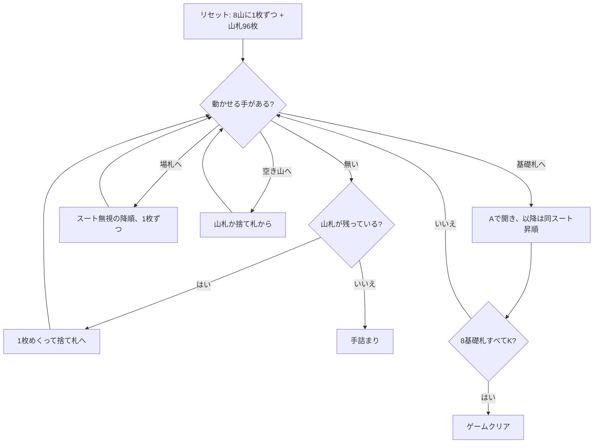

# コングレス（CUI版）遊び方

## ゲーム概要

52 枚 2 組（104 枚）で遊ぶイギリス発祥のソリティア。中央に 8 つの基礎札を置き、その左右に **4 つずつ計 8 つのタブロー山**を並べる。タブローには**最初 1 枚ずつ**しか配らず、残り 96 枚が山札になる。

基礎札は**最初は空**で、A が出てきたときにそこへ置き、同スートで K まで 13 枚積む。8×13 = 104 枚すべてを積み切ればクリア。

## 起動方法

```sh
go run ./cmd/trumpcards congress
go run ./cmd/trumpcards --lang en congress   # 英語
```

## ルール

- 52 枚 2 組（104 枚）。タブローは 8 山に **1 枚ずつ**、残り 96 枚が山札
- **基礎札**: 8 つ（スートごとに 2 つ）。**最初は空**で、A が出たら置く。以降は同スートで昇順、K で完成（13 枚）
- **タブロー**: **スートも色も無視した降順**。**1 枚ずつしか動かせない**（連番のまとめ移動は無い）。A の上には何も置けず、その山はそこで止まる
- **空き山**: **山札か捨て札の一番上からしか埋められない**。タブローから空き山へは動かせない
- 山札は 1 枚ずつ捨て札へめくる。**めくり直しは無い（1 巡のみ）**
- 空き山があるときは、捨て札を経由せず **`m s t <pile>` で山札から直接置ける**

> 補足: issue #4419 の仕様案とは 4 点異なるが、いずれも実際の規則に合わせた。
> (1) **8 枚の A を最初から基礎札に並べるのではない**。基礎札は空で始まり、A が出た順に置く（並べてしまうと山札から A を探し出す必要があり、別のゲームになる）。
> (2) **残り 96 枚はタブローではなく山札**。issue の配り方だと山札が 0 枚になり、同じ issue の規則 5「山札をめくる」と矛盾する。
> (3) 基礎札は「各スート 8 枚まで」ではなく **8 つの山に 13 枚ずつ**（前者は 32 枚にしかならず 104 枚を吸収できない）。
> (4) **空き山は山札か捨て札から埋める**（issue は触れていない）。

## ゲームの流れ



## コマンド一覧

| コマンド | 説明 |
|---------|------|
| `d`, `draw` | 山札を 1 枚めくって捨て札へ送る（めくり直しなし） |
| `m t <pile> f` | タブロー最上段を基礎札へ |
| `m t <from> t <to>` | タブロー間で 1 枚移動 |
| `m w f` | 捨て札から基礎札へ |
| `m w t <pile>` | 捨て札からタブローへ |
| `m s t <pile>` | 山札から空き山へ直接置く |
| `h`, `hint` | ヒントを表示する |
| `ac`, `autocomplete` | 基礎札へ送れる札がなくなるまで自動で送る |
| `u`, `undo` | 1 手戻す |
| `g`, `giveup` | ギブアップ |
| `l` | 棋譜（アクションログ）を表示する |
| `r`, `reset` | 最初からやり直す |
| `q`, `quit` | 終了する |

## 画面の見方

```
基礎札: SPADE 1 | [空] | [空] | [空] | [空] | [空] | [空] | [空]
山札: 90枚 捨て札: HEART 9 (5枚)
----------
山0: [0]SPADE 9 [1]HEART 8
山1: [0]CLOVER 4
山2: [空] (山札か捨て札からのみ)
...
山7: [0]DIAMOND 11
----------
手数: 12
```

- 空き山には「(山札か捨て札からのみ)」と添えられる。ここは場札の組み替え先ではない
- 各山の `[n]` は山内のインデックス。動かせるのは常に一番上の 1 枚だけ

## 遊び方のコツ

- **空き山は「場を組み替える道具」ではなく「山札・捨て札の受け皿」。** 場札から空き山へは動かせないので、山を空けたら山札か捨て札の行き場として使う
- **山札は 1 巡しか回らない。** 捨て札に送った札は 2 度と山札に戻らないので、めくる前に置き場所を考える
- 空き山があるうちは `m s t <pile>` で山札から直接置ける。捨て札に 1 枚積むより手が広い場面が多い
- タブローはスート無視の降順なので繋がりやすいが、**1 枚ずつしか動かせない**。深い山を掘るには何手もかかると見積もっておく
- A は出たらすぐ基礎札へ。8 つあるので序盤の 1 枚が後半を大きく変える
- 詰まったら `undo` で分岐をやり直す
