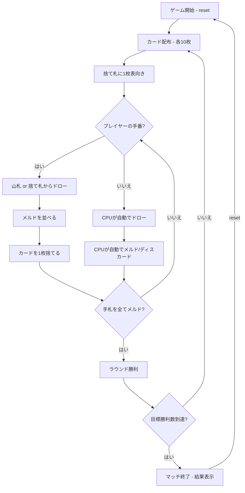

# コンキャン（CUI版）遊び方

## ゲーム概要

2人（プレイヤー1人 + CPU 1人）で遊ぶ、ラミーの祖先とされるメキシコ生まれのカードゲームです。40枚のラテンデッキ（8・9・10を抜いた構成）を使い、手札のカードをすべてテーブルメルド（セットやラン）として並べ切ったプレイヤーがそのラウンドの勝者になります。先に目標勝利数（デフォルト3）に達したプレイヤーがマッチに勝利します。

## 起動方法

```sh
go run ./cmd/trumpcards conquian
go run ./cmd/trumpcards --lang en conquian  # 英語モード
```

## ルール

### 基本ルール

- 40枚のラテンデッキを使用（各スートから 8・9・10 を除く）、2人プレイ
- 各プレイヤーに10枚ずつ配り、1枚を表向きにして捨て札を開始、残りは山札（ストック）
- 手番ではまず山札または捨て札からカードを1枚ドローする
- 捨て札から引いたカードは、その手番ですぐにメルドへ使わなければならない
- ドローのあとメルドを並べ、最後に手札から1枚捨てて手番を終える

### メルド

- **セット**: 同ランク3枚以上
- **ラン**: 同スートの連続する3枚以上。7とJは隣り合うものとして扱う（…6・7・J・Q…）
- メルドはプレイヤーごとに表向きでテーブルに並べる

### ラウンドとマッチの終了

- 手札をすべてメルドし切った（手札0枚になった）プレイヤーがそのラウンドの勝者
- 山札が尽きると引き分けで次のラウンドへ
- 先に目標勝利数（デフォルト3）に達したプレイヤーがマッチに勝利

### CPU難易度

- **Easy** (0): ランダムにカードを出す
- **Normal** (1): 基本的なメルド戦略（デフォルト）
- **Hard** (2): 戦略的なプレイ

## ゲームの流れ



## コマンド一覧

| コマンド | 短縮形 | 説明 |
|----------|--------|------|
| `reset` | `r` | ゲームリセット（設定保持） |
| `drawstock` | `ds` | 山札から1枚ドロー |
| `drawdiscard` | `dd` | 捨て札から1枚ドロー（必ずメルドに使用） |
| `meld <idx...>` | `m <idx...>` | テーブルにメルドを並べる（複数グループは `;` で区切る） |
| `discard <idx>` | `d <idx>` | カードを捨てる（インデックス指定） |
| `nextround` | `nr` | 次のラウンドへ |
| `setdifficulty <0-2>` | `sd <0-2>` | CPU難易度設定（0=Easy, 1=Normal, 2=Hard） |
| `setwins <n>` | `sw <n>` | 目標勝利数設定 |
| `log` | `l` | 棋譜表示 |
| `quit` | `q` | ゲーム終了 |
| `help` | `?` | ヘルプ表示 |

### コマンド例

- `ds` → 山札から1枚ドロー
- `dd` → 捨て札からトップカードをドロー（メルドに使う）
- `m 0 1 2` → インデックス0,1,2でメルドを1つ並べる
- `m 0 1 2 ; 3 4 5` → 2つのメルドをまとめて並べる
- `d 3` → インデックス3のカードを捨てる

## 画面の見方

```
==========
Conquian (コンキャン)
==========
ラウンド 2  フェーズ: MELD
捨て札: ♥ 7 | 山札: 28
----------
[You]: 勝利=1 手札=10
  [0]♠ A  [1]♣ 4  [2]♣ 5  [3]♥ 11  [4]♦ 12  ...
  メルド: {♣4, ♣5, ♣6}
CPU: 勝利=0 手札=10
----------
手番: あなた
==========
```

- `ラウンド N  フェーズ`: 現在のラウンド番号と進行フェーズ
- `捨て札`: 捨て札の一番上のカード / `山札`: 山札の残り枚数
- `[You]: 勝利=N 手札=N`: 各プレイヤーの勝利数と手札枚数
- `[0]♠ A`...: インデックス付きの手札カード
- `メルド`: テーブルに並んでいるメルド
- `メルド N/11`: 上がりに必要な11枚に対する進捗（手札10枚 + 引いた1枚を並べきると勝ち）。残り2枚以下になると「あと N 枚」が強調表示されます

## 遊び方のコツ

- 捨て札から引いたカードは必ずメルドに使う必要があるため、取るときは即メルドできるか確認しましょう
- 7とJが隣り合うランの特性を利用して、ランを伸ばすチャンスを見逃さないようにしましょう
- セットとランのどちらに組み込むか、手札全体の組み立てを意識しましょう
- 手札を1枚も残さずメルドし切ることがラウンド勝利の条件です
