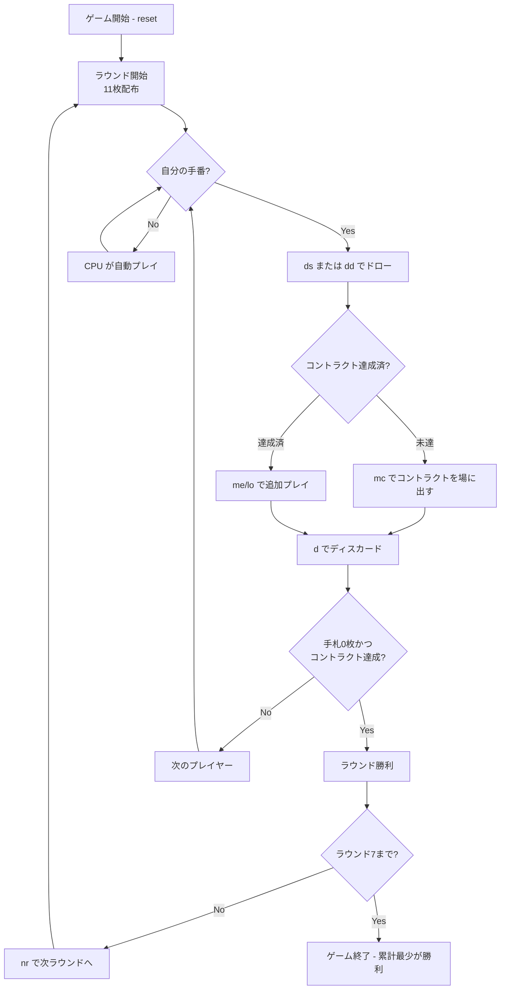

# コントラクトラミー（CUI版）遊び方

## ゲーム概要

人間1人＋CPU2人の3人プレイヤーで進行するラミー系ゲーム。全7ラウンドにわたり、ラウンドごとに「達成すべきメルドの組み合わせ（コントラクト）」が段階的に厳しくなる。手札ペナルティの累計が最も少ないプレイヤーが勝利する。

## 起動方法

```sh
go run ./cmd/trumpcards contractrummy
go run ./cmd/trumpcards --lang en contractrummy  # 英語モード
```

## ルール

### 基本ルール

- 2デッキ（104枚、ジョーカー無し）を使用。
- 初期配布: 各プレイヤーに11枚ずつ。残りは山札、最初の1枚を捨て札に。
- 各ターン: 山札 or 捨て札トップから1枚引く → コントラクト達成 / 追加メルド / レイオフ → 1枚捨ててターン終了。
- 自分のコントラクトを達成（オープン）するまでレイオフ・追加メルドはできない。
- 手札を全て出し切るとラウンド勝利（上がり）。ただしコントラクト達成済が前提。
- 山札と捨て札（トップ1枚を残し）が両方枯渇すると流局（誰の勝ち付かず、得点加算なし）。

### コントラクト一覧

| ラウンド | コントラクト |
|----------|--------------|
| 1 | 2つのセット（同ランク3枚）×2 |
| 2 | セット3枚 + ラン4枚（同スート連続） |
| 3 | ラン4枚 ×2 |
| 4 | セット3枚 ×3 |
| 5 | セット3枚 ×2 + ラン4枚 |
| 6 | セット3枚 + ラン4枚 ×2 |
| 7 | ラン4枚 ×3 |

### 得点

- 上がったプレイヤー: 0点。
- 他プレイヤー: 手札に残ったカードのペナルティが累計に加算される。
  - A=15点、2-9=額面、10/J/Q/K=10点。
- コントラクト未達のままラウンドが終わると、追加で「コントラクト未達ペナルティ（既定: 25点）」が加算される。

### ゲーム終了

7ラウンド終了時点で累計ペナルティが最少のプレイヤーが勝利。

## ゲームの流れ



## コマンド一覧

| コマンド | 短縮形 | 説明 |
|----------|--------|------|
| `reset` | `r` | 新しいゲームを開始 |
| `quit` | `q` | ゲーム終了 |
| `drawstock` | `ds` | 山札からカードを引く |
| `drawdiscard` | `dd` | 捨て札トップを取得 |
| `meldcontract <a,b,c> <d,e,f> ...` | `mc` | コントラクトを場に出す（スロットごとにカンマ区切り） |
| `meldextra <a,b,c>` | `me` | 追加メルドを場に出す（コントラクト達成後） |
| `layoff <pIdx> <mIdx> <cIdx>` | `lo` | 既存メルドにカードを追加 |
| `discard <idx>` | `d` | 手札からカードを捨ててターン終了 |
| `nextround` | `nr` | 次のラウンドへ進む |
| `setdifficulty <0-2>` | `sd` | CPU難易度を変更 (0=Easy, 1=Normal, 2=Hard) |
| `setpenalty <n>` | `sp` | コントラクト未達ペナルティを変更 |
| `log` | `l` | 棋譜を表示 |
| `help` | `?` | コマンド一覧を表示 |

## 画面の見方

```
==========
Contract Rummy (コントラクトラミー)
==========
ラウンド: 1 / 7  山札: 60枚
今回のコントラクト: 3枚セット + 3枚セット
捨て札: ♥7
You: 累積0点 ラウンド0点 11枚 [未達成]
  [0]♠5 [1]♥5 [2]♦5 [3]♣K [4]♥K ...
CPU 1: 累積0点 ラウンド0点 11枚 [未達成]
CPU 2: 累積0点 ラウンド0点 11枚 [未達成]
----------
手番: You (ドローフェーズ)
ds・・・山札から引く
dd・・・捨て札トップを取る
```

## 遊び方のコツ

- 序盤は手札を整理して、現在のコントラクトに必要なカードを集中して集める。
- A は15点と高ペナルティなので、コントラクト未達でラウンド終了が見えたら早めにディスカードする。
- 後半ラウンド（5-7）はコントラクトが大きいため、早めにオープンしておくとレイオフでさらに手札を減らしやすい。
