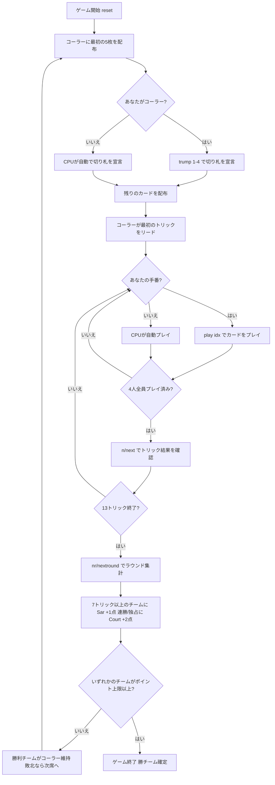

# コートピース (Rang)（CUI版）遊び方

## ゲーム概要

Court Piece（コートピース / Rang）は南アジアで広く親しまれている4人2チーム（席0&2 vs 席1&3）のトリックテイキングゲームです。各ラウンドの最初に**コーラー（Hakim）**が最初の5枚を見て**切り札スート**を宣言します。52枚のデッキを各自13枚で13トリック争い、**7トリック以上**取ったチームが**Sar（+1点）**を獲得します。連勝・全13トリック独占（Court）には**ボーナス（+2点）**。先に**ポイント上限（初期7）**へ達したチームの勝利です。

## 起動方法

```sh
go run ./cmd/trumpcards courtpiece
go run ./cmd/trumpcards --lang en courtpiece  # 英語モード
```

## ルール

### デッキと配布

- **デッキ**: 52枚（2〜A × 4スート）
- **プレイヤー**: 4人2チーム（あなた = 席0、席0&2がチームA、席1&3がチームB）
- **配布**: 各プレイヤー13枚、計13トリック

### トランプ宣言

- コーラー（Hakim）が最初の5枚を見て切り札スート（1=♠ 2=♣ 3=♥ 4=♦）を宣言します。

### トランプ宣言フェーズ

- 各ラウンドの最初に、**コーラー（Hakim）**が最初に配られた5枚を見て、切り札スートを1つ宣言します。
- `trump <1-4>` で宣言します（1=♠ 2=♣ 3=♥ 4=♦）。
- 宣言後に残りのカードが配られ、コーラーが最初のトリックをリードします。

### カードの強さ

トリック内での強さ（強い順）。切り札はすべての非切り札を上回ります。

| 強さ順 | カード |
|--------|--------|
| 1位 | A（エース） |
| 2位 | K（キング） |
| 3位 | Q（クイーン） |
| 4位 | J（ジャック） |
| 5位 | 10（テン） |
| … | 9 〜 2 |

### トリック・テイキング

- **スートフォロー義務**: リードされたスートのカードを持っている場合は必ず出さなければなりません。
- 持っていない場合は任意のカードを出せます（切り札でも非切り札でも）。
- **トリックの勝者**:
  - 切り札スートのカードが場にあれば、最も強い切り札カードが勝ちます。
  - 切り札がなければ、リードスートの最も強いカードが勝ちます。
- トリックの勝者が次のトリックをリードします。

### 得点計算と勝利条件

- 1ラウンド（13トリック）のうち**7トリック以上**取ったチームがそのラウンドに勝利し、**Sar（+1点）**を獲得します。
- 連勝（前ラウンドに続けて勝利）または**全13トリックの独占**を達成したチームには**Court ボーナス（+2点）**が加算されます。
- 勝利チームはコーラー役を維持します。敗北した場合、コーラーは次の席へ移ります。
- 先に**ポイント上限（初期7点）**へ達したチームがマッチ勝利。

## ゲームの流れ



## コマンド一覧

| コマンド | 短縮形 | 説明 |
|----------|--------|------|
| `trump <1-4>` | `t` | 切り札を宣言（1=♠ 2=♣ 3=♥ 4=♦） |
| `play <idx>` | `p` | 手札のidx番目のカードを出す |
| `next` | `n` | 次のトリックへ進む |
| `nextround` | `nr` | 次のラウンドへ進む |
| `setdifficulty <0-2>` | `sd` | CPU難易度設定（0=Easy, 1=Normal, 2=Hard） |
| `setlimit <n>` | `sl` | ポイント上限設定 |
| `hint` | `h` | ヒント表示 |
| `log` | `l` | アクションログを表示 |
| `reset` | `r` | 新しいゲームを開始（設定保持） |
| `quit` | `q` | ゲーム終了 |
| `help` | `?` | コマンド一覧を表示 |

## 画面の見方

```
==========
コートピース (Court Piece)
==========
ラウンド: 1  トリック: 0
切り札: 未宣言
累計: チーム0=0  チーム1=0
切り札を宣言: あなた (チームA)
あなた (チームA) 獲得0トリック 手札5枚
[0]SPADE 7  [1]SPADE 10  [2]HEART 5  [3]HEART 13  [4]DIAMOND 5
CPU 1 (チームB) 獲得0トリック 手札0枚
CPU 2 (チームA) 獲得0トリック 手札0枚
CPU 3 (チームB) 獲得0トリック 手札0枚
----------
切り札選択: あなたの番
t <1-4>・・・切り札を宣言 (1=♠ 2=♣ 3=♥ 4=♦)
```

- **タイトル行**: `コートピース (Court Piece)` — 日本語が先に出ます。
- **`切り札:` 行**: 宣言前は `未宣言`。
- **`累計:` 行**: `累計: チーム0=0  チーム1=0` — 両チームの累積ポイント。
- **`切り札を宣言:` 行**: 誰が宣言する番か。宣言後は出ません。
- **`切り札選択: あなたの番`**: 宣言フェーズの操作行 (`t <1-4>`)。
  **配りは 5 枚だけ**で始まり、他の席は `手札0枚` と出ます。
- **`[n]`付き行**: あなたの手札（インデックス付き）。
- **Court 成立行**: ラウンド終了時、連勝または全13トリック独占で Court ボーナスが付いたラウンドにだけ表示されます（そのラウンドは +1 ではなく +2 点）。

## 遊び方のコツ

- **長いスートを切り札に**: コーラーのときは、最も枚数の多いスートを切り札に選ぶとトリックを取りやすくなります。
- **切り札の温存**: 序盤は切り札を温存し、相手がリードした得点になりそうなトリックを切り札で奪う展開を狙いましょう。
- **7トリックを意識**: ラウンド勝利には13トリック中7トリック以上が必要です。確実に取れるトリックを数えながらプレイしましょう。
- **Court ボーナスを狙う**: 連勝中は次ラウンドの勝利で +2点。全13トリック独占でも +2点。優位な手札のときは大量得点を狙えます。
- **チームメイトとの連携**: チームメイト（席2のCPU）が勝っているトリックでは無理に強いカードを使わず、温存しましょう。
