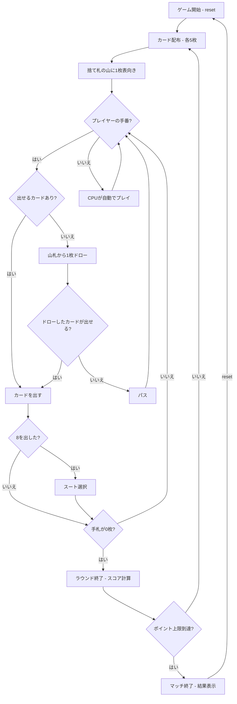

# クレイジーエイト（CUI版）遊び方

## ゲーム概要

4人（プレイヤー1人 + CPU 3人）で遊ぶカードゲームです。捨て札のトップカードとスートまたはランクが一致するカードを出していき、先に手札を全て出し切ったプレイヤーがラウンドの勝者です。ポイント上限（デフォルト200点）に達したプレイヤーが出たらマッチ終了です。

## 起動方法

```sh
go run ./cmd/trumpcards crazyeights
go run ./cmd/trumpcards --lang en crazyeights  # 英語モード
```

## ルール

### 基本ルール

- 52枚のトランプを使用、4人プレイ
- 各プレイヤーに5枚ずつ配り、1枚を表向きにして捨て札の山を開始、残りは山札
- 捨て札の山のトップカードとスートまたはランクが一致するカードを出す
- **8はワイルド**: 出すと次のスートを選べる
- 出せるカードがなければ山札から1枚ドロー。出せればそのまま続行、出せなければパス
- 山札が空になったら捨て札（トップを除く）をリサイクルして山札にする

### 得点

- ラウンド終了時、他プレイヤーの手札がスコアとして加算される
- 8=50点、J/Q/K=10点、A=1点、その他=額面

### ゲーム終了

- ポイント上限（デフォルト200点）に達したプレイヤーが出たらマッチ終了

### CPU難易度

- **Easy** (0): ランダムにカードを出す
- **Normal** (1): 基本的な戦略（デフォルト）
- **Hard** (2): 戦略的なプレイ（8の温存等）

## ゲームの流れ



## コマンド一覧

| コマンド | 短縮形 | 説明 |
|----------|--------|------|
| `reset` | `r` | ゲームリセット（設定保持） |
| `play <idx>` | `p <idx>` | カードをプレイ（インデックス指定） |
| `draw` | `d` | 山札から1枚ドロー |
| `suit <1-4>` | `s <1-4>` | スート選択（8を出した後）: 1=♠, 2=♣, 3=♥, 4=♦ |
| `nextround` | `nr` | ラウンドをスコアリングして次のラウンドへ |
| `setdifficulty <0-2>` | `sd <0-2>` | CPU難易度設定（0=Easy, 1=Normal, 2=Hard） |
| `setlimit <n>` | `sl <n>` | ポイント上限設定 |
| `log` | `l` | 棋譜表示 |
| `quit` | `q` | ゲーム終了 |
| `help` | `?` | ヘルプ表示 |

### コマンド例

- `p 2` → インデックス2のカードを出す
- `d` → 山札から1枚ドロー
- `s 3` → スートを♥に設定（8を出した後）
- `sd 2` → CPU難易度をHardに設定

## 画面の見方

```
==========
Crazy Eights (クレイジーエイト)
==========
ラウンド 1
----------
[You]: 0点
[0]SPADE 3  [1]CLOVER 8  [2]HEART Q  [3]DIAMOND 5  [4]SPADE J
CPU 1: 0点 (5枚)
CPU 2: 0点 (4枚)
CPU 3: 0点 (6枚)
----------
捨て札トップ: HEART 7
山札残り: 27枚
手番: あなた
p <idx>・・・カードを出す  d・・・ドロー
==========
```

- `ラウンド N`: 現在のラウンド番号
- `[You]: N点`: プレイヤーの累計得点
- `[0]SPADE 3`...: インデックス付きの手札カード
- `CPU N: M点 (X枚)`: CPUの累計得点と手札枚数
- `捨て札トップ`: 捨て札の山の一番上のカード
- `山札残り`: 山札の残り枚数

## 遊び方のコツ

- 8（ワイルド）は切り札として温存し、出せるカードがない時に使いましょう
- 相手の手札枚数が少なくなったら、出しにくいスートに切り替えて妨害しましょう
- 同じスートのカードが多い場合は、そのスートを続けて出すと有利です
- 高得点カード（8=50点、J/Q/K=10点）は早めに処理してリスクを減らしましょう
