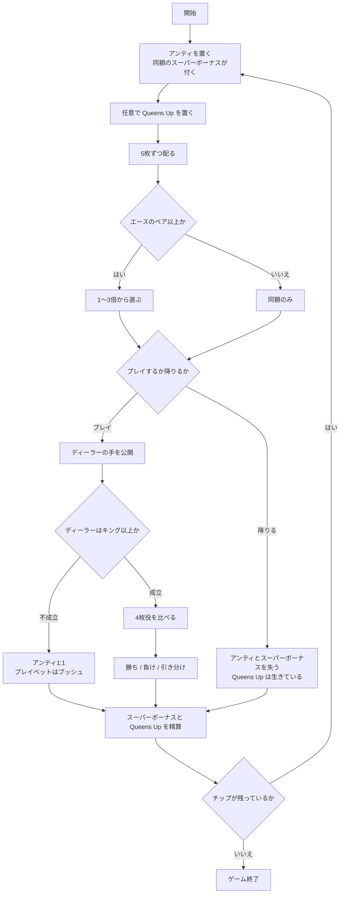

# クレイジー4ポーカー（CUI版）遊び方

## ゲーム概要

クレイジー4ポーカー（Crazy 4 Poker）はアメリカのカジノで定番のテーブルポーカーです。標準52枚のデッキを使い、プレイヤーとディーラーに5枚ずつ配って、**それぞれ最良の4枚**で勝負します。

名前の由来は独自のプレイベット規則です。プレイベットは通常アンティと同額しか置けませんが、**エースのペア以上を持っていれば3倍まで乗せられます**。つまり「倍率を動かせること自体が強い手の特典」で、ここがこのゲームの本体です。

## 起動方法

```sh
go run ./cmd/trumpcards crazyfourpoker
```

英語で起動する場合:

```sh
go run ./cmd/trumpcards --lang en crazyfourpoker
```

## ルール

- **アンティとスーパーボーナスは同額で必須**です。アンティを置くと自動的に同額のスーパーボーナスが付きます。
- **Queens Up** は任意のサイドベットです。自分の4枚役だけで決まり、ディーラーの手にも降りたかどうかにも左右されません。
- BET フェーズでは `Queens Up 配当: Four of a Kind 50:1 / Straight Flush 40:1 / ...` の行が出ます。**何が当たれば何倍かを見てから額を決められます。**
- 5枚ずつ配られたら、プレイベットを置くか降りるかを決めます。
  - 通常は**アンティと同額**のみ
  - **エースのペア以上**なら1〜3倍から選べます
  - 降りるとアンティとスーパーボーナスを失います
- **ディーラーはキング以上で成立（クオリファイ）**します。成立しなければアンティは1:1、プレイベットはプッシュです。
- ディーラーが成立して勝てばアンティとプレイベットが1:1、引き分けはプッシュ、負ければ両方没収です。
- **スーパーボーナスの3分岐**:
  - エースのペア以上 → **勝敗に関係なく**配当表どおり支払い
  - それ未満で勝ち・引き分け → 賭け金の返却
  - それ未満で負け → 没収
- 4枚役の強さは 4カード > ストレートフラッシュ > スリーカード > フラッシュ > ストレート > ツーペア > ワンペア > ハイカードです。

## ゲームの流れ



## コマンド一覧

| コマンド | 短縮形 | 説明 |
|----------|--------|------|
| `bet <額> [QU額]` | `b` | アンティを置く（同額のスーパーボーナスが付く。QU額は省略可） |
| `play <倍率>` | `p` | プレイベットを置く（3倍はエースのペア以上のみ） |
| `fold` | `f` | 降りる |
| `next` | - | 次のラウンドへ |
| `hint` | - | 助言を表示する |
| `log` | - | 棋譜を表示する |
| `reset` | `r` | ゲームをやり直す |
| `quit` | `q` | ゲームを終了する |
| `help` | - | ヘルプを表示する |

## 画面の見方

```
フェーズ: DECIDE
ラウンド: 3（チップ: 850）
アンティ 50 / Super Bonus 50 / Queens Up 20
----------
あなた: ♠A ♥A ♣5 ♦7 ♠9
  最良の4枚: ♠A ♥A ♦7 ♠9（Pair）
  置ける倍率: 1〜3
```

- **フェーズ**: `BET`（賭け）→ `DECIDE`（判断）→ `RESULT`（決着）
- **あなた**: 配られた5枚。そのうち**最良の4枚**が勝負に使われます
- **置ける倍率**: `1〜3` ならエースのペア以上、`1〜1` なら同額のみ
- **ディーラーの手は決着まで表示されません**。5枚から4枚を選ぶゲームなので、見えていると判断がまるごと変わってしまうためです

決着すると、ディーラーの5枚と最良の4枚、成立/不成立、収支が表示されます。

## 遊び方のコツ

- **エースのペア以上が出たら倍率を上げる場面です。** 出現率は約18.6%——5〜6回に1回は来ます。
- キング以上のハイカードがあれば同額で乗るのが基本です。ディーラーもキング以上でしか成立しないので、降りるとアンティとスーパーボーナスを確実に失います。
- **スーパーボーナスは「強い手なら負けても報われる」賭け**です。エースのペア以上さえあれば、ディーラーに負けても配当表どおり支払われます。
- Queens Up は自分の役だけで決まるので、降りても生きています。ハウスエッジは4.52%です。
