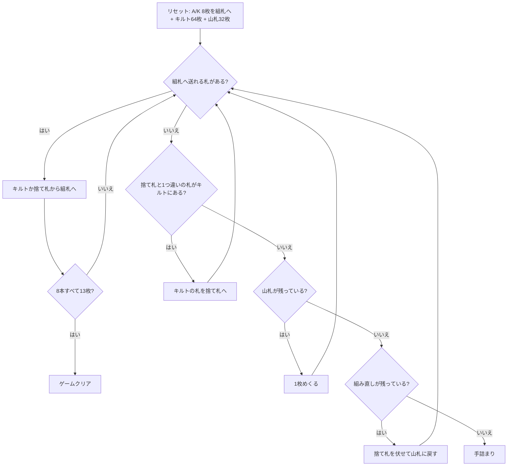

# クレイジーキルト（CUI版）遊び方

## ゲーム概要

イギリス発祥の 2 デッキソリティア。インディアンカーペットとも呼ばれる。8×8 の「キルト」に並べた 64 枚を崩しながら、8 本の組札に積み上げる。

このゲームの肝は**取れる札の条件**。カードは縦置きと横置きを market 目状に交互に敷いてあり、**短辺が空いている札だけ**が取れる。縦置きなら上か下、横置きなら左か右。**長辺が空いていても取れない**ので、盤面を見ただけでは何が取れるか分からない — CUI では取れる札に `*` を付けている。

## 起動方法

```sh
go run ./cmd/trumpcards crazyquilt
go run ./cmd/trumpcards --lang en crazyquilt   # 英語
```

## ルール

- 52 枚 2 組（104 枚）。**各スートの A と K を 1 枚ずつ、計 8 枚を先に抜いて組札に据える**
- 残り 96 枚のうち **64 枚を 8×8 のキルト**に並べ、残り **32 枚が山札**
- 組札は 8 本。前半 4 本は A から K への昇順、後半 4 本は K から A への降順（どちらも同スート）
- **取れるのは短辺が空いている札だけ。** 縦置きは上下、横置きは左右。盤の外は空き扱い
- キルトの札は組札へ送るほか、**捨て札の一番上と数字が 1 つ違いなら捨て札へも置ける**（スートは問わない）
- 山札は 1 枚ずつ捨て札へめくる。**尽きたら捨て札を伏せて 1 度だけ組み直せる**（シャッフルはしない）
- 8 本すべてが 13 枚になればクリア

## ゲームの流れ



## コマンド一覧

| コマンド | 短縮形 | 説明 |
|----------|--------|------|
| `draw` | `d` | 山札から1枚めくる（尽きたら組み直し） |
| `m q <cell> f` |  | キルトのマス `<cell>` (0..63) の札を組札へ |
| `m q <cell> w` |  | キルトの札を捨て札へ（数字が1つ違いのとき） |
| `m w f` |  | 捨て札を組札へ |
| `hint` | `h` | ヒントを表示する |
| `autocomplete` | `ac` | 送れるカードを自動で組札へ送る |
| `undo` | `u` | 1 手戻す |
| `giveup` | `g` | ギブアップ |
| `log` | `l` | 棋譜（アクションログ）を表示する |
| `reset` | `r` | 最初からやり直す |
| `quit` | `q` | 終了する |
| `help` | `?` | コマンド一覧を表示 |

## 画面の見方

```
組札(↑=A→K, ↓=K→A): ↑♠A | ↑♣A | ↑♥A | ↑♦A | ↓♠K | ↓♣K | ↓♥K | ↓♦K
山札: 32枚 組み直し: 残り1回 捨て札: ♥9 (1枚)
----------
*♠5 *♥7  ♣3  ♦10 *♠9  ・  *♥2 *♣8
 ♦4  ♠J   ♥6  ♣A  ♦Q   ♠2  ♥10 *♣7
...
* が付いた札だけ取れます（短辺が空いている札）
----------
手数: 0
```

- マス番号は左上が 0、右へ 1 ずつ増え、次の行は 8 から始まります（`row*8+col`）
- **`*` が付いた札だけ**が取れます。付いていない札は、短辺が両方とも埋まっています
- `・` は取り除いたあとの空きマス
- 組札の `↑` は A から K へ、`↓` は K から A へ積みます

## 遊び方のコツ

- **長辺が空いても意味が無い。** 縦置きの札は左右がいくら空いても取れません。`*` を見るのが確実です
- **1 枚どけると隣の短辺が開きます。** どの順で崩すと連鎖するかがこのゲームの読みどころ
- **捨て札への連番置きが主要な崩し手。** 組札に上げられない札でも、捨て札と 1 つ違いなら動かせます。これを使わないとキルトはほとんど減りません
- **組み直しは 1 度だけ。** 使う前に、キルトから捨て札へ送れる札が残っていないか確認する
- 同じ数字の札は 2 枚あり、そのスートの昇順・降順の 2 本がそれぞれ 1 枚ずつ必要とするので、片方に入らなくてももう一方が受け入れます

