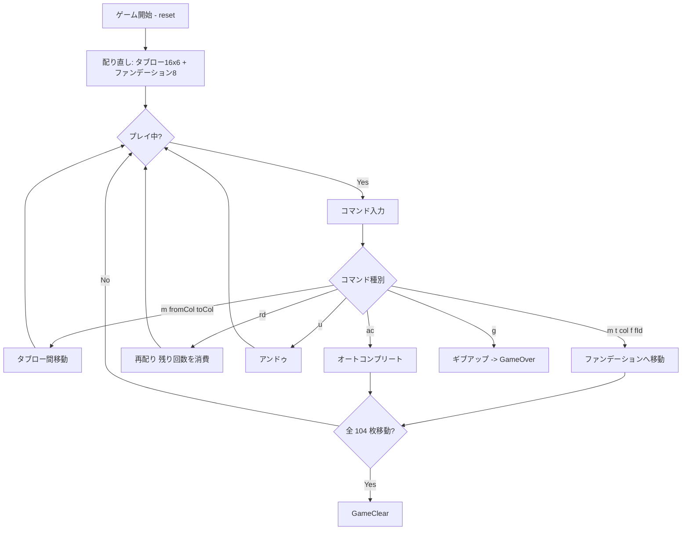

# クレセント・ソリティア（CUI版）遊び方

## ゲーム概要

2 デッキ（104 枚）を使うソリティアです。16 のタブロー山を 8 つのファンデーション（A から昇順×4、K から降順×4）に向けて整理し、すべてのカードをファンデーションに移せば勝利です。最大 3 回までタブローの並び順を反転させる「再配り（redeal）」が使えます。

## 起動方法

```sh
go run ./cmd/trumpcards crescent
go run ./cmd/trumpcards --lang en crescent  # 英語モード
```

## ルール

### 基本ルール

- カードは 2 デッキ 104 枚を使用します。
- 開始時に各スートの A と K を 1 枚ずつ取り出し、8 つのファンデーションの土台にします。
- 残り 96 枚を 16 列 × 6 枚のタブローに表向きで配ります。
- タブローの **最上段 1 枚** を移動できます。同じスート同士で値差 ±1、A↔K の wrap-around を許可します。
- 空になったタブロー列にはカードを置けません（再配りまで空のままです）。

### ファンデーション

| ファンデーション | 方向 | スート割り当て |
|------------------|------|-----------------|
| 0 | A → K（昇順） | ♠ |
| 1 | A → K（昇順） | ♣ |
| 2 | A → K（昇順） | ♥ |
| 3 | A → K（昇順） | ♦ |
| 4 | K → A（降順） | ♠ |
| 5 | K → A（降順） | ♣ |
| 6 | K → A（降順） | ♥ |
| 7 | K → A（降順） | ♦ |

### 再配り（redeal）

- ゲーム中に最大 3 回まで `rd` コマンドで再配りができます。
- 各タブロー列の **カードの順序を反転**（一番下が一番上に来る）し、再配り回数が 1 つ減ります。
- アンドゥ可能です。

### ゲーム終了

- すべてのカードをファンデーションに移せばクリアです。
- 残り再配り 0 回かつ合法手が無くなった場合は手詰まり（stalemate）になります。`g` でギブアップするか、アンドゥで脱出してください。

## ゲームの流れ



## コマンド一覧

| コマンド | 短縮形 | 説明 |
|----------|--------|------|
| `reset` | `r` | 新しいゲームを開始 |
| `m <fromCol> <toCol>` | — | タブロー間でカードを移動（簡略形） |
| `m t <fromCol> t <toCol>` | — | タブロー間でカードを移動 |
| `m t <fromCol> f <foundationId>` | — | タブローからファンデーションへ移動 |
| `redeal` | `rd` | 再配り（各タブロー列の順序を反転、最大 3 回） |
| `hint` | `h` | ヒントを表示 |
| `autocomplete` | `ac` | 残りすべてをファンデーションに移動 |
| `undo` | `u` | 直前の操作を取り消し |
| `giveup` | `g` | ゲームを放棄 |
| `log` | `l` | これまでの操作ログを表示 |
| `quit` | `q` | ゲーム終了 |
| `help` | `?` | コマンド一覧を表示 |

## 画面の見方

```
==========
Crescent Solitaire (クレセント・ソリティア)
==========
ファンデーション (昇順): [0]♠A | [1]♣A | [2]♥A | [3]♦A
ファンデーション (降順): [4]♠K | [5]♣K | [6]♥K | [7]♦K
残り再配り回数: 3
----------
列0: [0]♠6 [1]♥7 [2]♣2 [3]♣8 [4]♦3 [5]♠5
列1: [0]♠9 [1]♥10 ...
...
```

- ファンデーション ID と最上段カードが上 2 行に並びます。
- 各タブロー列は左端から右へカード番号付きで表示されます。

## 遊び方のコツ

- 同スートの ±1 を見つけたら、まず**ファンデーションへ送る** ことを優先しましょう。
- A↔K の wrap を利用するとタブロー内の長い連結が崩れずに移動できます。
- 再配りは **手詰まり寸前まで温存** すると展開が読みやすくなります。
- アンドゥが残っているうちに行き詰まりを検知して脱出を試みましょう。
