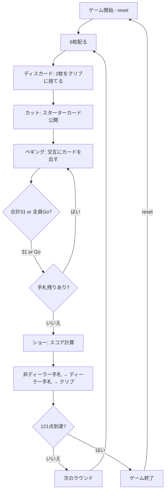

# クリベッジ（CUI版）遊び方

## ゲーム概要

2人対戦のカードゲームです。52枚のカードを使い、ペギング（カードを交互に出して得点）とハンドスコアリング（手札の組み合わせで得点）を繰り返し、先に121点に到達したプレイヤーが勝利します。

## 起動方法

```sh
go run ./cmd/trumpcards cribbage
go run ./cmd/trumpcards --lang en cribbage  # 英語モード
```

## ルール

### 基本ルール

- 52枚のトランプ（ジョーカーなし）を使用
- 2人対戦（1人 vs CPU）
- 各ラウンドでディーラーが交互に入れ替わる
- 先に121点（設定変更可能）に到達したプレイヤーが勝利

### ラウンドの流れ

1. **ディスカード**: 各プレイヤーに6枚配り、2枚ずつクリブ（ディーラーのボーナス手札）に捨てる
2. **カット**: 山札からスターターカードを1枚公開（Jならディーラーに2点 = His Heels）
3. **ペギング**: 非ディーラーから交互にカードを出し、合計31を目指す
4. **ショー**: 手札4枚+スターターカードの組み合わせでスコア計算

### カードの値（ペギング用）

| カード | 値 |
|--------|-----|
| A | 1 |
| 2〜10 | 数字通り |
| J, Q, K | 10 |

### ペギングの得点

| 条件 | 得点 |
|------|------|
| 合計が15になる | 2点 |
| ペア（同ランク2枚） | 2点 |
| ペアロイヤル（同ランク3枚） | 6点 |
| ダブルペアロイヤル（同ランク4枚） | 12点 |
| ラン（3枚以上の連番） | 枚数分 |
| 合計が31になる | 2点 |
| Go（相手が出せない） | 1点 |
| ラストカード | 1点 |

### ハンドスコアリング（ショーフェーズ）

手札4枚+スターターカードの5枚で以下を計算:

| 組み合わせ | 得点 |
|-----------|------|
| 15の組み合わせ | 各2点 |
| ペア | 各2点 |
| ラン（3枚以上の連番） | 枚数分 |
| フラッシュ（手札4枚同スート） | 4点 |
| フラッシュ（5枚同スート） | 5点 |
| ノブス（スターターと同スートのJ） | 1点 |

### CPU難易度

| 難易度 | 説明 |
|--------|------|
| Easy (0) | ランダムにプレイ |
| Normal (1) | 基本的な戦略でプレイ |
| Hard (2) | 最適なディスカードとペギング戦略 |

## ゲームの流れ



## コマンド一覧

| コマンド | 短縮形 | 説明 |
|----------|--------|------|
| `reset` | `r` | 新しいゲームを開始 |
| `discard <i1> <i2>` | `d` | 指定インデックスの2枚をクリブに捨てる |
| `peg <index>` | `p` | 指定インデックスのカードをペギングで出す |
| `go` | | Goを宣言（カードを出せない場合） |
| `hint` | `h` | おすすめのディスカード2枚またはペギングの1枚を表示 |
| `shownext` | `sn` | ショーフェーズの次のステップへ進む |
| `nextround` | `nr` | 次のラウンドを開始 |
| `setdifficulty <0-2>` | `sd` | CPU難易度を設定 |
| `setlimit <n>` | `sl` | 目標点数を設定 |
| `log` | `l` | アクションログ（棋譜）を表示 |
| `quit` | `q` | ゲーム終了 |
| `help` | `?` | コマンド一覧を表示 |

### コマンド例

- `d 4 5` → 手札の5番目と6番目のカードをクリブに捨てる
- `p 0` → 手札の1番目のカードをペギングで出す
- `go` → カードを出せない場合にGoを宣言
- `sn` → ショーフェーズの次のステップへ
- `nr` → 次のラウンドを開始
- `sd 2` → CPU難易度をHardに設定
- `sl 61` → 目標点数を61点に設定

## 画面の見方

```
==========
Cribbage (クリベッジ)
==========
ラウンド: 1  ディーラー: Player1
あなた: 累積0点 ラウンド0点 6枚
[0]SPADE 6  [1]HEART 7  [2]DIAMOND 9  [3]CLOVER 3  [4]CLOVER 11  [5]CLOVER 2
CPU 1 [D]: 累積0点 ラウンド0点 6枚
----------
手番: あなた (ディスカードフェーズ)
d <idx,idx>・・・クリブに2枚捨てる
==========
```

- `ラウンド: N  ディーラー: 名前`: ラウンド番号とディーラーが**同じ行**に出ます
- プレイヤー行: `あなた: 累積0点 ラウンド0点 6枚` — 累積得点・このラウンドの
  得点・手札枚数。**ディーラーの席には `[D]` が付きます**
- `[0]SPADE 6`...: インデックス付きの手札。番号が `d <idx,idx>` の引数です
- `手番: あなた (ディスカードフェーズ)`: 手番と、いまどのフェーズか。
  ペギングに入ると文言が変わります

## 遊び方のコツ

- ディスカードでは、クリブがディーラーのものであることを意識しましょう（自分がディーラーならクリブに良い組み合わせを、非ディーラーなら避けましょう）
- 15の組み合わせを作りやすいカード（5や10系カード）を手札に残すと高得点になりやすいです
- ペギングでは相手に15や31を作らせないよう注意しましょう
- ランを狙える連番のカードは手札に残しておくと有利です
- ショーフェーズでのスコアリングをよく理解し、ディスカードの判断に活かしましょう
