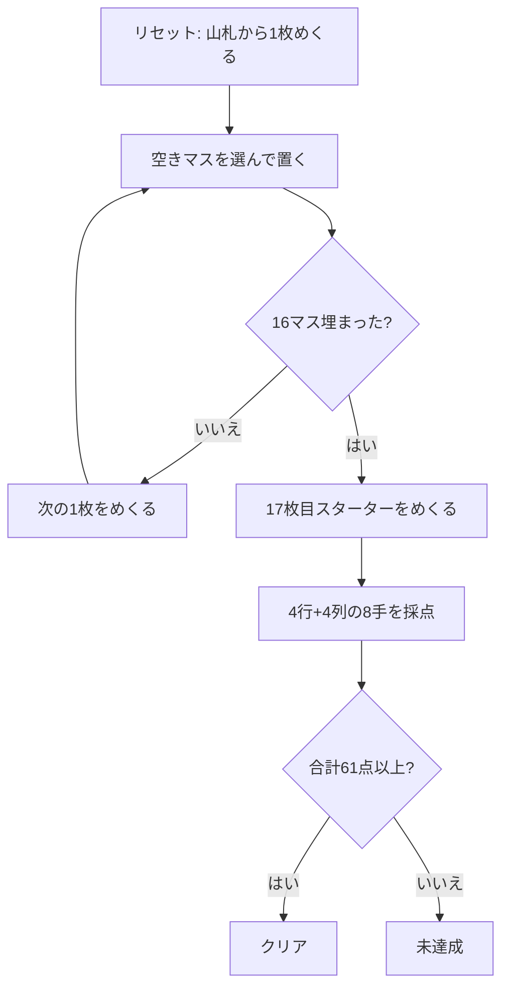

# クリベッジ・スクエアズ（CUI版）遊び方

## ゲーム概要

52 枚 1 組から 17 枚だけを使う 1 人用のパズル。4×4 のマスにカードを 1 枚ずつ置いていき、置き終えてから **17 枚目の「スターター」**をめくる。4 行 + 4 列の計 8 手を、それぞれ「その 4 枚 + スターター」のクリベッジの手として採点し、合計 **61 点**以上でクリア。

置いたカードは二度と動かせず、**スターターは最後まで分からない**。つまり 8 つの手すべてを、5 枚目が何になるか分からないまま組むことになる。15 とペアをどこまで重ねに行くかがすべて。

## 起動方法

```sh
go run ./cmd/trumpcards cribbagesquares
go run ./cmd/trumpcards --lang en cribbagesquares   # 英語
```

## ルール

- 52 枚 1 組。山札から 1 枚ずつめくり、**空いているマスならどこにでも**置ける
- 置いたカードは動かせない。16 マスすべて埋まるまで続ける
- 16 枚置き終えたら **17 枚目（スターター）をめくる**
- **4 行 + 4 列の計 8 手**を、それぞれ「4 枚 + スターター」の 5 枚として採点する
  - **15**: 合計 15 になる組合せ 1 つにつき 2 点（枚数は問わない）
  - **ペア**: 同じランク 2 枚につき 2 点（3 枚なら 6 点、4 枚なら 12 点）
  - **ラン**: 3 枚以上の連番 1 つにつき、その枚数ぶんの点
  - **フラッシュ**: 手の 4 枚が同じスートなら 4 点。スターターも同スートなら 5 点
  - **ノブズ**: 手の中の J がスターターと同じスートなら 1 点
  - 絵札はすべて 10 として数える（15 の計算）。ランクの並びは A=1 から K=13
- 8 手の合計が **61 点以上でクリア**

## ゲームの流れ



## コマンド一覧

| コマンド | 短縮形 | 説明 |
|----------|--------|------|
| `place <行> <列>` | `p` | 手持ちのカードを置く（0始まり、0..3） |
| `hint` | `h` | 置き場所のヒントを表示する |
| `undo` | `u` | 1 手戻す |
| `giveup` | `g` | ギブアップ |
| `log` | `l` | 棋譜（アクションログ）を表示する |
| `reset` | `r` | 最初からやり直す |
| `quit` | `q` | 終了する |
| `help` | `?` | コマンド一覧を表示 |

## 画面の見方

```
(0,0) ♠5 | (0,1) ♥10 | (0,2) ..... | (0,3) .....   => 行スコア: 0
(1,0) ..... | (1,1) ..... | (1,2) ..... | (1,3) .....   => 行スコア: 0
(2,0) ..... | (2,1) ..... | (2,2) ..... | (2,3) .....   => 行スコア: 0
(3,0) ..... | (3,1) ..... | (3,2) ..... | (3,3) .....   => 行スコア: 0
----------
col0=0 col1=0 col2=0 col3=0
----------
手持ちカード: ♦7
スターター: (16枚置き終えるまで伏せたまま)
配置済み: 2/16  合計得点: 0
```

- `(行,列)` は 0 始まり。`.....` は空きマス
- **行スコアと列スコアはスターターがめくられるまで 0 のまま。** 4 枚だけで数えた点を出すと、本来より低い数字を途中経過だと誤解してしまうため
- 終了時には 8 手それぞれの内訳（`15が4 ペア2` のように）と、クリア基準 61 点との比較が表示される

## 遊び方のコツ

- **5 と 10 系（10・J・Q・K）は 15 を作る主役。** 5 が来たら 10 系の並ぶ行・列へ、10 系が来たら 5 のある行・列へ寄せる
- **同じランクを 3 枚並べると 6 点、4 枚なら 12 点。** ペアは行と列の両方で数えられるので、同じランクを縦横が交わる位置に集めると効率が良い
- **フラッシュは 4 点だが行か列の片方でしか成立しない。** 4 枚すべて同じスートに揃える必要があり、途中でスートが割れると 0 点になる。狙うなら早めに 1 列を決め打ちする
- **スターターは全 8 手に効く。** どの手にも 5 枚目として加わるので、A から K までまんべんなく散らすより、狙ったランク帯に寄せたほうが噛み合いやすい
- `hint` は「その位置に置くと行と列で何点増えるか」で選んでいる。フラッシュとノブズはスターター次第なので数に入れていない

