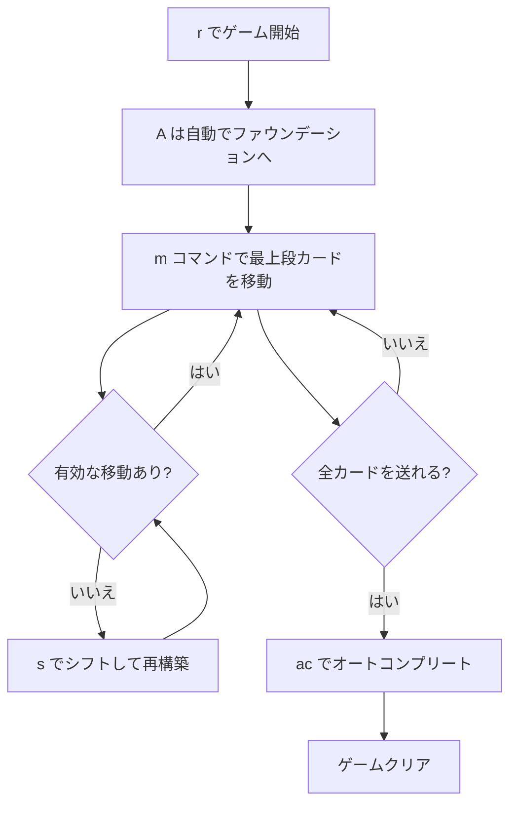

# クルーエル（CUI版）遊び方

## ゲーム概要

Cruel（クルーエル）は1人用のクラシックなパズル系ソリティアです。4枚のAは最初から組札に置かれ、残り48枚を12列×4枚のタブローに表向きで配ります。カード移動は「同スートで降順」のみ、空列にはカードを置けないという厳しいルールが特徴で、行き詰まったときの脱出手段として「シフト」という独特な再配置ギミックがあります。

## 起動方法

```sh
go run ./cmd/trumpcards cruel           # 日本語
go run ./cmd/trumpcards --lang en cruel # 英語
```

## ルール

### 配り方

- 開始時にすべてのAをファウンデーションへ自動配置
- 残り48枚を12列×4枚のタブローに表向きで配る

### 移動ルール

- タブロー → タブロー: 各列の**最上段カードのみ**を移動可能（同スートで1つ下の値）
- タブロー → ファウンデーション: 各列の最上段カードのみ（同スート・昇順）
- 空の列にはカードを置けない
- **シフト**: 残りタブローカードを左から順に集め、再度12列×4枚に左詰めで配り直す（列の順序とカードの相対順序は保持）

### 勝利条件

- すべてのカード（A→K）が4スート分ファウンデーションに揃ったらクリア

## ゲームの流れ



## コマンド一覧

| コマンド | 短縮形 | 説明 |
|----------|--------|------|
| `move <列> <列>` | `m` | 列間で最上段カードを移動 |
| `move <列> f` | `m` | タブローからファウンデーションへ移動 |
| `shift` | `s` | シフト（盤面を再構築） |
| `giveup` | `g` | ギブアップ |
| `hint` | `h` | ヒント |
| `autocomplete` | `ac` | オートコンプリート |
| `undo` | `u` | 元に戻す |
| `log` | `l` | 棋譜表示 |
| `reset` | `r` | リセット |
| `quit` | `q` | 終了 |
| `help` | `?` | コマンド一覧を表示 |

## 画面の見方

```
=== Cruel (クルーエル) ===
Foundation: SPADE 1 | CLOVER 1 | HEART 1 | DIAMOND 1
----------
列0: [0]♠5 [1]♥9 [2]♣7 [3]♦K
列1: [0]♥3 [1]♠Q [2]♦8 [3]♣2
列2: [0]♣J [1]♦4 [2]♠6 [3]♥10
...
列11: [0]♦Q [1]♥6 [2]♣4 [3]♠8
----------
手数: 0
```

## 遊び方のコツ

- 同スート降順しか繋げないため、すぐに行き詰まりやすい
- 移動できるのは各列の**最上段だけ**なので、上のカードを動かして下のカードを掘り出すという発想は通用しない
- 手詰まり時は `s`（シフト）で盤面を作り直すと新しい移動の機会が生まれることがある
- ただしシフト後の並びは元の順序を保つため、必ず解決するとは限らない
- `h` でヒントを参照し、優先順位は「ファウンデーション送り > タブロー間移動」と覚えておく
- `u` でいつでも巻き戻せるので、シフト前に試行錯誤するのが安全
