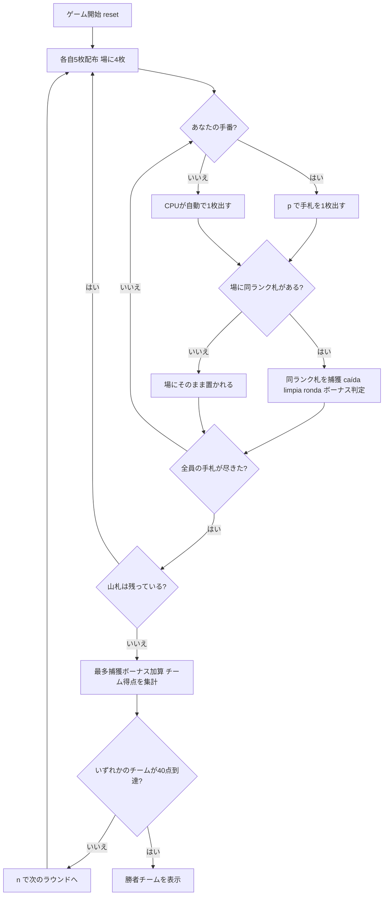

# クアレンタ（CUI版）遊び方

## ゲーム概要

Cuarenta（クアレンタ）はエクアドル生まれの4人2チーム制（座席 {0,2}=チームA 対 {1,3}=チームB）の**捕獲（フィッシング）系カードゲーム**です。8・9・10を除いた40枚のスペイン式デッキを使い、各自5枚ずつ配って中央の場に4枚を置きます。自分の手番ではカードを1枚出し、場のカードと**同じランク**があればその同ランク札をすべて捕獲します（同ランクが3枚以上並ぶ「ronda」では連鎖して追加捕獲できます）。捕獲できなければそのカードは場に置かれます。捕獲には caída・limpia・ronda などのボーナスがあり、ラウンド終了時には全40枚の過半数（20枚超）を捕獲したチームに「最多捕獲」ボーナスが入ります。先に目標点（デフォルト40点）に到達したチームの勝利です。

## 起動方法

```sh
go run ./cmd/trumpcards cuarenta
go run ./cmd/trumpcards --lang en cuarenta  # 英語モード
```

## ルール

### デッキと配布

- **デッキ**: 40枚（8・9・10を除いたスペイン式デッキ）
- **プレイヤー**: 4人2チーム（あなた + CPU3人）。座席 {0,2}=チームA、{1,3}=チームB。
- **配布**: 各プレイヤーに5枚ずつ。さらに場の中央に4枚を置きます。
- 手札が全員尽きたら、山札から5枚ずつ配り直します。

### カードを出す・捕獲する

- 自分の手番では、手札を1枚選んで出します（`p <手札番号>`）。
- 出したカードが**場のカードと同じランク**なら、その同ランク札をすべて捕獲します。
- 同ランクが**3枚以上**並んでいる場合（ronda）は、連鎖してまとめて捕獲できます。
- 捕獲できなかった場合、出したカードはそのまま場に置かれます。

### ボーナス（すべて加点）

| 項目 | 内容 | 得点 |
|------|------|------|
| caída（カイダ） | 直前のプレイヤーが置いたカードを即座に捕獲 | +2 |
| limpia（リンピア） | 場のカードをすべて捕獲して空にする | +1 |
| ronda（ロンダ） | 同ランク3枚以上の連を捕獲（2枚を超える1枚ごと） | +1/枚 |

### 最多捕獲ボーナス

- ラウンド終了時、全40枚のうち**過半数（20枚超）**を捕獲したチームに **+6点**。

### ゲーム終了

- 先に**目標点（デフォルト40点）**に到達したチームの勝利です。

### CPU難易度

- **Easy（0）**: ランダムな合法手を選びます。
- **Normal（1）**: 捕獲できる手を優先します。
- **Hard（2）**: caída や ronda など高得点の捕獲を狙います。

## ゲームの流れ



## コマンド一覧

| コマンド | 短縮形 | 説明 |
|----------|--------|------|
| `play <h>` | `p` | 手札h番を出す（場の同ランク札を捕獲、なければ場に置く） |
| `next` | `n` | 次のラウンドを開始する |
| `setdifficulty <0-2>` | `sd` | CPU難易度設定（0=Easy, 1=Normal, 2=Hard）。リセットされます |
| `log` | `l` | アクションログを表示 |
| `reset` | `r` | 新しいゲームを開始（設定保持） |
| `quit` | `q` | ゲーム終了 |
| `help` | `?` | コマンド一覧を表示 |

## 画面の見方

```
==========
Cuarenta (クアレンタ)
==========
山札: 残り16枚
場: ♣7 ♦K ♠5 ♥7 (4枚)
チームA 得点: 0 / チームB 得点: 0
あなた (チームA): 手札5枚 / 捕獲0枚
CPU 1 (チームB): 手札5枚 / 捕獲0枚
CPU 2 (チームA): 手札5枚 / 捕獲0枚
CPU 3 (チームB): 手札5枚 / 捕獲0枚
手番: あなた
p <hand> で手札を1枚出す (場の同ランク札を捕獲)
```

- **山札行**: 山札の残り枚数。
- **場行**: 場に出ているカードと枚数。
- **チーム得点行**: チームA・チームBの累計得点。
- **プレイヤー行**: 各プレイヤーの所属チーム・手札枚数・捕獲枚数。
- **手番表示**: 現在の手番のプレイヤー。

## 遊び方のコツ

- **caída を狙う**: 直前のプレイヤーが置いたカードと同ランクの札を持っていれば、即座に捕獲して +2点。相手の捨て札をよく観察しましょう。
- **limpia で一掃**: 場のカードをすべて捕獲できる手は、+1点に加え相手の caída の機会も奪えます。
- **ronda の連鎖**: 同ランクが3枚以上並んだら、まとめて捕獲して追加点を稼ぎましょう。
- **最多捕獲を意識**: ラウンドで20枚超を捕獲すると +6点と大きいので、終盤は枚数も意識して捕獲しましょう。
- **難易度調整**: Hard のCPUは caída や ronda を狙ってきます。慣れないうちは Easy から始めましょう。
