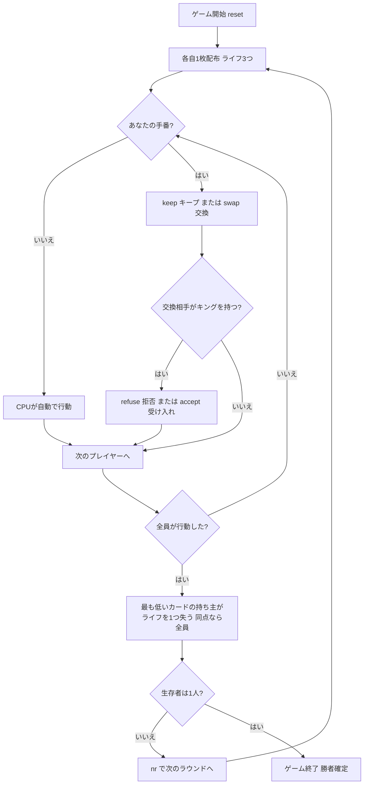

# カッコー（CUI版）遊び方

## ゲーム概要

Cuckoo（カッコー、別名 **Chase the Ace** / **Ranter-Go-Round**）は4人で遊ぶ**ライフ・サバイバルゲーム**です。各プレイヤーは1枚のカードと3つの**ライフ**を持ちます。自分の手番では、手札をそのまま**キープ**するか、**隣のプレイヤーと交換**します（親は山札と交換します）。**キング**を持っていれば、隣からの交換を**拒否**できます（キングを公開します）。全員が行動したあと、**最も低いカード**の持ち主がライフを1つ失います（同点なら全員）。ライフが0になると**脱落**し、最後まで生き残ったプレイヤーが勝者です。

## 起動方法

```sh
go run ./cmd/trumpcards cuckoo
go run ./cmd/trumpcards --lang en cuckoo  # 英語モード
```

## ルール

### デッキと配布

- **デッキ**: 52枚（標準デッキ）
- **プレイヤー**: 4人（あなた + CPU3人）
- **ライフ**: 各自3つ（初期ライフは設定で変更可能）
- **配布**: 各プレイヤー1枚。残りは山札になります。

### 手番（キープ／交換）

- 自分の手番では、手札をそのまま残す**キープ**（`keep`）か、**隣のプレイヤーと交換**する（`swap`）かを選びます。
- **親（ディーラー）**は隣のプレイヤーではなく、**山札の一番上**と交換します。
- カードのランクが低いほど不利です。ランクの低いカードを持っていると感じたら交換を狙いましょう。

### 拒否（キング）

- 交換を仕掛けられた側が**キング**を持っている場合、キングを公開して交換を**拒否**できます（`refuse`）。
- 拒否したくない場合は交換を**受け入れ**ます（`accept`）。

### ラウンド解決

- 全員が行動したあと、**最も低いカード**の持ち主がライフを1つ失います。
- 同じ最低ランクを複数人が持っていた場合、その全員がライフを1つ失います。
- ライフが0になったプレイヤーは**脱落**します。

### 勝利条件

- 脱落せずに最後まで生き残ったプレイヤーの勝利です。

### CPU難易度

- **Easy（0）**: 弱気でやや不利な判断をしがち。
- **Normal（1）**: 標準的な判断。
- **Hard（2）**: 手堅く有利な判断をする。

## ゲームの流れ



## コマンド一覧

| コマンド | 短縮形 | 説明 |
|----------|--------|------|
| `keep` | `k` | 手札をそのままキープする |
| `swap` | `s` | 隣のプレイヤーと交換する（親は山札と交換） |
| `refuse` | `rf` | キングを公開して交換を拒否する |
| `accept` | `ac` | 交換を受け入れる |
| `nextround` | `nr` | 次のラウンドへ進む |
| `setdifficulty <0-2>` | `sd` | CPU難易度設定（0=Easy, 1=Normal, 2=Hard）。リセットされます |
| `log` | `l` | アクションログを表示 |
| `reset` | `r` | 新しいゲームを開始（設定保持） |
| `quit` | `q` | ゲーム終了 |
| `help` | `?` | コマンド一覧を表示 |

## 画面の見方

```
==========
Cuckoo (カッコー)
==========
ラウンド 1  親: CPU 3  山札: 47枚
----------
あなた: ♥♥♥ 5♠ <- turn
CPU 1: ♥♥♥
CPU 2: ♥♥♥
CPU 3: ♥♥♥
----------
あなたの番です — keep でキープ、swap で交換できます。
```

- **ラウンド行**: 現在のラウンド数・親・山札の枚数。
- **プレイヤー行**: 各プレイヤーのライフ（♥）と状態。あなたのカードのみ常に公開されます。
- **手番表示**: `<- turn` が現在の手番のプレイヤーを示します。

## 遊び方のコツ

- **低いカードは交換**: キングやエース以外の低いランクを持っていたら、積極的に交換を狙いましょう。
- **キングは盾**: キングを引いたら交換を拒否できます。最後まで温存して生き残りを狙えます。
- **親は山札頼み**: 親のときは隣ではなく山札と交換するため、結果が読みにくくなります。
- **難易度調整**: Hard のCPUは手堅い判断をします。慣れないうちは Easy から始めましょう。
