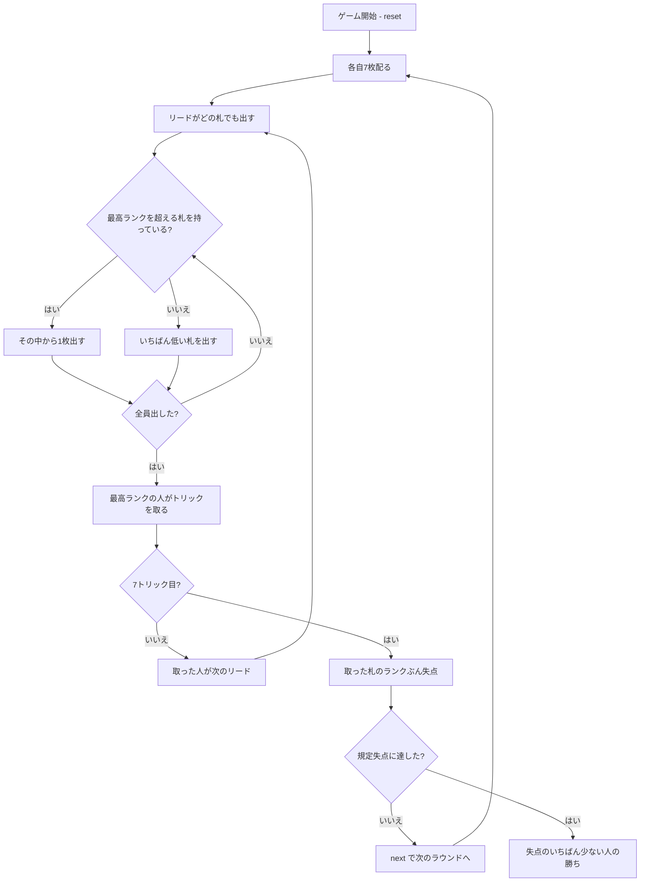

# キューカンバー（CUI版）遊び方

## ゲーム概要

スウェーデン・フィンランドの**変則トリックテイキング**（グルカとも）。**スートは一切関係ありません。** いま出ている最高ランクより高い札を持っていれば必ずそれを出し、無ければ手札のいちばん低い札を出します。**失点が付くのは最終トリックを取った1人だけ**で、そのトリックを取った札のランクぶん失点します。3〜6人で遊べます。

## 起動方法

```sh
go run ./cmd/trumpcards cucumber
go run ./cmd/trumpcards --lang en cucumber  # 英語モード
```

## ルール

### 配り

**各自7枚固定**です。標準52枚から配り、残りは使いません。

| 人数 | 使う枚数 |
|------|---------|
| 3人 | 21枚 |
| 4人 | 28枚 |
| 5人 | 35枚 |
| 6人 | 42枚 |

52枚は3人・5人・6人で割り切れないので、**人数で割らずに7枚固定**にしています。

### 比較フォロー

リードの人は**どの札でも**出せます。以降の人は次のどちらかです。

1. **いま出ている最高ランクより高い札を持っていれば、その中から1枚出す**（スート不問）
2. **1枚も持っていなければ、手札のいちばん低い札を出す**

**選べるのは「どの高い札を出すか」だけ**で、出さない自由も、低い札を温存する自由もありません。

ランクは A がいちばん強く（14）、K・Q・J・10…2 と下がります。

### トリック

**最高ランクを出した人が取ります。** 同ランクなら先に出したほうが勝ちです。取った人が次のリードになります。

### 失点

**失点が付くのは最終トリック（7トリック目）を取った1人だけ**で、そのトリックを取った札のランクぶん失点します。

途中のトリックは何枚取っても**0点**です。つまり危険なのは、**終盤に高い札が残っていること**だけです。

### 勝敗

誰かが規定の失点（既定30点）に達したらゲーム終了。**失点がいちばん少ない人の勝ち**です。

### 終わらない心配はありません

最終トリックのランクは必ず2以上なので、**毎ラウンド必ず誰かの失点が増えます**。失点は減らないので、いずれ上限に届きます。

## ゲームの流れ



## コマンド一覧

| コマンド | 短縮形 | 説明 |
|----------|--------|------|
| `play <idx>` | `p` | 手札の `<idx>` 番目を出す |
| `next` | `n` | 次のラウンドを配る |
| `hint` | `h` | 出すべき札を提示する |
| `giveup` | `g` | 投了する |
| `log` | `l` | 棋譜（アクションログ）を表示する |
| `reset` | `r` | 最初からやり直す |
| `quit` | `q` | 終了する |
| `help` | `?` | コマンド一覧を表示 |

**ラウンドが終わったら `next` を押すまで配り直しません。** 誰がいくつ失点したかを読む時間です。

## 画面の見方

```
==========
Cucumber (キューカンバー／グルカ)
==========
ラウンド: 3  トリック: 5  終了失点: 30点
スートは一切関係ありません。いま出ている最高ランクより高い札を持っていれば必ずそれを出し、無ければ手札のいちばん低い札を出します。選べるのは「どの高い札を出すか」だけです。トリックは最高ランクを出した人が取りますが、失点が付くのは最終トリックを取った1人だけで、そのトリックを取った札のランクぶん失点します。途中のトリックは何枚取っても0点です。失点がいちばん少ない人の勝ちです。
いまの最高ランク: 9
>あなた: 手札3枚 失点12点
  [0]♠3 [1]♥10 [2]♣Q
 CPU1[最終トリックで11点]: 手札3枚 失点11点
 CPU2: 手札3枚 失点0点
 CPU3: 手札3枚 失点5点
----------
9 より高い札を出してください。
play <idx>・・・カードを出す
```

- **いまの最高ランク**: **これが盤面の全て**です。スートが無いので、これ以外に手掛かりはありません
- **失点**: これがそのまま順位。**少ないほうが良い**ので、得点表示はありません
- **`[最終トリックで N 点]`**: 直前のラウンドで失点を負った席。盤面には痕跡が残らないので明示します
- **促し**: 「N より高い札」「いちばん低い札を出すことになります」「リードです」を言い分けます

## 遊び方のコツ

- **高い札は早めに使う。** 最終トリックに A や K が残っているのがいちばん危険です
- **更新は最小限で。** 9 を超えるのに A を使う必要はありません。10 で足りるなら 10 です
- **終盤に手札が弱いほど安全。** 更新できなければ低い札を捨てるだけで、失点は付きません
- **相手の失点を見る。** 上限に近い相手が居るなら、そのまま押し切ればゲームが終わります
- **途中のトリックは何枚取っても0点。** 取ること自体を怖がる必要はありません
