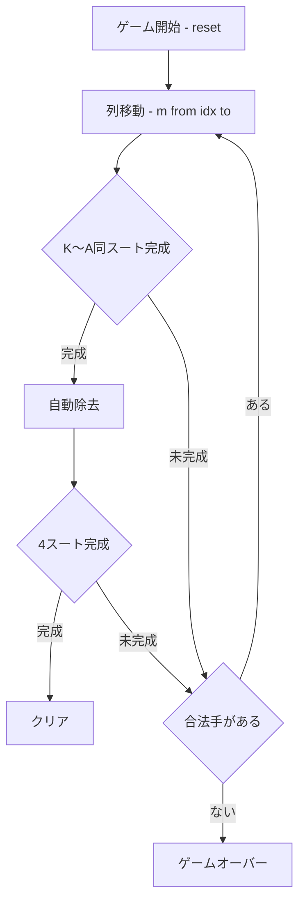

# カーズ・アンド・ホエイ（CUI版）遊び方

## ゲーム概要

カーズ・アンド・ホエイは、スパイダー系ソリティアの一種です。標準52枚デッキを **最初から全て表向きに 13 列（各4枚）** へ配り、**ストックもフリーセルもありません**。各列の最上位カード、または同スート降順の連番列を移動し、**同スートの K〜A 完全列** が揃うと自動的に除去されます。**4 スート全て除去でクリア**です。

## 起動方法

```sh
go run ./cmd/trumpcards curdsandwhey
go run ./cmd/trumpcards --lang en curdsandwhey  # 英語モード
```

## ルール

1. **移動**: `m <from> <idx> <to>` で、列 `from` の `idx` 番目（0 始まり）以降のカードを列 `to` へ移します。`idx` 以降は単体、または同スート降順の連番列である必要があります。
2. **配置**: **同スートで 1 つ大きい**ランクの上、または**同じランク**の上に置けます（例: ♠6 は ♠7 の上、♥7 は ♠7 の上）。空列には何でも置けます。Simple Simon の「スート不問」とはここが違います。
3. **完成**: 同スートで K〜A の完全な降順列が揃うと自動除去され、完成スートにカウントされます。
4. **勝敗**: 4 スート全除去でクリア、合法手がなくなれば失敗です。

## ゲームの流れ



## コマンド一覧

| コマンド | 短縮形 | 説明 |
|----------|--------|------|
| `m <from> <idx> <to>` | | 列 from の idx 番目以降を列 to へ移す |
| `undo` | `u` | 直近の手を取り消す |
| `giveup` | `g` | 投了する |
| `hint` | `h` | ヒントを表示 |
| `log` | `l` | 棋譜を表示 |
| `reset` | `r` | 新しいゲームを開始 |
| `quit` | `q` | ゲーム終了 |
| `help` | `?` | コマンド一覧を表示 |

## 画面の見方

```
==========
カーズ・アンド・ホエイ (Curds and Whey)
==========
列0: ♠K ♥4 ♣7 ...
列1: ♦2 ♠9 ...
...
完成スート: 0 / 4
手数: 0 （戻せる手はありません）
==========
```

- `列0〜9` … 各列のカード（右端が最上位）。**`|` から右がまとめて動かせる塊**（末尾から同スート降順に続く部分）です。列全体が 1 つの塊のときは `|` が付きません
- `完成スート` … 除去済みスート数

## 遊び方のコツ

- 全カードが見えているので、除去までの手順を逆算して先読みしましょう。
- 空列を作業スペースとして活用し、長い列をほぐしましょう。
