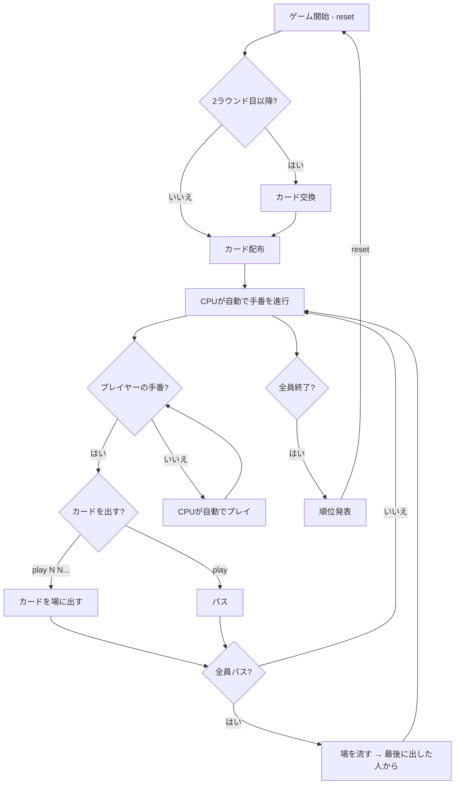

# 大富豪（CUI版）遊び方

## ゲーム概要

4人（プレイヤー1人 + CPU 3人）で遊ぶカードゲームです。手札を場に出していき、最初に手札をなくしたプレイヤーが「大富豪」、最後まで残ったプレイヤーが「大貧民」になります。

## 起動方法

```sh
go run ./cmd/cli daifugo
```

## ルール

### カードの強さ（通常時）

```
弱い ← 3 < 4 < 5 < 6 < 7 < 8 < 9 < 10 < J < Q < K < A < 2 → 強い
```

ジョーカーは常に最強です。

### デッキ

52枚の標準トランプ + ジョーカー2枚（合計54枚）

### 順位

| 順位 | 称号 |
|------|------|
| 1位 | 大富豪 |
| 2位 | 富豪 |
| 3位 | 平民 |
| 4位 | 大貧民 |

### ローカルルール（全て有効）

| ルール | 説明 |
|--------|------|
| 8切り | 8を出すと場が流れ、出したプレイヤーが続けて出せる |
| スート縛り | 同じスートが2連続で出ると、以降そのスートのカードしか出せない |
| 11バック | Jを出すとカードの強さが一時的に逆転する |
| 階段 | 同じスートの連続3枚以上を一度に出せる |
| カード交換 | 2ラウンド目以降、大富豪⇔大貧民で2枚、富豪⇔平民で1枚を交換 |
| 革命 | 4枚同時出しでカードの強さが永続的に逆転（再度4枚出しで元に戻る） |

## ゲームの流れ



## コマンド一覧

| コマンド | 短縮形 | 説明 |
|----------|--------|------|
| `reset` | `r` | 新しいラウンドを開始 |
| `play N N...` | `p N N...` | 指定インデックスのカードを出す（例: `p 0 2`） |
| `play` | `p` | パス（カードを出さない） |
| `quit` | `q` | ゲーム終了 |

## カードの出し方

### 基本

- 場にカードがない場合: 好きなカードを出せます
- 場にカードがある場合: 同じ枚数かつ場より強いカードを出す必要があります

### 複数枚出し

- 同じ数字のカードは複数枚同時に出せます（例: `p 3 7` で同じ数字のカード2枚）
- ジョーカーはワイルドカードとして任意のカードの代わりになります

### 階段

- 同じスートの連続する3枚以上を一度に出せます（例: SPADE 5, SPADE 6, SPADE 7）

## 画面の見方

```
==========
Daifugo (大富豪)
==========
[You]: 13枚
[0]SPADE 3  [1]CLOVER 5  [2]HEART 8  ...
CPU 1: 13枚
CPU 2: 上がり (ランク: 大富豪)
CPU 3: 13枚
----------
【革命中】2が最弱、3が最強
【スート縛り】SPADE
場: SPADE 10, SPADE J (出したプレイヤー: CPU 1)
----------
```

- `[You]: N枚`: プレイヤーの手札枚数とカード一覧
- `CPU N: M枚`: CPUの手札枚数（カード内容は非表示）
- `上がり (ランク: ...)`: そのプレイヤーは手札がなくなり、順位が確定
- `[0]`, `[1]`...: カードのインデックス（`play` で指定）
- `場:`: 現在場に出ているカード
- `【革命中】` / `【スート縛り】` / `【11バック】` / `【階段】`: 有効なルールの表示

## カード交換（2ラウンド目以降）

ラウンド開始時に前ラウンドの結果に基づいてカード交換が行われます:

- 大貧民 → 大富豪: 最も強いカード2枚を渡す
- 大富豪 → 大貧民: 最も弱いカード2枚を渡す
- 平民 → 富豪: 最も強いカード1枚を渡す
- 富豪 → 平民: 最も弱いカード1枚を渡す
