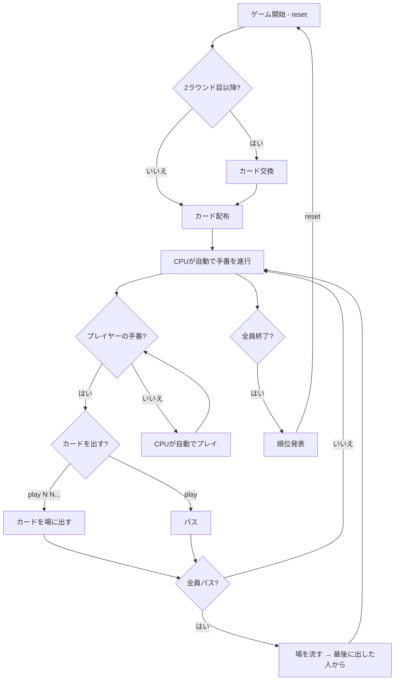

# 大富豪（CUI版）遊び方

## ゲーム概要

4人（プレイヤー1人 + CPU 3人）で遊ぶカードゲームです。手札を場に出していき、最初に手札をなくしたプレイヤーが「大富豪」、最後まで残ったプレイヤーが「大貧民」になります。

## 起動方法

```sh
go run ./cmd/trumpcards daifugo
go run ./cmd/trumpcards --lang en daifugo  # 英語モード
```

## ルール

### カードの強さ（通常時）

```
弱い ← 3 < 4 < 5 < 6 < 7 < 8 < 9 < 10 < J < Q < K < A < 2 → 強い
```

ジョーカーは常に最強です。

### デッキ

52枚の標準トランプ + ジョーカー2枚（合計54枚）

### 順位

| 順位 | 称号 |
|------|------|
| 1位 | 大富豪 |
| 2位 | 富豪 |
| 3位 | 平民 |
| 4位 | 大貧民 |

### ローカルルール

CUI版では以下のルールが**常時有効**です:

| ルール | 説明 |
|--------|------|
| 8切り | 8を出すと場が流れ、出したプレイヤーが続けて出せる |
| スート縛り | 同じスートが連続で出ると、以降そのスートのカードしか出せない（モード設定可能: なし / 片縛り / 両縛り） |
| 11バック | Jを出すとカードの強さが一時的に逆転する |
| 階段 | 同じスートの連続3枚以上を一度に出せる |
| カード交換 | 2ラウンド目以降、大富豪⇔大貧民で2枚、富豪⇔平民で1枚を交換 |
| 革命 | 4枚同時出しでカードの強さが永続的に逆転（再度4枚出しで元に戻る） |

以下のルールはデフォルトで**無効**です（`sr` コマンドで切り替え可能）:

| ルール | 説明 |
|--------|------|
| 5飛び | 5を出すと次のプレイヤーの手番がスキップされる（スキップ人数は設定可能、デフォルト1） |
| 7渡し | 7を出すと次のプレイヤーに任意のカード1枚を渡さなければならない |
| 10捨て | 10を出すと手札から任意のカード1枚を捨てなければならない |
| スペ3返し | 場がジョーカー1枚のとき、スペードの3で返せる |
| 都落ち | 前ラウンドの大富豪が2位以下になった場合、最下位の順位と入れ替わる |
| 9リバース | 9を出すとターンの進行方向が逆転する（再度9を出すと元に戻る） |
| クーデター | 9を3枚同時に出すと革命が発生する |
| 数縛り | 同じ数字が連続で出ると、以降その数字のカードしか出せない（スート縛りから独立した設定） |
| 砂嵐 | ジョーカーでない3を3枚同時に出すと場が流れる（8切りと同様の効果） |
| エンペラー | 場が空の状態で、4枚の連番カード（すべて異なるスート）を出すと革命が発生し場が流れる |
| 階段革命 | 4枚以上の階段を出すと革命が発生する |
| 階段縛り | 階段の上に階段を出すと階段縛りが発動する。場が流れてもリセットされず、ゲームリセット時のみ解除される。縛り中に場が空の場合、3枚以上の階段またはエンペラーのみ出せる |
| 反則上がり | 8切り・ジョーカー・革命で上がると反則となり、最下位に降格される |
| 12ボンバー | Qを出すと数字を選び、全プレイヤーからその数字のカードを除去する |
| ブラインドカード交換 | カード交換時に、上位のプレイヤーが最も弱いカードではなくランダムなカードを渡す |

### CPU難易度

CUI版のCPU難易度は**ふつう（Normal）**固定です。

| 難易度 | 説明 |
|--------|------|
| よわい（Easy） | 単純に出せる中で最も弱いカードを出す。8やジョーカーの温存、革命防止をしない |
| ふつう（Normal） | バランスの取れたAI。8やジョーカーを温存し、革命を防止する（デフォルト） |
| つよい（Hard） | 相手の手札枚数を考慮し、相手が残り少ない場合は強いカードから出す。戦略的にパスする場合もある |

## ゲームの流れ



## コマンド一覧

| コマンド | 短縮形 | 説明 |
|----------|--------|------|
| `reset` | `r` | 新しいラウンドを開始 |
| `play N N...` | `p N N...` | 指定インデックスのカードを出す（例: `p 0 2`） |
| `play` | `p` | パス（カードを出さない） |
| `sort N` | - | 手札のソート方法を変更（0=強さ順、1=スート順、2=数字順） |
| `setrule <rule> <0\|1>` | `sr <rule> <0\|1>` | ローカルルールの有効/無効を切り替え（リセットして反映） |
| `suitlockmode N` | - | スート縛りモードを設定（0=なし、1=片縛り、2=両縛り） |
| `5skipcount N` | - | 5飛びスキップ人数を設定（1〜5） |
| `setdifficulty N` | `sd N` | CPU難易度を設定（0=Normal、1=Easy、2=Hard） |
| `setjoker N` | `sj N` | ジョーカー枚数を設定（0〜2） |
| `quit` | `q` | ゲーム終了 |
| `help` | `?` | コマンド一覧を表示 |

### ルール設定コマンド（`sr`）

`setrule`（短縮形: `sr`）で各ローカルルールの有効/無効を切り替えます。設定変更後は自動でリセットされます。

使用可能なルールキー:

| キー | 対応ルール |
|------|-----------|
| `8cut` | 8切り |
| `11back` | 11バック |
| `seq` | 階段 |
| `exchange` | カード交換 |
| `5skip` | 5飛び |
| `7pass` | 7渡し |
| `10discard` | 10捨て |
| `spade3` | スペ3返し |
| `capital` | 都落ち |
| `9reverse` | 9リバース |
| `coupdetat` | クーデター |
| `numberlock` | 数縛り |
| `sandstorm` | 砂嵐 |
| `emperor` | エンペラー |
| `seqrev` | 階段革命 |
| `seqlock` | 階段縛り |
| `illegal` | 反則上がり |
| `12bomber` | 12ボンバー |
| `blindexchange` | ブラインドカード交換 |

例:

```
sr 5skip 1        # 5飛びを有効にする
sr 12bomber 1     # 12ボンバーを有効にする
sr numberlock 1   # 数縛りを有効にする
suitlockmode 2    # スート縛りを両縛りに設定
5skipcount 3      # 5飛びで3人スキップに設定
```

## カードの出し方

### 基本

- 場にカードがない場合: 好きなカードを出せます
- 場にカードがある場合: 同じ枚数かつ場より強いカードを出す必要があります

### 複数枚出し

- 同じ数字のカードは複数枚同時に出せます（例: `p 3 7` で同じ数字のカード2枚）
- ジョーカーはワイルドカードとして任意のカードの代わりになります

### 階段

- 同じスートの連続する3枚以上を一度に出せます（例: SPADE 5, SPADE 6, SPADE 7）

## 画面の見方

```
==========
Daifugo (大富豪)
==========
[You]: 13枚
[0]SPADE 3  [1]CLOVER 5  [2]HEART 8  ...
CPU 1: 13枚
CPU 2: 上がり (ランク: 大富豪)
CPU 3: 13枚
----------
【革命中】2が最弱、3が最強
【スート縛り】SPADE
場: SPADE 10, SPADE J (出したプレイヤー: CPU 1)
----------
```

- `[You]: N枚`: プレイヤーの手札枚数とカード一覧
- `CPU N: M枚`: CPUの手札枚数（カード内容は非表示）
- `上がり (ランク: ...)`: そのプレイヤーは手札がなくなり、順位が確定
- `[0]`, `[1]`...: カードのインデックス（`play` で指定）
- `場:`: 現在場に出ているカード
- `【革命中】` / `【スート縛り】` / `【11バック】` / `【階段】` / `【9リバース】` / `【数縛り】`: 有効なルールの表示

## カード交換（2ラウンド目以降）

ラウンド開始時に前ラウンドの結果に基づいてカード交換が行われます:

- 大貧民 → 大富豪: 最も強いカード2枚を渡す
- 大富豪 → 大貧民: 最も弱いカード2枚を渡す
- 平民 → 富豪: 最も強いカード1枚を渡す
- 富豪 → 平民: 最も弱いカード1枚を渡す
