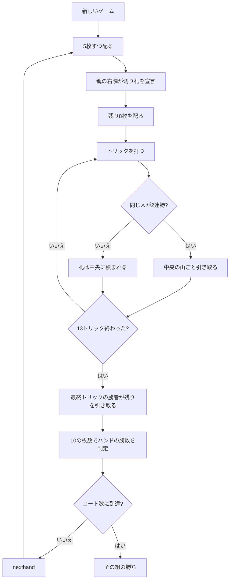

# デーラ・パカド（CUI版）遊び方

## ゲーム概要

デーラ・パカド（Dehla Pakad、「**10 を掴む**」）はインド・パキスタンで広く遊ばれているトリックテイキングです。52 枚を 4 人・2 対 2 で使い、あなたは席 0、**相方は向かいの CPU 2** です（隣は必ず相手）。

勝敗を決めるのはトリック数ではなく、**各スートの 10（デーラ）を何枚取ったか**です。そして一番の特徴は ── **トリックを取っても札はもらえません**。

## 起動方法

```sh
go run ./cmd/trumpcards dehlapakad
# または
go run ./cmd/trumpcards --lang en dehlapakad
```

## ルール

### 配りは 2 回に分かれる

まず **5 枚だけ**配り、**親の右隣**がその 5 枚だけを見て**切り札を宣言**します。宣言してから残り 8 枚を配ります。13 枚全部を見てから決められるわけではない、というのがこの手順の意味です。

### 札の強さ

A > K > Q > J > 10 > 9 > … > 2。リードスート必従で、切り札は台札スートより常に強くなります。

### **札は 2 連勝ではじめて手に入る**

これがこのゲームの心臓部です。

- トリックを取っても、その 4 枚は**中央に積まれるだけ**です。
- **同じ人が 2 トリック続けて取った**とき、はじめてその人が**山ごと**引き取ります。
- ただし**最終（13 番目）のトリック**の勝者は、連勝でなくても山を引き取ります。

つまり 10 は何度取られても誰のものにもならず、毎トリックの問いは「取れるか」ではなく「**取って、次も取れるか**」になります。

### ハンドの勝敗（左右非対称）

| 10 の枚数 | 結果 |
|-----------|------|
| どちらかが 4 枚 | **コート（Kot）**を 1 つ獲得 |
| 親でない組が 2 枚か 3 枚 | 親でない組の勝ち |
| 親側が 3 枚 | 親側の勝ち |

**2 対 2 は親でない組の勝ち**です。親側だけが 3 枚を要求される、この非対称が判定の要になります。

### 親の移動と 7 連勝

**親が動くのは親側が勝ったときだけ**で、親でない組が勝つと親は据え置きです。だからこそ同じ組が勝ち続けることが起こり、**7 連勝でもコートを 1 つ**獲得します。

規定のコート数（既定 2、1〜5）に先に届いた組がマッチの勝者です。

## ゲームの流れ



## コマンド一覧

| コマンド | 短縮形 | 説明 |
|----------|--------|------|
| `trump <1-4>` | `t` | 切り札を宣言（親の右隣のみ。1=♠ 2=♣ 3=♥ 4=♦） |
| `play <idx>` | `p` | 手札の idx 番目の札を出す |
| `nexthand` | `nh` | 次のハンドへ進む |
| `setdifficulty <0-2>` | `sd` | CPU難易度（0=Easy, 1=Normal, 2=Hard） |
| `setkots <1-5>` | `sk` | 勝利に必要なコート数 |
| `hint` | `h` | 推奨アクションを表示 |
| `log` | `l` | アクションログを表示 |
| `reset` | `r` | 新しいゲームを開始（設定保持） |
| `quit` | `q` | 終了 |
| `help` | `?` | コマンド一覧を表示 |

## 画面の見方

```
==========
デーラ・パカド
==========
ハンド 3（2 コート先取）
切り札: ハート（♥）
トリック: 5/13
10（デーラ）— 味方 1 / 相手 0　コート — 味方 0 / 相手 1
あなた （組0 / 子）: 手札 9 枚
[0]♥A  [1]♥10  [2]♥4  [3]♠K  [4]♠7  [5]♣Q  [6]♣3  [7]♦J  [8]♦2
CPU 1 （組1 / 親）: 手札 9 枚
CPU 2 （組0 / 子）: 手札 9 枚
CPU 3 （組1 / 子）: 手札 9 枚
----------
トリック: CPU 1=♠A  CPU 2=♠5
中央に 8 枚（うち 10 が 1 枚）が積まれています。
CPU 1 が次のトリックも取れば、この山ごと引き取ります。
手番: あなた
出せる札: [3]♠K  [4]♠7
play <idx> ... 札を出す
==========
```

「中央に 8 枚（うち 10 が 1 枚）」が、まだ誰のものでもない札です。その次の行が**いま誰が 2 連勝に王手をかけているか**で、この 2 行がこのゲームの読みどころになります。
