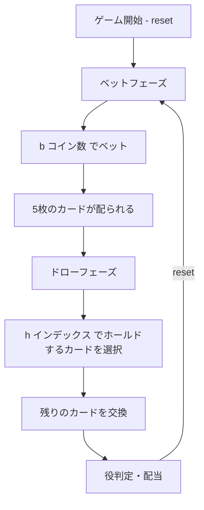

# デューシーズワイルド（CUI版）遊び方

## ゲーム概要

1人用カジノカードゲームです。52枚のトランプを使い、5枚のカードでポーカーの役を作ります。すべての2がワイルドカードとして扱われ、他の任意のカードの代わりになります。Deuces Wild専用のペイテーブルに基づいて配当が支払われます。

## 起動方法

```sh
go run ./cmd/trumpcards deuceswild
go run ./cmd/trumpcards --lang en deuceswild  # 英語モード
```

## ルール

### 基本ルール

- 52枚のトランプ（ジョーカーなし）を使用
- すべての2（デュース）がワイルドカード
- 1〜5コインをベットしてゲーム開始
- 5枚のカードが配られる
- 残したいカード（ホールド）を選び、残りを交換
- 最終的な5枚の手札で役を判定し、配当を支払い

### 配当表（Deuces Wild）

| 役 | 1コイン | 2コイン | 3コイン | 4コイン | 5コイン |
|----|---------|---------|---------|---------|---------|
| ナチュラルロイヤルフラッシュ | 250 | 500 | 750 | 1000 | 4000 |
| フォーデュース | 200 | 400 | 600 | 800 | 1000 |
| ワイルドロイヤルフラッシュ | 25 | 50 | 75 | 100 | 125 |
| ファイブカード | 15 | 30 | 45 | 60 | 75 |
| ストレートフラッシュ | 9 | 18 | 27 | 36 | 45 |
| フォーカード | 5 | 10 | 15 | 20 | 25 |
| フルハウス | 3 | 6 | 9 | 12 | 15 |
| フラッシュ | 2 | 4 | 6 | 8 | 10 |
| ストレート | 2 | 4 | 6 | 8 | 10 |
| スリーカード | 1 | 2 | 3 | 4 | 5 |

### ワイルドカード

- すべての2（デュース）は任意のカードとして扱える
- ナチュラルロイヤルフラッシュ: ワイルドなしのロイヤルフラッシュ（最高配当）
- ワイルドロイヤルフラッシュ: ワイルドを含むロイヤルフラッシュ
- フォーデュース: 4枚の2が揃う特別役
- ファイブカード: ワイルドを使って同じランク5枚

## ゲームの流れ



## コマンド一覧

| コマンド | 短縮形 | 説明 |
|----------|--------|------|
| `reset` | `r` | 新しいゲームを開始 |
| `bet <amount>` | `b <amount>` | ベットする（1〜5コイン） |
| `hold <indices>` | `h <indices>` | カードをホールドして交換（インデックス0〜4） |
| `log` | `l` | アクションログ（棋譜）を表示 |
| `quit` | `q` | ゲーム終了 |
| `help` | `?` | コマンド一覧を表示 |

### コマンド例

- `r` → ゲームリセット
- `b 5` → 5コインベット
- `h 0 2 4` → 0番目、2番目、4番目のカードをホールドし、残りを交換
- `h` → 全カード交換（ホールドなし）
- `l` → 棋譜を表示

## 画面の見方

```
==========
デューシーズワイルド
==========
チップ: 100
----------
ベットフェーズ
b・・・ベット  l・・・棋譜
==========

> b 3

==========
デューシーズワイルド
==========
チップ: 97
----------
[0]♠A  [1]♥2  [2]♦K  [3]♣3  [4]♠J
----------
ドローフェーズ
h・・・ホールド  l・・・棋譜
==========

> h 0 1 2

==========
デューシーズワイルド
==========
チップ: 106
----------
[0]♠A  [1]♥2  [2]♦K  [3]♥A  [4]♦9
----------
スリーカード  配当: 9
----------
r・・・リセット  l・・・棋譜
==========
```

- `チップ: N`: 所持チップ数
- `[N]♠A`: カードのインデックスとカード表示
- `配当: N`: 獲得配当

## 遊び方のコツ

- 5コインベットでナチュラルロイヤルフラッシュの配当が大幅に増える（250→4000）ため、可能なら最大ベットがお得
- 2（デュース）は常にホールドする
- デュースを持っている場合、より高い役を狙いやすい
- デュースなしの場合はJacks or Betterより最低配当条件が厳しい（スリーカード以上が必要）
