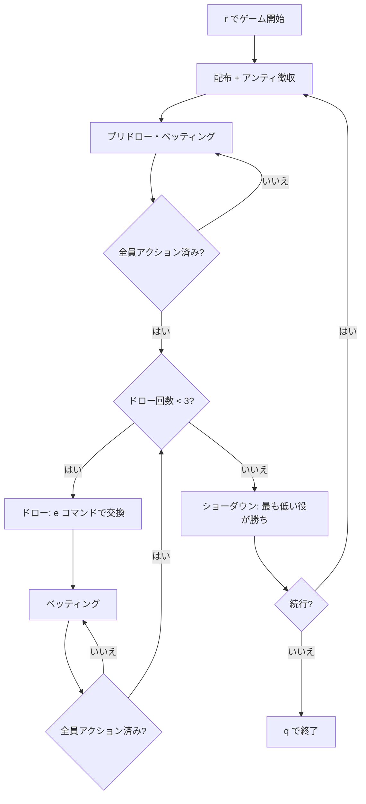

# デューストゥセブン（CUI版）遊び方

## ゲーム概要

2-7 トリプルドロー（Deuce to Seven Triple Draw）は WSOP でも人気のローボールドローポーカーです。各プレイヤーに5枚が配られ、3回のドロー（交換）と4回のベッティングラウンドを経て、**ストレートやフラッシュを含まない、最も数字の低い5枚**を目指します。エースは常にハイカードとして扱われ、ストレート・フラッシュは「強い役」と判定されるためローでは不利に働きます。最強の手は **7-5-4-3-2（セブンロー）** です。

## 起動方法

```sh
go run ./cmd/trumpcards deucetoseven
go run ./cmd/trumpcards --lang en deucetoseven   # 英語モード
```

## ルール

### 基本ルール

- 52枚のトランプを使用（ジョーカーなし）
- 各プレイヤーに5枚配布
- 最大3回のドロー（交換）
- ベッティングラウンドは計4回（ディール後・各ドロー後）
- ショーダウンでは通常のポーカー役として読み、**最も弱い（低い）役が勝ち**
- エースは常にハイ。A-2-3-4-5 はストレートにならず「エースハイ」のハイカード
- ストレート・フラッシュは成立し、ローでは不利（最悪クラス）
- 同じ役カテゴリ内ではカードを高い方から比較し、低い方が勝ち

### ハンドの強さ（弱い役ほど強いロー）

| 強さ | 例 | 説明 |
|------|----|------|
| 最強 | 7-5-4-3-2 | ペア・ストレート・フラッシュなしの最小手（ナッツ） |
| 強 | 8-6-4-3-2 | 8以下のメイドロー |
| 中 | 10-7-5-3-2 | ハイカードが9〜J |
| 弱 | ペア / Q+ ハイ | ワンペアやクイーン以上のハイカード |
| 最弱 | ストレート / フラッシュ | ローでは負け札 |

### リミット構造

Fixed Limit / Pot Limit / No Limit の3種類。Fixed Limit ではラウンド1〜2がスモールベット、3〜4がビッグベット（= 2×）となります。

## ゲームの流れ



## コマンド一覧

| コマンド | 別名 | 説明 |
|----------|------|------|
| `r` | `reset` | 新しいハンドを開始 |
| `b [amount]` | `bet` | 指定額をベット |
| `c` | `call` | 現在のベット額にコール |
| `ra [amount]` | `raise` | 指定額にレイズ |
| `ck` | `check` | チェック |
| `f` | `fold` | フォールド |
| `a` | `allin` | オールイン |
| `e [indices]` | `exchange` | カード交換（例: `e 0 2 4`） |
| `s` | `stand` | 交換なし（スタンドパット） |
| `bl <n>` | `bettinglimit` | リミット設定（0=Fixed, 1=PotLimit, 2=NoLimit） |
| `scc <n>` | `setcpucount` | CPU人数（1〜3） |
| `mai <0\|1>` | `metaai` | メタAIの有効/無効 |
| `log` / `l` | — | 棋譜表示 |
| `q` | `quit` | 終了 |

カード位置は `0` 〜 `4` で指定します（手札は左から 0, 1, 2, 3, 4）。

## 画面の見方

```
==========
2-7 Triple Draw (Deuce to Seven Lowball)
==========
ディーラー: Player 0
ポット: 130
ドロー: 1/3
リミット: Fixed
----------
あなた チップ:990
  手札: [0]♠7  [1]♥5  [2]♦4  [3]♣3  [4]♠2  [High Card]
CPU 1 (Conservative) チップ:980 ベット:10
CPU 2 (Aggressive)   チップ:970 ベット:20
CPU 3 (Bluffer)      チップ:960 ベット:30
----------
[CPU行動]
  Player 1 (pre-draw): ベット (10)
  Player 2 (pre-draw): レイズ (10)
----------
[CPUドロー]
  Player 2 (draw 1): 2枚交換
  Player 3 (draw 1): 0枚交換
```

- **ディーラー**: ボタン位置のプレイヤー
- **ドロー**: 現在のドロー進行（`プリドロー` / `n/3`）
- **リミット**: Fixed / PotLimit / NoLimit
- **手札**: インデックス付きで `[0]♠7` のように表示

## 遊び方のコツ

- 8以下のメイドロー（例: 8-6-4-3-2）は迷わずスタンドパット
- ペア・ストレート・フラッシュは負け札 — ドローで崩す
- エースは常にハイ。A入りの手はローとしては弱い
- CPUの交換枚数は強さのシグナル — 0 はメイドハンド、複数枚は未完成のドロー
- Fixed Limit では後半（ラウンド3〜4）がビッグベット。前半で仕掛け過ぎると苦しくなる
